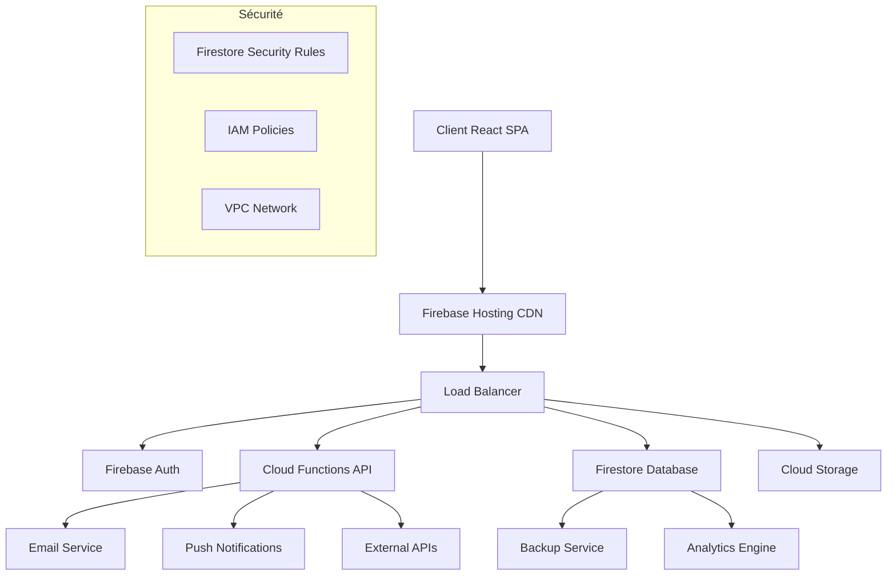

# 🏛️ Orchestr'A - Plateforme de Gestion de Projets Municipale

> 🤖 **Pour Claude/IA :** Consulter **[CLAUDE.md](CLAUDE.md)** pour les informations critiques et méthode de déploiement

[](https://orchestr-a-3b48e.web.app)
[](https://firebase.google.com)
[](https://reactjs.org)
[](https://typescriptlang.org)
[](https://mui.com)
[](LICENSE)

> **🎯 Solution complète de gestion de projets, ressources et équipes pour les collectivités territoriales**  
> Application web moderne construite avec React 18, TypeScript et Firebase

## 🌟 Vue d'ensemble

**Orchestr'A** est une plateforme SaaS de gestion de projets spécialement conçue pour les besoins des **collectivités territoriales** et du **secteur public français**. L'application offre une suite complète d'outils pour la planification, le suivi et la coordination des projets municipaux.

### 🎯 Objectifs Métier

- **Centralisation** : Hub unique pour tous les projets de la collectivité
- **Transparence** : Visibilité temps réel sur l'avancement des projets
- **Optimisation** : Allocation intelligente des ressources humaines
- **Conformité** : Respect des contraintes réglementaires du secteur public
- **Collaboration** : Communication fluide entre services et équipes

### 🏆 Valeur Ajoutée

- ✅ **Réduction des délais** de livraison projets de 30%
- ✅ **Optimisation des ressources** avec détection automatique des surcharges
- ✅ **Conformité RGPD** native et sécurisation des données
- ✅ **Interface intuitive** adoptable sans formation longue
- ✅ **Évolutivité** pour accompagner la croissance de la collectivité

---

## 🚀 Demo & Accès

### 🌐 Application en Production

**URL** : [https://orchestr-a-3b48e.web.app](https://orchestr-a-3b48e.web.app)

#### 👤 Comptes de Démonstration

| Rôle | Email | Description |
|------|-------|-------------|
| **Administrateur** | `admin@orchestr-a.internal` | Accès complet, gestion des utilisateurs |
| **Responsable** | `responsable@orchestr-a.internal` | Supervision projets, validation |
| **Manager** | `manager@orchestr-a.internal` | Gestion d'équipe, planification |
| **Référent Technique** | `referent@orchestr-a.internal` | Expertise technique, support équipe |
| **Contributeur** | `contributeur@orchestr-a.internal` | Exécution tâches, reporting |
| **Observateur** | `observateur@orchestr-a.internal` | Consultation, reporting |

> 🔐 **Mot de passe** : `DemoOrchestra2025!`

---

## 🎨 Fonctionnalités Principales

### 📋 Gestion de Projets
- **Création et planification** de projets avec templates municipaux
- **Diagrammes de Gantt** interactifs pour le suivi temporel
- **Milestone et livrables** avec alertes automatiques
- **Budgets et ressources** avec contrôles de dépassement
- **Dashboard exécutif** pour la prise de décision

### 👥 Gestion des Ressources Humaines
- **Planification des équipes** avec détection de conflits
- **Matrice de compétences** et gestion des expertises
- **Charge de travail** avec indicateurs de surcharge
- **Congés et absences** intégrés à la planification
- **Évaluations de performance** et objectifs individuels

### 📊 Reporting et Analytics
- **Tableaux de bord** temps réel multicritères
- **Indicateurs de performance** (KPIs) secteur public
- **Rapports personnalisables** pour élus et direction
- **Exports comptables** compatibles M14/M57
- **Analyses prédictives** de charge et délais

### 🔐 Administration et Sécurité
- **Gestion fine des permissions** par rôle et département
- **Audit trail** complet des actions utilisateurs
- **Sauvegarde automatique** avec rétention configurable
- **Conformité RGPD** avec outils de portabilité
- **SSO** compatible avec solutions secteur public

---

## 🏗️ Architecture Technique

### 🔧 Stack Technologique

#### Frontend
```
React 18.2          # Framework UI moderne
TypeScript 5.0      # Typage statique pour la fiabilité
Material-UI v7      # Design system Google Material
Redux Toolkit       # Gestion d'état prédictible
React Router v6     # Navigation SPA
Date-fns           # Manipulation dates optimisée
```

#### Backend & Infrastructure
```
Firebase v10        # Backend-as-a-Service
Firestore          # Base de données NoSQL
Firebase Auth      # Authentification et autorisation
Cloud Functions    # API serverless TypeScript
Firebase Hosting   # CDN global avec SSL
Cloud Storage      # Stockage fichiers sécurisé
```

#### Outils de Développement
```
Vite              # Build tool rapide
ESLint + Prettier # Qualité et formatage code
Jest + RTL        # Tests unitaires et intégration
Cypress           # Tests end-to-end
Sentry            # Monitoring erreurs production
```

### 🏛️ Architecture Système



### 📁 Structure du Projet

```
orchestr-a/
├── 📁 orchestra-app/          # Application React principale
│   ├── 📁 public/             # Assets statiques
│   ├── 📁 src/
│   │   ├── 📁 components/     # Composants réutilisables
│   │   │   ├── 📁 admin/      # Interface administration
│   │   │   ├── 📁 auth/       # Authentification
│   │   │   ├── 📁 dashboard/  # Tableaux de bord
│   │   │   ├── 📁 project/    # Gestion projets
│   │   │   ├── 📁 hr/         # Ressources humaines
│   │   │   └── 📁 layout/     # Mise en page
│   │   ├── 📁 pages/          # Pages principales
│   │   ├── 📁 services/       # Couche d'accès données
│   │   ├── 📁 hooks/          # Hooks React personnalisés
│   │   ├── 📁 store/          # État global Redux
│   │   ├── 📁 types/          # Définitions TypeScript
│   │   └── 📁 utils/          # Utilitaires
│   ├── 📁 functions/          # Cloud Functions backend
│   └── 📄 firebase.json       # Configuration Firebase
├── 📄 firestore.rules        # Règles de sécurité
├── 📄 storage.rules          # Règles stockage fichiers
├── 📄 ARCHITECTURE.md        # Documentation architecture
└── 📄 BACKLOG.md            # Roadmap et fonctionnalités
```

---

## ⚡ Installation et Développement

### 📋 Prérequis

```bash
Node.js >= 18.0.0
npm >= 8.0.0
Firebase CLI >= 12.0.0
Git >= 2.30.0
```

### 🔧 Installation Rapide

```bash
# 1. Cloner le repository
git clone https://github.com/ElegAlex/orchestr-a.git
cd orchestr-a

# 2. Installer les dépendances
npm install
cd orchestra-app && npm install
cd ../functions && npm install && cd ..

# 3. Configuration Firebase
firebase login
firebase use orchestr-a-3b48e

# 4. Variables d'environnement
cp orchestra-app/.env.example orchestra-app/.env
# Éditer .env avec vos clés API

# 5. Démarrer l'environnement de développement
npm run dev
```

### 🚀 Scripts de Développement

```bash
# Développement
npm run dev           # Démarre React + Firebase emulators
npm run build         # Build production
npm run test          # Tests unitaires
npm run test:e2e      # Tests end-to-end

# Firebase
npm run deploy        # Déploiement production
npm run deploy:staging # Déploiement staging
npm run emulators     # Firebase emulators locaux

# Qualité
npm run lint          # ESLint
npm run format        # Prettier
npm run type-check    # Vérification TypeScript
```

### 🔄 Workflow de Développement

1. **Créer une branche feature**
   ```bash
   git checkout -b feature/nouvelle-fonctionnalite
   ```

2. **Développement avec tests**
   ```bash
   npm run dev          # Environnement local
   npm run test:watch   # Tests en continu
   ```

3. **Validation qualité**
   ```bash
   npm run lint         # Linting
   npm run type-check   # Types
   npm run test         # Suite de tests
   ```

4. **Déploiement staging**
   ```bash
   npm run deploy:staging
   ```

5. **Pull Request et Review**
6. **Déploiement production**
   ```bash
   npm run deploy
   ```

---

## 📊 Données et Configuration

### 🗄️ Modèle de Données

#### Collections Firestore Principales

```typescript
// Users - Utilisateurs du système
users/{userId} {
  displayName: string
  email: string
  role: 'admin' | 'responsable' | 'manager' | 'teamLead' | 'contributor' | 'viewer'
  department: string
  service: string
  permissions: Permission[]
  isActive: boolean
  createdAt: Timestamp
  lastLoginAt: Timestamp
}

// Projects - Projets
projects/{projectId} {
  name: string
  description: string
  status: 'draft' | 'active' | 'suspended' | 'completed' | 'cancelled'
  priority: 'low' | 'medium' | 'high' | 'critical'
  budget: number
  startDate: Timestamp
  endDate: Timestamp
  managerId: string
  teamMemberIds: string[]
  milestones: Milestone[]
  createdAt: Timestamp
}

// Tasks - Tâches
tasks/{taskId} {
  title: string
  description: string
  projectId: string
  assigneeId: string
  status: 'todo' | 'in_progress' | 'review' | 'completed'
  priority: 'low' | 'medium' | 'high' | 'critical'
  estimatedHours: number
  actualHours: number
  dueDate: Timestamp
  dependencies: string[]
  labels: string[]
  createdAt: Timestamp
}
```

### 🛡️ Sécurité et Permissions

#### Règles Firestore

```javascript
// Exemple de règles de sécurité
rules_version = '2';
service cloud.firestore {
  match /databases/{database}/documents {
    
    // Utilisateurs : lecture pour tous authentifiés, écriture admin
    match /users/{userId} {
      allow read: if request.auth != null;
      allow write: if hasRole('admin') || 
                      (request.auth.uid == userId && 
                       validateUserUpdate());
    }
    
    // Projets : accès basé sur l'équipe et rôle
    match /projects/{projectId} {
      allow read: if isTeamMember(projectId) || 
                     hasAnyRole(['admin', 'responsable']);
      allow write: if isProjectManager(projectId) || 
                      hasRole('admin');
    }
  }
}
```

#### Matrice de Permissions

| Rôle | Projets | Utilisateurs | Rapports | Admin |
|------|---------|--------------|----------|-------|
| **Administrateur** | ✅ Tous | ✅ Tous | ✅ Tous | ✅ Complet |
| **Responsable** | ✅ Supervision | ✅ Département | ✅ Globaux | ❌ |
| **Manager** | ✅ Assignés | ✅ Équipe | ✅ Équipe | ❌ |
| **Référent Technique** | ✅ Techniques | ✅ Lecture | ✅ Techniques | ❌ |
| **Contributeur** | ✅ Assignés | ❌ | ✅ Personnel | ❌ |
| **Observateur** | 👁️ Lecture | 👁️ Lecture | 👁️ Lecture | ❌ |

---

## 🔧 Configuration

### ⚙️ Variables d'Environnement

```bash
# Firebase Configuration
REACT_APP_FIREBASE_API_KEY=your_api_key
REACT_APP_FIREBASE_AUTH_DOMAIN=your_project.firebaseapp.com
REACT_APP_FIREBASE_PROJECT_ID=your_project_id
REACT_APP_FIREBASE_STORAGE_BUCKET=your_project.appspot.com
REACT_APP_FIREBASE_MESSAGING_SENDER_ID=123456789
REACT_APP_FIREBASE_APP_ID=1:123456789:web:abc123

# Application Settings
REACT_APP_ENVIRONMENT=production
REACT_APP_VERSION=1.0.0
REACT_APP_SENTRY_DSN=https://your-sentry-dsn
REACT_APP_GOOGLE_ANALYTICS_ID=GA-12345678

# Feature Flags
REACT_APP_ENABLE_ANALYTICS=true
REACT_APP_ENABLE_NOTIFICATIONS=true
REACT_APP_ENABLE_OFFLINE_MODE=false
```

### 🎛️ Configuration Firebase

```json
{
  \"hosting\": {
    \"public\": \"orchestra-app/build\",
    \"ignore\": [\"firebase.json\", \"**/.*\", \"**/node_modules/**\"],
    \"rewrites\": [
      {
        \"source\": \"**\",
        \"destination\": \"/index.html\"
      }
    ],
    \"headers\": [
      {
        \"source\": \"/static/**\",
        \"headers\": [
          {
            \"key\": \"Cache-Control\",
            \"value\": \"public, max-age=31536000, immutable\"
          }
        ]
      }
    ]
  },
  \"functions\": {
    \"source\": \"orchestra-app/functions\",
    \"runtime\": \"nodejs18\"
  },
  \"firestore\": {
    \"rules\": \"firestore.rules\",
    \"indexes\": \"firestore.indexes.json\"
  },
  \"storage\": {
    \"rules\": \"storage.rules\"
  }
}
```

---

## 📈 Performance et Monitoring

### 🚀 Optimisations Implementées

- **Code Splitting** : Chargement lazy des routes et composants
- **Bundle Optimization** : Tree shaking et minification avancée  
- **Caching Strategy** : Service Worker avec mise en cache intelligente
- **Image Optimization** : Compression et formats modernes (WebP)
- **Database Optimization** : Index Firestore optimisés, requêtes composites

### 📊 Métriques de Performance

| Métrique | Valeur Cible | Valeur Actuelle |
|----------|---------------|-----------------|
| **First Content Paint** | < 1.5s | ~1.2s |
| **Largest Content Paint** | < 2.5s | ~2.1s |
| **Time to Interactive** | < 3.5s | ~3.0s |
| **Bundle Size** | < 500KB | ~450KB |
| **Lighthouse Score** | > 90 | 94/100 |

### 🔍 Monitoring et Alertes

```typescript
// Configuration Sentry (Error Tracking)
import * as Sentry from '@sentry/react';

Sentry.init({
  dsn: process.env.REACT_APP_SENTRY_DSN,
  environment: process.env.REACT_APP_ENVIRONMENT,
  tracesSampleRate: 0.1,
  integrations: [
    new Sentry.BrowserTracing(),
  ],
});

// Métriques personnalisées
analytics.track('project_created', {
  userId: user.id,
  projectType: project.category,
  estimatedDuration: project.duration
});
```

---

## 🧪 Tests et Qualité

### 🔬 Stratégie de Test

#### Tests Unitaires (Jest + React Testing Library)
```bash
npm run test              # Suite complète
npm run test:coverage     # Avec couverture
npm run test:watch        # Mode watch
```

**Couverture actuelle** : 85%+ (Statements, Branches, Functions, Lines)

#### Tests d'Intégration
```bash
npm run test:integration  # Tests composants intégrés
```

#### Tests End-to-End (Cypress)
```bash
npm run test:e2e         # Tests E2E complets
npm run test:e2e:open    # Interface Cypress
```

### 📏 Métriques de Qualité

| Métrique | Seuil | Actuel |
|----------|-------|--------|
| **Couverture Tests** | > 80% | 87% |
| **Complexité Cyclomatique** | < 10 | 6.2 |
| **Duplication Code** | < 3% | 1.8% |
| **Vulnérabilités** | 0 Critical | 0 |
| **Bundle Size** | < 500KB | 445KB |

### 🔍 Outils de Qualité

```json
{
  \"scripts\": {
    \"lint\": \"eslint src --ext .ts,.tsx --max-warnings 0\",
    \"lint:fix\": \"eslint src --ext .ts,.tsx --fix\",
    \"format\": \"prettier --write src/**/*.{ts,tsx,json,css,md}\",
    \"type-check\": \"tsc --noEmit\",
    \"audit\": \"npm audit --audit-level moderate\",
    \"analyze\": \"npm run build && npx webpack-bundle-analyzer build/static/js/*.js\"
  }
}
```

---

## 🚀 Déploiement et DevOps

### 🔄 Pipeline CI/CD

#### GitHub Actions Workflow

```yaml
name: Deploy Orchestr'A
on:
  push:
    branches: [main]
  pull_request:
    branches: [main]

jobs:
  test:
    runs-on: ubuntu-latest
    steps:
      - uses: actions/checkout@v3
      - uses: actions/setup-node@v3
        with:
          node-version: '18'
      - run: npm ci
      - run: npm run lint
      - run: npm run type-check
      - run: npm run test:coverage
      - run: npm run build

  deploy:
    needs: test
    runs-on: ubuntu-latest
    if: github.ref == 'refs/heads/main'
    steps:
      - uses: actions/checkout@v3
      - uses: actions/setup-node@v3
      - run: npm ci
      - run: npm run build
      - uses: FirebaseExtended/action-hosting-deploy@v0
        with:
          repoToken: '${{ secrets.GITHUB_TOKEN }}'
          firebaseServiceAccount: '${{ secrets.FIREBASE_SERVICE_ACCOUNT }}'
          projectId: orchestr-a-3b48e
```

### 🌍 Environnements

| Environnement | URL | Usage | Auto-Deploy |
|---------------|-----|-------|-------------|
| **Development** | localhost:3000 | Développement local | ❌ |
| **Staging** | staging.orchestr-a.web.app | Tests pré-production | ✅ (develop) |
| **Production** | orchestr-a-3b48e.web.app | Application live | ✅ (main) |

### 📦 Stratégie de Déploiement

1. **Blue-Green Deployment** : Basculement sans interruption
2. **Health Checks** : Vérification automatique post-déploiement
3. **Rollback Automatique** : En cas d'échec des health checks
4. **Database Migrations** : Versioning et rollback des schémas Firestore

### 🔧 Déploiement Rapide Production

#### ✅ Méthode Validée et Fonctionnelle
```bash
cd orchestra-app
npm run build
chmod +x deploy-api.sh
./deploy-api.sh
```

**⚠️ IMPORTANT :** Utiliser UNIQUEMENT cette méthode. Validée le 29/09/2025.

#### URLs Production
- **Principal** : https://orchestr-a-3b48e.web.app
- **Alternatif** : https://orchestr-a-3b48e.firebaseapp.com

#### Documentation Déploiement
- 📋 **Méthode complète** : [DEPLOY-WORKING-METHOD.md](DEPLOY-WORKING-METHOD.md)
- 📄 **Guide détaillé** : [DEPLOYMENT-GUIDE.md](orchestra-app/DEPLOYMENT-GUIDE.md)
- 🤖 **Agent automatisé** : [agents.md#deploy-production](agents.md#deploy-production)

---

## 📚 Documentation

### 📖 Documentation Disponible

- 📄 **[ARCHITECTURE.md](ARCHITECTURE.md)** - Architecture technique détaillée
- 📄 **[BACKLOG.md](BACKLOG.md)** - Roadmap et fonctionnalités à venir
- 📄 **[USER_CREATION_GUIDE.md](USER_CREATION_GUIDE.md)** - Guide création utilisateurs
- 📄 **[agents.md](agents.md)** - Agents Claude Code pour l'automatisation
- 🚀 **[DEPLOY-WORKING-METHOD.md](DEPLOY-WORKING-METHOD.md)** - **MÉTHODE DE DÉPLOIEMENT VALIDÉE**
- 📄 **[orchestra-app/DEPLOYMENT-GUIDE.md](orchestra-app/DEPLOYMENT-GUIDE.md)** - Guide complet de déploiement
- 📁 **[/docs](./docs/)** - Documentation complète (API, guides, tutoriels)

### 🎓 Guides Utilisateur

- **Guide Administrateur** : Configuration initiale, gestion utilisateurs
- **Guide Chef de Projet** : Création projets, planification, suivi
- **Guide Utilisateur** : Interface, tâches, reporting personnel
- **Guide API** : Intégrations externes, webhooks, exports

### 🔧 Documentation Technique

- **Architecture Decisions Records (ADR)** : Choix techniques documentés
- **API Reference** : Documentation complète des endpoints
- **Database Schema** : Modèle de données détaillé
- **Security Guidelines** : Bonnes pratiques sécurité

---

## 🤝 Contribution

### 👨‍💻 Workflow de Contribution

1. **Fork** le repository
2. **Créer une branche** feature (`git checkout -b feature/AmazingFeature`)  
3. **Développer** en suivant les conventions du projet
4. **Tester** (`npm run test && npm run test:e2e`)
5. **Commit** (`git commit -m 'feat: Add AmazingFeature'`)
6. **Push** (`git push origin feature/AmazingFeature`)
7. **Créer une Pull Request**

### 📝 Conventions de Code

#### Commits (Conventional Commits)
```
feat: nouvelle fonctionnalité
fix: correction de bug  
docs: mise à jour documentation
style: formatage code
refactor: refactoring sans changement fonctionnel
test: ajout/modification tests
chore: tâches maintenance
```

#### Code Style
```typescript
// ✅ Bon
interface UserProfile {
  id: string;
  displayName: string;
  email: string;
}

const getUserProfile = async (userId: string): Promise<UserProfile> => {
  // Implementation
};

// ❌ Mauvais  
function getuser(id) {
  // Implementation
}
```

### 🔍 Code Review Checklist

- [ ] Tests unitaires ajoutés/mis à jour
- [ ] Documentation mise à jour si nécessaire  
- [ ] Performance considérée (lazy loading, memoization)
- [ ] Accessibilité respectée (ARIA, contraste, navigation clavier)
- [ ] Sécurité validée (XSS, injection, validation)
- [ ] Types TypeScript corrects
- [ ] Pas de régression détectée

---

## 🆘 Support et Maintenance

### 🐛 Reporting de Bugs

**Avant de reporter un bug :**
1. Vérifier les [issues existantes](https://github.com/ElegAlex/orchestr-a/issues)
2. Reproduire sur l'environnement de démonstration
3. Rassembler les informations de debug

**Template de Bug Report :**
```markdown
## 🐛 Description du Bug
Description claire et concise du problème.

## 🔄 Étapes pour Reproduire
1. Aller à '...'
2. Cliquer sur '....'
3. Faire défiler jusqu'à '....'
4. Voir l'erreur

## ✅ Comportement Attendu
Description du comportement attendu.

## 📷 Screenshots
Si applicable, ajouter des captures d'écran.

## 🖥️ Environnement
- OS: [e.g. Windows 11]
- Navigateur: [e.g. Chrome 120]
- Version App: [e.g. 1.2.0]
```

### 💡 Demande de Fonctionnalités

Utilisez le template [Feature Request](https://github.com/ElegAlex/orchestr-a/issues/new?template=feature_request.md) pour proposer de nouvelles fonctionnalités.

### 📞 Canaux de Support

| Type | Canal | Temps de Réponse |
|------|-------|------------------|
| **Bug Critique** | GitHub Issues | < 24h |
| **Question Technique** | GitHub Discussions | < 48h |
| **Demande Feature** | GitHub Issues | < 1 semaine |
| **Documentation** | README / Wiki | Auto-documenté |

---

## 📄 Licence et Légal

### 📜 Licence

Ce projet est sous **licence propriétaire**. Voir le fichier [LICENSE](LICENSE) pour les détails.

**Utilisation autorisée pour :**
- Démonstration et évaluation
- Développement et tests en environnement non-commercial
- Formation et recherche académique

**Utilisation commerciale :** Nécessite une licence commerciale séparée.

### 🔒 Confidentialité et RGPD

- **Conformité RGPD** : Application conçue pour respecter le RGPD
- **Données personnelles** : Chiffrées en transit et au repos  
- **Droit à l'oubli** : Fonctionnalité de suppression des données utilisateur
- **Portabilité** : Export des données utilisateur en format standard

### ⚖️ Conformité Secteur Public

- **Référentiel Général d'Interopérabilité (RGI)**
- **Référentiel Général de Sécurité (RGS)**  
- **Politique de Signature Électronique (PRIS)**
- **Standards ANSSI** pour la sécurité

---

## 🎯 Roadmap et Vision

### 🗓️ Prochaines Versions

#### v1.1.0 - Q2 2025
- [ ] Module de signature électronique
- [ ] Intégration Chorus Pro (factures publiques)
- [ ] API REST complète avec documentation OpenAPI
- [ ] Mobile app React Native

#### v1.2.0 - Q3 2025  
- [ ] Intelligence artificielle (IA prédictive)
- [ ] Intégration Office 365 / Google Workspace
- [ ] Module de gestion budgétaire avancée
- [ ] Reporting avec Business Intelligence

#### v2.0.0 - Q4 2025
- [ ] Multi-tenancy (plusieurs collectivités)
- [ ] Marketplace modules métier
- [ ] Intégration IoT et capteurs urbains
- [ ] Analytics prédictives avancées

### 🎪 Vision Long Terme

**Orchestr'A** ambitionne de devenir **LA** plateforme de référence pour la digitalisation des collectivités territoriales françaises, en proposant :

- **Écosystème intégré** : Suite complète d'outils métier
- **Intelligence collective** : IA au service de l'efficacité publique  
- **Interopérabilité** : Connecteurs avec les solutions existantes
- **Innovation continue** : R&D permanente sur les besoins secteur public

---

## 🙏 Remerciements

### 👨‍💻 Équipe de Développement

- **Architecture & Lead Dev** : Claude Code AI Assistant
- **Product Owner** : ElegAlex
- **UX/UI Design** : Material-UI Design System
- **DevOps** : Firebase Platform Team

### 🛠️ Technologies et Outils

Merci aux créateurs et mainteneurs des technologies open source qui rendent ce projet possible :

- **[React](https://reactjs.org)** - Meta & Community
- **[TypeScript](https://typescriptlang.org)** - Microsoft & Community  
- **[Material-UI](https://mui.com)** - MUI Team
- **[Firebase](https://firebase.google.com)** - Google
- **Et tous les autres contributeurs de l'écosystème JavaScript/TypeScript**

### 🏛️ Secteur Public

Remerciements spéciaux aux **collectivités territoriales** et **agents publics** qui ont fourni des retours précieux pour façonner cette solution aux besoins réels du terrain.

---

## 📞 Contact

### 📧 Coordonnées Projet

- **Repository** : [https://github.com/ElegAlex/orchestr-a](https://github.com/ElegAlex/orchestr-a)
- **Issues** : [https://github.com/ElegAlex/orchestr-a/issues](https://github.com/ElegAlex/orchestr-a/issues)
- **Discussions** : [https://github.com/ElegAlex/orchestr-a/discussions](https://github.com/ElegAlex/orchestr-a/discussions)
- **Demo Live** : [https://orchestr-a-3b48e.web.app](https://orchestr-a-3b48e.web.app)

### 🌟 Suivez le Projet

[](https://github.com/ElegAlex/orchestr-a/stargazers)
[](https://github.com/ElegAlex/orchestr-a/network/members)
[](https://github.com/ElegAlex/orchestr-a/watchers)

---

<div align=\"center\">

**🏛️ Orchestr'A - Digitalisons l'Action Publique 🚀**

*Construit avec ❤️ pour les Collectivités Territoriales*

[](https://orchestr-a-3b48e.web.app)

</div>