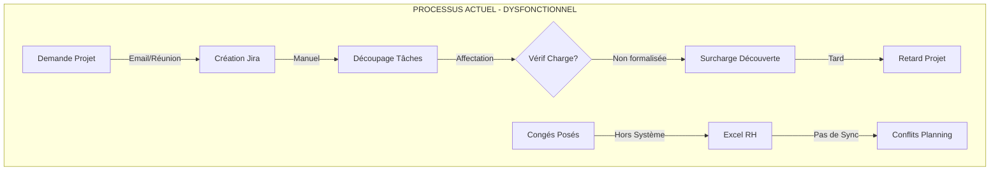
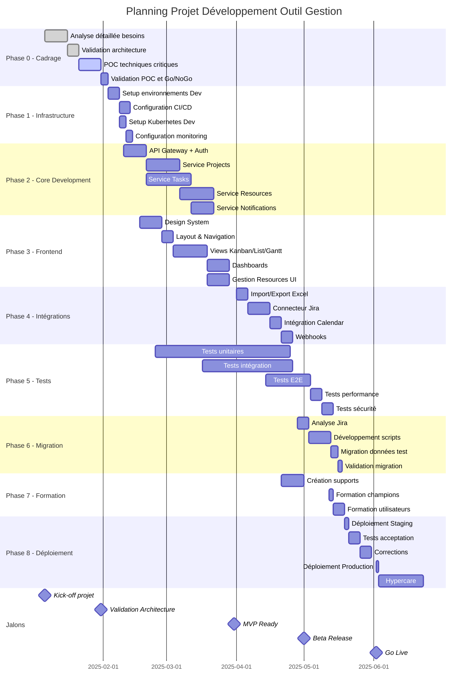

# 📚 CAHIER DES CHARGES TECHNIQUE DÉTAILLÉ
## Système de Gestion de Projet Intégré - Version Complète pour Exécution

### **SOMMAIRE EXÉCUTIF RÉVISÉ**

D'après l'analyse approfondie de vos besoins exprimés et implicites, ce projet révèle des enjeux critiques non formulés mais essentiels :

**ENJEUX STRATÉGIQUES IDENTIFIÉS :**
- **Transition d'un environnement Jira** → Besoin de migration sans perte et formation minimale
- **Contexte secteur public** → Contraintes légales, traçabilité, marchés publics
- **Absence de gestion de coûts** → Compensation par métriques de valeur publique
- **Culture non-agile native** → Accompagnement au changement nécessaire
- **Nom de l'application** : Orchestr'A (Orchestration Agile)

---

## 📊 PARTIE 1 : ANALYSE DÉTAILLÉE DU CONTEXTE

### **1.1 ANALYSE DE L'EXISTANT**

#### **AUDIT SYSTÈME ACTUEL (PRÉSUMÉ JIRA)**

```yaml
CONFIGURATION JIRA ACTUELLE (À VALIDER):
  Nombre_Projets_Actifs: ~10-15
  Utilisateurs_Actifs: 4-10
  Volume_Tickets: ~500-1000/an
  Personnalisation:
    - Workflows: Basiques (To Do → In Progress → Done)
    - Champs_Custom: <5
    - Intégrations: Aucune ou minimales
  
PROBLÈMES_IDENTIFIÉS:
  Complexité:
    - Sur-fonctionnalisation: "80% des features non utilisées"
    - Navigation_Complexe: "Trop de clics pour info simple"
    - Configuration_Lourde: "Besoin d'admin Jira dédié"
  
  Visibilité:
    - Pas_Vue_Charge_Globale: "Qui fait quoi non visible"
    - Planning_Fragmenté: "Gantt non intégré natif"
    - Affectations_Non_Visuelles: "Pas d'avatars directs"
  
  Gestion_Ressources:
    - Absence_Calcul_Charge: "Surcharge non détectée"
    - Pas_Gestion_Congés: "Planning manuel Excel"
    - Conflits_Non_Anticipés: "Découverte tardive"

DONNÉES_À_MIGRER:
  Projets: ~20-30 (incluant archivés)
  Tickets: ~2000-3000 total
  Utilisateurs: 10-15
  Pièces_Jointes: ~5-10GB
  Historique: 2-3 ans minimum
```

#### **PROCESSUS MÉTIER ACTUELS**



### **1.2 ANALYSE DES PARTIES PRENANTES COMPLÈTE**

```yaml
PARTIES_PRENANTES:
  SPONSORS:
    Direction_Générale:
      Attentes: "Visibilité portefeuille, ROI temps, conformité"
      Craintes: "Coût projet, résistance changement"
      Influence: HAUTE
      Intérêt: HAUT
    
    DSI:
      Attentes: "Sécurité, maintenabilité, intégration SI"
      Craintes: "Dette technique, compétences équipe"
      Influence: HAUTE
      Intérêt: MOYEN

  UTILISATEURS_DIRECTS:
    Chefs_Projet (2-3):
      Attentes: "Simplicité, automatisation, tableaux bord"
      Craintes: "Perte fonctionnalités Jira, courbe apprentissage"
      Fréquence_Usage: QUOTIDIEN
      Niveau_Technique: INTERMÉDIAIRE
    
    Contributeurs (4-8):
      Attentes: "Interface simple, mobile, notifications"
      Craintes: "Surcharge administrative, double saisie"
      Fréquence_Usage: QUOTIDIEN
      Niveau_Technique: BASIQUE
    
    Managers (2-3):
      Attentes: "Reporting, consolidation, prévisions"
      Craintes: "Perte contrôle, données incorrectes"
      Fréquence_Usage: HEBDOMADAIRE
      Niveau_Technique: BASIQUE

  UTILISATEURS_INDIRECTS:
    RH:
      Besoin: "Intégration planning congés, export paie"
    Contrôle_Gestion:
      Besoin: "Métriques performance, audits"
    Clients_Internes:
      Besoin: "Visibilité avancement leurs demandes"
```

### **1.3 CONTRAINTES SECTEUR PUBLIC SPÉCIFIQUES**

```yaml
CONTRAINTES_LÉGALES:
  Marchés_Publics:
    - Traçabilité_Complète: "Qui, quoi, quand, pourquoi"
    - Justification_Décisions: "Audit trail permanent"
    - Non_Modification_Historique: "Immutabilité logs"
  
  RGPD_Spécifique:
    - Données_Agents: "Consentement, portabilité"
    - Droit_Oubli: "Anonymisation après départ"
    - Hébergement: "France/UE obligatoire"
  
  Archives_Publiques:
    - Conservation: "5-10 ans selon types"
    - Format: "Standards ouverts obligatoires"
    - Versement: "Export normalisé SEDA"

CONTRAINTES_ORGANISATIONNELLES:
  Instances_Décisionnelles:
    - CT/CHSCT: "Validation ergonomie poste travail"
    - Commission_Informatique: "Validation architecture"
    - DPO: "Validation RGPD/Sécurité"
  
  Cycles_Budgétaires:
    - Annualité: "Engagement/Paiement même exercice"
    - Reports: "Gestion CP/AE complexe"
    - Justifications: "Indicateurs performance publique"

CULTURE_SPÉCIFIQUE:
  - Pas_Notion_Rentabilité: "Valeur publique vs ROI"
  - Hiérarchie_Forte: "Validations multiples"
  - Continuité_Service: "Zéro interruption toléré"
  - Égalité_Traitement: "Tous agents même outils"
```

---

## 🔧 PARTIE 2 : SPÉCIFICATIONS FONCTIONNELLES EXHAUSTIVES

### **2.1 GESTION DES PROJETS - DÉTAIL COMPLET**

#### **UC-001: CRÉATION DE PROJET**

```gherkin
Feature: Création et initialisation complète d'un projet

Background:
  Given un utilisateur authentifié avec rôle "Chef de Projet"
  And les templates suivants disponibles:
    | Template | Type | Phases | Jalons |
    | Projet SI Standard | IT | 5 | 8 |
    | Projet RH | RH | 3 | 5 |
    | Projet Réglementaire | Conformité | 4 | 6 |
    | Projet Personnalisé | Libre | 0 | 0 |

Scenario: Création avec template et personnalisation
  When l'utilisateur clique sur "Nouveau Projet"
  Then le système affiche le wizard en 5 étapes:
    """
    ÉTAPE 1 - INFORMATIONS GÉNÉRALES
    - Nom projet* : [_________________]
    - Code projet* : [AUTO-2025-XXX] (modifiable)
    - Description : [Zone texte riche]
    - Sponsor* : [Dropdown utilisateurs]
    - Chef de projet* : [Défaut: utilisateur actuel]
    - Template : [Dropdown templates]
    - Catégorie : [IT/RH/Finance/Conformité/Autre]
    - Priorité : [P0-Critique/P1-Haute/P2-Normale/P3-Basse]
    - Tags : [Multi-select ou saisie libre]
    
    ÉTAPE 2 - PÉRIMÈTRE ET ÉQUIPE
    - Objectifs SMART :
      * [Objectif 1 - Mesurable - Date cible]
      * [+ Ajouter objectif]
    - Livrables attendus :
      * [Livrable - Type - Date prévue]
      * [+ Ajouter livrable]
    - Équipe projet :
      * [Avatar] [Nom] [Rôle] [Taux affectation %] [Du] [Au]
      * [+ Ajouter membre]
    - Parties prenantes :
      * [Nom] [Entité] [Rôle] [Influence/Intérêt]
    
    ÉTAPE 3 - PLANNING
    - Date début* : [Calendrier]
    - Date fin cible* : [Calendrier]
    - Méthode : [Cascade/Agile/Hybride]
    - Si Agile:
      * Durée sprint : [1/2/3/4 semaines]
      * Cérémonies : [Planning/Daily/Review/Retro]
    - Import planning : [Upload MS Project/Excel]
    - Génération automatique jalons : [Oui/Non]
      Si Oui: [Nb jalons] [Répartition uniforme/Manuel]
    
    ÉTAPE 4 - RESSOURCES ET BUDGET
    - Budget temps total : [____] jours-hommes
    - Répartition par profil :
      * Senior : [__] j-h à [__] j-h/jour
      * Confirmé : [__] j-h à [__] j-h/jour
      * Junior : [__] j-h à [__] j-h/jour
    - Contraintes ressources :
      * [Ressource] [Disponible du] [au] [à %]
    - Budget externe (si applicable) :
      * Prestations : [____] €
      * Licences : [____] €
      * Formation : [____] €
    
    ÉTAPE 5 - RISQUES ET GOUVERNANCE
    - Risques initiaux :
      * [Description] [Probabilité 1-5] [Impact 1-5] [Mitigation]
      * [+ Ajouter risque]
    - Instances de gouvernance :
      * COPIL : [Fréquence] [Participants]
      * COTECH : [Fréquence] [Participants]  
    - Règles d'escalade :
      * Si retard > [X] jours → Notifier [Rôle]
      * Si surcoût > [X]% → Validation [Rôle]
    - Documents types :
      * [Template CR] [Template Reporting]
    """
  
  When l'utilisateur complète toutes les étapes obligatoires
  And clique sur "Créer le projet"
  Then le système:
    - Génère l'ID unique projet
    - Crée la structure WBS selon template
    - Initialise les jalons avec calcul automatique dates
    - Affecte les ressources avec vérification disponibilité
    - Crée les espaces documentaires
    - Configure les workflows selon méthode
    - Envoie notifications à l'équipe
    - Génère le dashboard projet
    - Crée l'entrée journal d'audit
```

#### **UC-002: GESTION DES TÂCHES AVANCÉE**

```yaml
CYCLE_VIE_TÂCHE_COMPLET:
  CRÉATION:
    Modes:
      - Manuel_Formulaire: "Saisie complète guidée"
      - Quick_Add: "Titre + Enter, détails après"
      - Import_Masse: "CSV/Excel avec template"
      - Duplication: "Depuis tâche existante"
      - Template_Tâche: "Bibliothèque entreprise"
      - IA_Suggestion: "Décomposition auto depuis objectif"
    
    Champs_Obligatoires_Minimum:
      - Titre: "Max 100 car, unique dans projet"
      - Type: [User Story|Tâche|Bug|Spike|Épique]
      - Priorité: "MoSCoW ou P0-P3"
    
    Champs_Étendus:
      Contexte:
        - Description_Riche: "WYSIWYG, Markdown, @mentions"
        - Critères_Acceptation: "Format Gherkin auto-proposé"
        - Definition_of_Done: "Checklist type personnalisable"
        - Pièces_Jointes: "Drag&drop, 100MB max/fichier"
      
      Planning:
        - Estimation:
            - Jours_Hommes: "Decimal, 0.25 minimum"
            - Story_Points: "Fibonacci 1,2,3,5,8,13,21"
            - Taille_T-Shirt: "XS,S,M,L,XL,XXL"
            - Complexité: "Simple|Moyenne|Complexe|Très Complexe"
        - Dates:
            - Début_Au_Plus_Tôt: "Avec calcul chemin critique"
            - Fin_Au_Plus_Tard: "Avec marge libre/totale"
            - Deadline_Métier: "Contrainte dure"
        - Dépendances:
            - Type: [FS|FF|SF|SS] "Fin-Début par défaut"
            - Délai: "+/- X jours entre tâches"
            - Criticité: "Bloquante|Importante|Souple"
      
      Affectation:
        - Assigné_Principal: "Avatar + charge affichée"
        - Contributeurs: "Multi-select avec rôles"
        - Validateurs: "Chain validation configurable"
        - Informés: "Notification only"
        - Compétences_Requises: "Tags avec niveau"
      
      Métadonnées:
        - Labels: "Multi-select, hiérarchiques"
        - Composant: "Module système impacté"
        - Version_Cible: "Release planning"
        - Client: "Si multi-tenant"
        - Custom_Fields: "Jusqu'à 20 par organisation"

  ÉTATS_WORKFLOW:
    Standard:
      BACKLOG:
        Actions: [Estimer, Assigner, Prioriser]
        Règles: "Non assigné ou futur sprint"
      
      TODO:
        Actions: [Commencer, Bloquer, Annuler]
        Règles: "Sprint actif, assigné"
      
      IN_PROGRESS:
        Actions: [Suspendre, Terminer, Demander_Aide]
        Règles: "Time tracking actif"
        Sous-états: [Analyse|Dev|Test_Unit]
      
      REVIEW:
        Actions: [Approuver, Rejeter, Commenter]
        Règles: "Validateur défini"
        SLA: "24h ouvré pour review"
      
      TESTING:
        Actions: [Valider, Rejeter_Bug, Suspendre]
        Règles: "Cas test associés"
      
      DONE:
        Actions: [Rouvrir, Archiver]
        Règles: "DoD complète, validé"
      
      BLOCKED:
        Actions: [Débloquer, Escalader, Annuler]
        Règles: "Raison obligatoire, notif manager"

  AUTOMATISATIONS:
    Règles_Métier:
      - "Si priorité P0 → Notification immédiate manager"
      - "Si retard > 2j → Passage Orange + escalade"
      - "Si dépendance bloquée → Blocage auto tâche"
      - "Si 80% temps consommé → Alerte assigné"
      - "Si Done → Màj auto avancement parent"
    
    Actions_Bulk:
      - "Déplacer sprint → Mise à jour dates"
      - "Changer assigné → Recalcul charge"
      - "Clôturer sprint → Archivage + reports"
```

### **2.2 MODULE GESTION DES RESSOURCES - SPÉCIFICATIONS COMPLÈTES**

#### **MOTEUR DE CALCUL DE CHARGE DÉTAILLÉ**

```python
# ALGORITHME COMPLET DE CALCUL DE CHARGE

class ResourceAllocationEngine:
    """
    Moteur de calcul de charge avec prise en compte de tous les paramètres
    """
    
    def calculate_availability(self, resource, period):
        """
        Calcul de la disponibilité réelle d'une ressource
        """
        # 1. CAPACITÉ THÉORIQUE
        capacity_theoretical = working_days(period) * resource.daily_hours
        
        # 2. DÉDUCTIONS PLANIFIÉES
        deductions = {
            'congés': self.get_planned_leaves(resource, period),
            'formation': self.get_training_hours(resource, period),
            'jours_fériés': self.get_public_holidays(period),
            'RTT': self.get_rtt_days(resource, period),
            'réunions_récurrentes': self.calculate_recurring_meetings(resource),
            'temps_projet_transverse': self.get_cross_project_time(resource)
        }
        
        # 3. COEFFICIENTS D'AJUSTEMENT
        adjustments = {
            'productivité': resource.productivity_rate or 0.8,  # 80% par défaut
            'facteur_interruption': 0.9,  # 10% d'interruptions
            'marge_sécurité': 0.95,  # 5% de marge
            'séniorité': self.get_seniority_factor(resource),  # 0.7-1.2
            'télétravail': self.get_remote_work_factor(resource, period)
        }
        
        # 4. CALCUL CAPACITÉ NETTE
        capacity_net = capacity_theoretical
        for deduction in deductions.values():
            capacity_net -= deduction
            
        for adjustment in adjustments.values():
            capacity_net *= adjustment
            
        # 5. CHARGE DÉJÀ AFFECTÉE
        allocated_load = self.get_allocated_load(resource, period)
        
        # 6. DISPONIBILITÉ RÉSIDUELLE
        availability = max(0, capacity_net - allocated_load)
        
        # 7. ANALYSE PRÉDICTIVE
        predictions = {
            'risque_surcharge': self.predict_overload_risk(resource, availability),
            'période_critique': self.identify_critical_periods(resource, period),
            'suggestions_réallocation': self.suggest_reallocations(resource, availability)
        }
        
        return {
            'capacité_théorique': capacity_theoretical,
            'capacité_nette': capacity_net,
            'charge_affectée': allocated_load,
            'disponibilité': availability,
            'taux_occupation': (allocated_load / capacity_net * 100) if capacity_net > 0 else 0,
            'décomposition_déductions': deductions,
            'coefficients_appliqués': adjustments,
            'prédictions': predictions,
            'alertes': self.generate_alerts(resource, availability)
        }
    
    def optimize_allocation(self, tasks, resources, constraints):
        """
        Algorithme d'optimisation d'affectation multi-critères
        """
        # Utilisation d'un algorithme génétique ou programmation linéaire
        # pour optimiser l'affectation selon:
        # - Compétences requises vs disponibles
        # - Charge équilibrée
        # - Respect des deadlines
        # - Minimisation des conflits
        # - Préférences individuelles
        pass
```

#### **GESTION AVANCÉE DES COMPÉTENCES**

```yaml
MODÈLE_COMPÉTENCES:
  Structure:
    Domaines:
      Technique:
        Langages:
          - Java: [Débutant|Confirmé|Expert|Référent]
          - Python: [1-5 ans exp|5-10 ans|10+ ans]
          - React: [Certification|Projets réalisés]
        Outils:
          - Docker: [Notions|Pratique|Maîtrise]
          - Kubernetes: [Score certification 0-100]
        Méthodologies:
          - Scrum: [CSM|PSM I|PSM II|PSM III]
          - SAFe: [Practitioner|Agilist|RTE]
      
      Métier:
        Domaines_Fonctionnels:
          - Finance: [Comptabilité|Contrôle|Trésorerie]
          - RH: [Paie|Formation|Recrutement]
        Secteurs:
          - Public: [Marchés|Comptabilité publique]
          - Santé: [SI hospitalier|Réglementation]
      
      Soft_Skills:
        - Leadership: [360° feedback score]
        - Communication: [Auto-éval + Manager]
        - Gestion_Conflits: [Formations suivies]
  
  Évaluation:
    Sources:
      - Auto_Évaluation: "Déclaratif collaborateur"
      - Validation_Manager: "Confirmation N+1"
      - Certification_Externe: "Preuve uploadée"
      - Évaluation_Projet: "Feedback post-projet"
      - Tests_Techniques: "Quiz intégrés"
    
    Scoring:
      Calcul_Global:
        - Niveau_Déclaré: 30%
        - Validation_Manager: 30%
        - Expérience_Projets: 25%
        - Certifications: 15%
    
    Évolution:
      - Historisation: "Track progression"
      - Obsolescence: "Alerte si > 2 ans sans pratique"
      - Plan_Formation: "Suggestions auto"

MATRICE_AFFECTATION_INTELLIGENTE:
  Algorithme:
    1_Analyse_Besoin:
      - Extraction compétences requises tâche
      - Niveau minimum acceptable
      - Compétences "nice to have"
    
    2_Matching:
      - Score compatibilité par ressource
      - Pondération selon criticité
      - Prise en compte montée compétence
    
    3_Optimisation:
      - Équilibrage charge équipe
      - Développement compétences juniors
      - Backup/binômage sur compétences rares
    
    4_Recommandation:
      - Top 3 candidats avec justification
      - Alertes si compétence manquante
      - Suggestions formation si gap
```

### **2.3 TABLEAUX DE BORD ET ANALYTICS - SPÉCIFICATIONS DÉTAILLÉES**

#### **ARCHITECTURE DATA WAREHOUSE**

```sql
-- MODÈLE EN ÉTOILE POUR ANALYTICS

-- Table de faits principale
CREATE TABLE fact_task_metrics (
    date_id INTEGER REFERENCES dim_date(id),
    task_id UUID REFERENCES dim_tasks(id),
    project_id UUID REFERENCES dim_projects(id),
    resource_id UUID REFERENCES dim_resources(id),
    sprint_id UUID REFERENCES dim_sprints(id),
    
    -- Métriques
    planned_hours DECIMAL(10,2),
    actual_hours DECIMAL(10,2),
    remaining_hours DECIMAL(10,2),
    story_points INTEGER,
    complexity_score INTEGER,
    
    -- Statuts
    is_completed BOOLEAN,
    is_blocked BOOLEAN,
    is_overdue BOOLEAN,
    
    -- Calculs
    velocity_points DECIMAL(10,2),
    efficiency_ratio DECIMAL(5,2),
    
    -- Partitioning pour performance
    PRIMARY KEY (date_id, task_id)
) PARTITION BY RANGE (date_id);

-- Dimensions
CREATE TABLE dim_date (
    id INTEGER PRIMARY KEY,
    full_date DATE,
    year INTEGER,
    quarter INTEGER,
    month INTEGER,
    week INTEGER,
    day_of_week INTEGER,
    is_working_day BOOLEAN,
    is_holiday BOOLEAN,
    fiscal_period VARCHAR(20)
);

-- Vues matérialisées pour performance
CREATE MATERIALIZED VIEW mv_project_dashboard AS
SELECT 
    p.project_id,
    p.project_name,
    DATE_TRUNC('week', f.date_id) as week,
    
    -- KPIs Projet
    SUM(f.planned_hours) as total_planned,
    SUM(f.actual_hours) as total_actual,
    AVG(f.efficiency_ratio) as avg_efficiency,
    
    -- Velocity
    SUM(CASE WHEN f.is_completed THEN f.story_points END) as completed_points,
    
    -- Santé
    COUNT(CASE WHEN f.is_blocked THEN 1 END) as blocked_tasks,
    COUNT(CASE WHEN f.is_overdue THEN 1 END) as overdue_tasks,
    
    -- Tendances
    LAG(SUM(f.actual_hours), 1) OVER (PARTITION BY p.project_id ORDER BY week) as prev_week_hours,
    
    -- Score santé calculé
    CASE 
        WHEN COUNT(CASE WHEN f.is_overdue THEN 1 END) > 5 THEN 'RED'
        WHEN COUNT(CASE WHEN f.is_overdue THEN 1 END) > 2 THEN 'YELLOW'
        ELSE 'GREEN'
    END as health_status
    
FROM fact_task_metrics f
JOIN dim_projects p ON f.project_id = p.id
GROUP BY p.project_id, p.project_name, week
REFRESH MATERIALIZED VIEW CONCURRENTLY mv_project_dashboard;
```

#### **DASHBOARDS INTERACTIFS DÉTAILLÉS**

```javascript
// CONFIGURATION DASHBOARDS DYNAMIQUES

const DASHBOARD_CONFIGS = {
  EXECUTIVE: {
    layout: 'grid-2x3',
    refreshInterval: 300, // 5 minutes
    widgets: [
      {
        type: 'PortfolioHealth',
        position: { x: 0, y: 0, w: 2, h: 1 },
        config: {
          view: 'heatmap',
          metrics: ['schedule', 'budget', 'scope', 'quality'],
          thresholds: {
            red: { schedule_variance: -10 },
            yellow: { schedule_variance: -5 }
          },
          drilldown: true
        }
      },
      {
        type: 'ResourceUtilization',
        position: { x: 0, y: 1, w: 1, h: 1 },
        config: {
          view: 'gauge_chart',
          groupBy: 'department',
          showForecast: true,
          alertThreshold: 90
        }
      },
      {
        type: 'RiskMatrix',
        position: { x: 1, y: 1, w: 1, h: 1 },
        config: {
          view: 'bubble_matrix',
          axes: { x: 'probability', y: 'impact' },
          sizeBy: 'exposure_amount',
          colorBy: 'category'
        }
      },
      {
        type: 'MilestoneTracking',
        position: { x: 0, y: 2, w: 2, h: 1 },
        config: {
          view: 'timeline',
          showDependencies: true,
          highlightCriticalPath: true,
          forecastMode: 'montecarlo'
        }
      }
    ],
    filters: [
      { field: 'portfolio', type: 'multi-select' },
      { field: 'date_range', type: 'date_picker', default: 'current_quarter' },
      { field: 'risk_level', type: 'slider', range: [1, 5] }
    ],
    exports: ['PDF', 'PowerPoint', 'Excel'],
    sharing: {
      scheduled_email: 'weekly_monday_8am',
      recipients: ['direction', 'pmo'],
      format: 'PDF_embedded'
    }
  },
  
  PROJECT_MANAGER: {
    layout: 'tabs',
    tabs: [
      {
        name: 'Sprint Overview',
        widgets: [
          {
            type: 'SprintBurndown',
            config: {
              showIdealLine: true,
              showScope: true,
              predictCompletion: true,
              metrics: ['story_points', 'hours', 'tasks']
            }
          },
          {
            type: 'TeamVelocity',
            config: {
              periods: 6, // Last 6 sprints
              showTrend: true,
              showCapacity: true,
              breakdown: 'by_member'
            }
          },
          {
            type: 'ImpedimentsList',
            config: {
              groupBy: 'severity',
              showAging: true,
              escalationRules: true
            }
          }
        ]
      },
      {
        name: 'Resource Management',
        widgets: [
          {
            type: 'TeamCalendar',
            config: {
              view: 'month',
              showLeaves: true,
              showWorkload: 'heatmap',
              showConflicts: true
            }
          },
          {
            type: 'SkillMatrix',
            config: {
              heatmap: true,
              showGaps: true,
              showTrainingNeeds: true
            }
          },
          {
            type: 'AllocationOptimizer',
            config: {
              algorithm: 'genetic',
              constraints: ['skills', 'availability', 'preferences'],
              suggest: 3 // Top 3 suggestions
            }
          }
        ]
      }
    ]
  },
  
  TEAM_MEMBER: {
    layout: 'single-column',
    personalized: true,
    widgets: [
      {
        type: 'MyTasks',
        config: {
          groupBy: 'priority',
          showDeadlines: true,
          quickActions: ['complete', 'block', 'comment'],
          showSubtasks: 'expandable'
        }
      },
      {
        type: 'MyWorkload',
        config: {
          view: 'calendar_week',
          showOverallocation: true,
          allowDragDrop: true
        }
      },
      {
        type: 'MyMetrics',
        config: {
          metrics: ['velocity', 'quality', 'punctuality'],
          comparison: 'team_average',
          period: 'last_month'
        }
      },
      {
        type: 'Notifications',
        config: {
          types: ['mentions', 'assignments', 'reviews'],
          groupBy: 'project',
          markAsRead: 'on_view'
        }
      }
    ]
  }
};

// SYSTÈME DE WIDGETS PERSONNALISABLES
class DashboardWidget {
  constructor(config) {
    this.type = config.type;
    this.datasource = this.connectDataSource(config);
    this.renderer = this.selectRenderer(config);
    this.refreshInterval = config.refreshInterval || 60000;
    this.interactions = this.setupInteractions(config);
  }
  
  async loadData() {
    const query = this.buildQuery();
    const data = await this.datasource.execute(query);
    const transformed = this.transformData(data);
    const cached = this.cacheData(transformed);
    return cached;
  }
  
  setupInteractions(config) {
    return {
      click: this.handleClick.bind(this),
      hover: this.handleHover.bind(this),
      drill: config.drilldown ? this.handleDrilldown.bind(this) : null,
      export: this.handleExport.bind(this),
      customize: this.handleCustomize.bind(this)
    };
  }
  
  handleDrilldown(event) {
    // Navigation contextuelle vers détail
    const context = event.dataPoint;
    this.router.navigate(`/details/${context.type}/${context.id}`, {
      returnUrl: this.currentUrl,
      filters: this.activeFilters
    });
  }
}
```

### **2.4 SYSTÈME DE NOTIFICATIONS ET ALERTES**

```yaml
MOTEUR_NOTIFICATIONS:
  Configuration:
    Canaux:
      Email:
        Provider: "SMTP/SendGrid/AWS SES"
        Templates: "Responsive HTML"
        Batching: "Par heure si > 5 notifs"
        Unsubscribe: "Lien dans footer"
      
      InApp:
        Storage: "WebSocket + Redis"
        Persistence: "30 jours"
        GroupBy: "Type et Projet"
        Mark: "Read/Unread/Archived"
      
      Mobile:
        Provider: "Firebase FCM"
        iOS_Android: true
        Priority: "High pour P0/P1"
      
      Teams:
        Webhook: "Par projet/équipe"
        Format: "Adaptive Cards"
        Actions: "Direct depuis Teams"
      
      Slack:
        Bot: "OAuth App"
        Commands: "/task, /status, /assign"
        Threads: "Par projet"
      
      SMS:
        Provider: "Twilio"
        Cas: "Urgence P0 uniquement"
        Opt-in: "Obligatoire"

  Règles_Déclenchement:
    Tâches:
      Création:
        Condition: "Assigné à utilisateur"
        Canaux: [InApp, Email]
        Template: "task_assigned"
        Données: {task, project, assigner, deadline}
      
      Modification:
        Condition: "Changement {deadline|priorité|assigné}"
        Canaux: [InApp]
        Grouping: "Si > 3 modifs en 1h"
      
      Retard:
        Condition: "Date dépassée"
        Canaux: [Email, InApp, Mobile]
        Escalade:
          J+1: "Assigné"
          J+3: "Assigné + Chef Projet"
          J+5: "Assigné + CP + Manager"
      
      Blocage:
        Condition: "Statut → Bloqué"
        Canaux: [InApp, Teams, Email]
        Immédiat: true
        Cibles: "CP + Dépendances"
    
    Projets:
      Milestone:
        M-7: "Rappel approche jalon"
        M-3: "Préparation review"
        M-0: "Jalon atteint/manqué"
      
      Santé:
        Dégradation: "Green→Yellow ou Yellow→Red"
        Amélioration: "Red→Yellow ou Yellow→Green"
        Canaux: [Email, Dashboard]
        Cibles: "Sponsor + Direction"
      
      Budget:
        Seuils: [50%, 75%, 90%, 100%]
        Prévision: "Si dépassement prévu"
        Canaux: [Email + Meeting Request]
    
    Ressources:
      Surcharge:
        Condition: "> 100% sur semaine"
        Canaux: [Email to Manager]
        Action: "Proposition réallocation"
      
      Congés:
        Conflit: "Tâche pendant absence"
        Rappel: "J-7 avant congé"
        Retour: "Résumé activité période"
    
    Système:
      Performance:
        Condition: "Response time > 5s"
        Canaux: [Email to Admin]
        Monitoring: "Datadog/NewRelic"
      
      Sécurité:
        Condition: "Login suspect, Mass download"
        Canaux: [SMS to Admin, Lock account]
        Log: "SIEM integration"

  Personnalisation:
    Par_Utilisateur:
      Préférences:
        - Canaux actifs par type
        - Fréquence (Immédiat/Batch/Digest)
        - Heures quiet (22h-8h)
        - Jours off (Weekend/Congés)
      
      Filtres:
        - Projets suivis
        - Priorités minimum
        - Types événements
        - Mots-clés exclus
    
    Par_Organisation:
      Templates:
        - Personnalisation HTML/Texte
        - Variables disponibles
        - Langues (FR/EN/ES/DE)
        - Branding (logo, couleurs)
      
      Règles_Métier:
        - Définition custom
        - Workflows approbation
        - Chaînes escalade
        - SLA par type

  Analytics_Notifications:
    Métriques:
      - Taux ouverture par canal
      - Temps réaction moyen
      - Taux désabonnement
      - Volume par type/projet
    
    Optimisation:
      - A/B Testing templates
      - Best time to send
      - Réduction fatigue
      - Pertinence scoring
```

---

## ⚙️ PARTIE 3 : ARCHITECTURE TECHNIQUE COMPLÈTE

### **3.1 ARCHITECTURE SYSTÈME DÉTAILLÉE**

```yaml
ARCHITECTURE_MICROSERVICES_COMPLÈTE:
  
  FRONTEND:
    Technologies:
      Framework: "React 18 + TypeScript"
      State: "Redux Toolkit + RTK Query"
      UI: "Ant Design Pro + Tailwind"
      Build: "Vite + SWC"
      Tests: "Jest + Testing Library + Playwright"
    
    Structure:
      Public_App:
        - Pages: "Lazy loading par route"
        - Components: "Atomic Design Pattern"
        - Services: "API abstraction layer"
        - Store: "Feature-based slices"
        - Hooks: "Custom business logic"
        - Utils: "Helpers et formatters"
      
      Admin_App:
        - Separate build
        - Enhanced security
        - Audit features
    
    Performance:
      - Code splitting par route
      - Service Worker + PWA
      - CDN assets (CloudFront)
      - Image optimization (WebP)
      - Bundle < 200KB initial
  
  API_GATEWAY:
    Solution: "Kong Gateway Enterprise"
    Features:
      - Rate limiting par tenant/user
      - API Key management
      - Request/Response transformation
      - Circuit breaker
      - Caching strategy
      - OAuth2/JWT validation
      - GraphQL aggregation layer
      - WebSocket support
    
    Routes:
      /api/v1/projects: "project-service:3001"
      /api/v1/tasks: "task-service:3002"
      /api/v1/resources: "resource-service:3003"
      /api/v1/analytics: "analytics-service:3004"
      /api/v1/notifications: "notification-service:3005"
      /graphql: "graphql-service:4000"
      /ws: "websocket-service:5000"
  
  MICROSERVICES:
    Project_Service:
      Tech: "Node.js + NestJS"
      DB: "PostgreSQL + Redis cache"
      Responsibilities:
        - CRUD projets
        - Gestion portfolio
        - Templates
        - Workflows
      
    Task_Service:
      Tech: "Node.js + Fastify"
      DB: "PostgreSQL + Elasticsearch"
      Responsibilities:
        - CRUD tâches
        - Dépendances
        - Commentaires
        - Pièces jointes
      
    Resource_Service:
      Tech: "Python + FastAPI"
      DB: "PostgreSQL + Neo4j (compétences)"
      Responsibilities:
        - Gestion utilisateurs
        - Calcul charge
        - Planning
        - Compétences
        - Optimization engine
      
    Analytics_Service:
      Tech: "Python + Apache Spark"
      DB: "ClickHouse + TimescaleDB"
      Responsibilities:
        - Agrégations
        - KPIs temps réel
        - Rapports
        - Prédictions ML
        - Data warehouse
      
    Notification_Service:
      Tech: "Go + Gin"
      DB: "MongoDB + Redis"
      Queue: "RabbitMQ"
      Responsibilities:
        - Multi-channel dispatch
        - Template rendering
        - Scheduling
        - Batching
        - Analytics
    
    Document_Service:
      Tech: "Node.js + Express"
      Storage: "S3-compatible (MinIO)"
      DB: "PostgreSQL metadata"
      Features:
        - Versioning
        - Full-text search
        - Preview generation
        - Virus scanning
        - DLP scanning
    
    Integration_Service:
      Tech: "Node.js + Apache Camel"
      Features:
        - Jira sync
        - Calendar sync
        - LDAP/AD sync
        - Webhook management
        - ETL pipelines
    
    Auth_Service:
      Tech: "Node.js + Passport"
      Features:
        - SSO (SAML/OAuth/OIDC)
        - MFA support
        - Session management
        - Audit logging
        - Password policies

  MESSAGE_QUEUE:
    Solution: "RabbitMQ Cluster"
    Exchanges:
      tasks.events:
        - task.created
        - task.updated
        - task.completed
      
      projects.events:
        - project.created
        - project.milestone
        - project.alert
      
      notifications.commands:
        - send.email
        - send.push
        - send.sms
    
    Patterns:
      - Publish/Subscribe
      - Request/Reply
      - Priority Queues
      - Dead Letter Queues
      - Delayed Messages

  DATABASES:
    PostgreSQL_Cluster:
      Version: "15"
      Setup: "Primary + 2 Replicas"
      Features:
        - Streaming replication
        - Automatic failover (Patroni)
        - Connection pooling (PgBouncer)
        - Partitioning for large tables
        - Full-text search
        - JSONB for flexibility
    
    Redis_Cluster:
      Version: "7"
      Setup: "3 Masters + 3 Slaves"
      Usage:
        - Session storage
        - API response cache
        - Rate limiting counters
        - Real-time notifications
        - Distributed locks
        - Pub/Sub messaging
    
    Elasticsearch:
      Version: "8"
      Setup: "3 nodes minimum"
      Usage:
        - Full-text search
        - Audit logs
        - Application logs
        - Advanced queries
    
    ClickHouse:
      Usage: "Analytics OLAP"
      Features:
        - Columnar storage
        - Real-time aggregation
        - Time-series optimization
    
    MongoDB:
      Usage: "Notifications, Audit"
      Features:
        - Flexible schema
        - TTL indexes
        - GridFS for attachments

  INFRASTRUCTURE:
    Orchestration:
      Kubernetes:
        Version: "1.28"
        Distribution: "EKS/AKS/GKE ou On-Premise"
        Addons:
          - Istio: "Service mesh"
          - Prometheus: "Monitoring"
          - Grafana: "Dashboards"
          - Loki: "Log aggregation"
          - Jaeger: "Distributed tracing"
          - ArgoCD: "GitOps deployment"
          - Vault: "Secrets management"
    
    CI/CD:
      Pipeline:
        Source: "GitLab/GitHub"
        CI: "GitLab CI/GitHub Actions"
        Build:
          - Docker multi-stage
          - Security scanning (Trivy)
          - SAST (SonarQube)
          - Dependency check
        Test:
          - Unit (>80% coverage)
          - Integration
          - E2E (critical paths)
          - Performance
        Deploy:
          - Dev: "Auto on commit"
          - Staging: "Auto on tag"
          - Prod: "Manual approval"
    
    Monitoring:
      Metrics:
        - Prometheus + Grafana
        - Custom business metrics
        - SLI/SLO tracking
      
      Logs:
        - ELK Stack or Loki
        - Structured logging
        - Correlation IDs
      
      Tracing:
        - Jaeger/Zipkin
        - OpenTelemetry
      
      Alerting:
        - PagerDuty integration
        - Slack notifications
        - Escalation policies

  SECURITY:
    Network:
      - WAF (ModSecurity)
      - DDoS protection
      - TLS 1.3 everywhere
      - Network policies (Calico)
      - Private subnets
    
    Application:
      - OWASP Top 10 compliance
      - Input validation
      - SQL injection prevention
      - XSS protection
      - CSRF tokens
      - Rate limiting
      - API authentication (OAuth2/JWT)
    
    Data:
      - Encryption at rest (AES-256)
      - Encryption in transit (TLS)
      - Database encryption
      - Backup encryption
      - Key rotation (Vault)
      - Data masking for non-prod
    
    Compliance:
      - RGPD compliance
      - Audit logging
      - Data retention policies
      - Right to deletion
      - Data portability
      - Consent management
```

### **3.2 MODÈLE DE DONNÉES COMPLET**

```sql
-- SCHÉMA BASE DE DONNÉES COMPLET AVEC TOUTES LES TABLES

-- ============================================
-- GESTION DES UTILISATEURS ET ORGANISATIONS
-- ============================================

CREATE TABLE organizations (
    id UUID PRIMARY KEY DEFAULT gen_random_uuid(),
    name VARCHAR(255) NOT NULL,
    slug VARCHAR(100) UNIQUE NOT NULL,
    type ENUM('PUBLIC', 'PRIVATE', 'NGO', 'GOV') NOT NULL,
    settings JSONB DEFAULT '{}',
    subscription_tier VARCHAR(50) DEFAULT 'STANDARD',
    max_users INTEGER DEFAULT 50,
    max_projects INTEGER DEFAULT 100,
    storage_quota_gb INTEGER DEFAULT 100,
    created_at TIMESTAMP DEFAULT NOW(),
    updated_at TIMESTAMP DEFAULT NOW(),
    deleted_at TIMESTAMP,
    metadata JSONB DEFAULT '{}'
);

CREATE TABLE users (
    id UUID PRIMARY KEY DEFAULT gen_random_uuid(),
    email VARCHAR(255) UNIQUE NOT NULL,
    username VARCHAR(100) UNIQUE NOT NULL,
    first_name VARCHAR(100),
    last_name VARCHAR(100),
    avatar_url VARCHAR(500),
    phone VARCHAR(20),
    
    -- Authentication
    password_hash VARCHAR(255),
    mfa_secret VARCHAR(100),
    mfa_enabled BOOLEAN DEFAULT FALSE,
    
    -- Organization
    organization_id UUID REFERENCES organizations(id),
    department VARCHAR(100),
    job_title VARCHAR(100),
    employee_id VARCHAR(50),
    
    -- Permissions
    role ENUM('ADMIN', 'PROJECT_MANAGER', 'TEAM_MEMBER', 'STAKEHOLDER', 'VIEWER'),
    permissions JSONB DEFAULT '[]',
    
    -- Preferences
    language VARCHAR(5) DEFAULT 'fr',
    timezone VARCHAR(50) DEFAULT 'Europe/Paris',
    notifications_preferences JSONB DEFAULT '{}',
    ui_preferences JSONB DEFAULT '{}',
    
    -- Status
    status ENUM('ACTIVE', 'INACTIVE', 'SUSPENDED', 'PENDING'),
    last_login_at TIMESTAMP,
    password_changed_at TIMESTAMP,
    
    -- Productivity settings
    daily_capacity_hours DECIMAL(3,1) DEFAULT 7.0,
    productivity_coefficient DECIMAL(3,2) DEFAULT 0.8,
    
    -- Metadata
    created_at TIMESTAMP DEFAULT NOW(),
    updated_at TIMESTAMP DEFAULT NOW(),
    deleted_at TIMESTAMP,
    created_by UUID REFERENCES users(id),
    
    CONSTRAINT check_daily_capacity CHECK (daily_capacity_hours BETWEEN 0 AND 24)
);

CREATE TABLE teams (
    id UUID PRIMARY KEY DEFAULT gen_random_uuid(),
    organization_id UUID REFERENCES organizations(id),
    name VARCHAR(255) NOT NULL,
    description TEXT,
    lead_id UUID REFERENCES users(id),
    parent_team_id UUID REFERENCES teams(id),
    type VARCHAR(50), -- 'FUNCTIONAL', 'PROJECT', 'CROSS_FUNCTIONAL'
    created_at TIMESTAMP DEFAULT NOW(),
    updated_at TIMESTAMP DEFAULT NOW(),
    metadata JSONB DEFAULT '{}'
);

CREATE TABLE team_members (
    team_id UUID REFERENCES teams(id) ON DELETE CASCADE,
    user_id UUID REFERENCES users(id) ON DELETE CASCADE,
    role VARCHAR(50), -- 'MEMBER', 'LEAD', 'DEPUTY'
    allocation_percentage INTEGER DEFAULT 100,
    start_date DATE DEFAULT CURRENT_DATE,
    end_date DATE,
    PRIMARY KEY (team_id, user_id)
);

-- ============================================
-- GESTION DES COMPÉTENCES
-- ============================================

CREATE TABLE skills (
    id UUID PRIMARY KEY DEFAULT gen_random_uuid(),
    organization_id UUID REFERENCES organizations(id),
    name VARCHAR(100) NOT NULL,
    category VARCHAR(100), -- 'TECHNICAL', 'FUNCTIONAL', 'SOFT'
    subcategory VARCHAR(100),
    description TEXT,
    parent_skill_id UUID REFERENCES skills(id),
    is_certifiable BOOLEAN DEFAULT FALSE,
    created_at TIMESTAMP DEFAULT NOW(),
    UNIQUE (organization_id, name, category)
);

CREATE TABLE user_skills (
    user_id UUID REFERENCES users(id) ON DELETE CASCADE,
    skill_id UUID REFERENCES skills(id) ON DELETE CASCADE,
    level INTEGER CHECK (level BETWEEN 1 AND 5),
    verified BOOLEAN DEFAULT FALSE,
    verified_by UUID REFERENCES users(id),
    verified_at TIMESTAMP,
    certification_name VARCHAR(255),
    certification_date DATE,
    certification_expiry DATE,
    years_experience DECIMAL(3,1),
    last_used_date DATE,
    notes TEXT,
    created_at TIMESTAMP DEFAULT NOW(),
    updated_at TIMESTAMP DEFAULT NOW(),
    PRIMARY KEY (user_id, skill_id)
);

-- ============================================
-- GESTION DES PROJETS
-- ============================================

CREATE TABLE portfolios (
    id UUID PRIMARY KEY DEFAULT gen_random_uuid(),
    organization_id UUID REFERENCES organizations(id),
    name VARCHAR(255) NOT NULL,
    description TEXT,
    owner_id UUID REFERENCES users(id),
    budget_total DECIMAL(15,2),
    strategic_alignment TEXT,
    created_at TIMESTAMP DEFAULT NOW(),
    updated_at TIMESTAMP DEFAULT NOW()
);

CREATE TABLE projects (
    id UUID PRIMARY KEY DEFAULT gen_random_uuid(),
    organization_id UUID REFERENCES organizations(id) NOT NULL,
    portfolio_id UUID REFERENCES portfolios(id),
    
    -- Identité
    code VARCHAR(50) UNIQUE NOT NULL,
    name VARCHAR(255) NOT NULL,
    description TEXT,
    business_case TEXT,
    
    -- Hiérarchie
    parent_project_id UUID REFERENCES projects(id),
    project_type VARCHAR(50), -- 'STANDARD', 'AGILE', 'HYBRID', 'MAINTENANCE'
    
    -- Responsables
    sponsor_id UUID REFERENCES users(id),
    project_manager_id UUID REFERENCES users(id),
    technical_lead_id UUID REFERENCES users(id),
    
    -- Planning
    planned_start_date DATE,
    planned_end_date DATE,
    actual_start_date DATE,
    actual_end_date DATE,
    
    -- Budget
    budget_days_total DECIMAL(10,2),
    budget_days_consumed DECIMAL(10,2),
    budget_external DECIMAL(15,2),
    
    -- Statut
    status VARCHAR(50) NOT NULL DEFAULT 'DRAFT',
    health_status VARCHAR(20) DEFAULT 'GREEN',
    priority INTEGER CHECK (priority BETWEEN 0 AND 3),
    
    -- Méthodologie
    methodology VARCHAR(50), -- 'WATERFALL', 'SCRUM', 'KANBAN', 'SAFE'
    sprint_duration_weeks INTEGER,
    
    -- Risques
    risk_level VARCHAR(20), -- 'LOW', 'MEDIUM', 'HIGH', 'CRITICAL'
    risk_assessment JSONB DEFAULT '[]',
    
    -- Métriques
    completion_percentage DECIMAL(5,2) DEFAULT 0,
    spi DECIMAL(5,2), -- Schedule Performance Index
    cpi DECIMAL(5,2), -- Cost Performance Index
    velocity_average DECIMAL(10,2),
    
    -- Tags et catégories
    tags TEXT[],
    category VARCHAR(100),
    department VARCHAR(100),
    
    -- Configuration
    settings JSONB DEFAULT '{}',
    custom_fields JSONB DEFAULT '{}',
    workflow_id UUID,
    
    -- Audit
    created_at TIMESTAMP DEFAULT NOW(),
    updated_at TIMESTAMP DEFAULT NOW(),
    created_by UUID REFERENCES users(id),
    deleted_at TIMESTAMP,
    
    CONSTRAINT check_dates CHECK (planned_end_date >= planned_start_date),
    CONSTRAINT check_budget CHECK (budget_days_consumed >= 0)
);

CREATE TABLE project_members (
    project_id UUID REFERENCES projects(id) ON DELETE CASCADE,
    user_id UUID REFERENCES users(id) ON DELETE CASCADE,
    role VARCHAR(100) NOT NULL,
    allocation_percentage INTEGER DEFAULT 100,
    start_date DATE DEFAULT CURRENT_DATE,
    end_date DATE,
    is_core_team BOOLEAN DEFAULT FALSE,
    responsibilities TEXT,
    created_at TIMESTAMP DEFAULT NOW(),
    PRIMARY KEY (project_id, user_id, role)
);

-- ============================================
-- GESTION DES TÂCHES
-- ============================================

CREATE TABLE sprints (
    id UUID PRIMARY KEY DEFAULT gen_random_uuid(),
    project_id UUID REFERENCES projects(id) ON DELETE CASCADE,
    name VARCHAR(255) NOT NULL,
    goal TEXT,
    start_date DATE NOT NULL,
    end_date DATE NOT NULL,
    status VARCHAR(50) DEFAULT 'PLANNED',
    capacity_days DECIMAL(10,2),
    velocity_achieved DECIMAL(10,2),
    created_at TIMESTAMP DEFAULT NOW(),
    completed_at TIMESTAMP,
    retrospective_notes TEXT
);

CREATE TABLE tasks (
    id UUID PRIMARY KEY DEFAULT gen_random_uuid(),
    project_id UUID REFERENCES projects(id) ON DELETE CASCADE NOT NULL,
    sprint_id UUID REFERENCES sprints(id) ON DELETE SET NULL,
    
    -- Identité
    code VARCHAR(50) UNIQUE,
    title VARCHAR(500) NOT NULL,
    description TEXT,
    acceptance_criteria TEXT,
    definition_of_done TEXT[],
    
    -- Hiérarchie
    parent_task_id UUID REFERENCES tasks(id) ON DELETE CASCADE,
    epic_id UUID REFERENCES tasks(id),
    task_type VARCHAR(50) NOT NULL, -- 'EPIC', 'STORY', 'TASK', 'BUG', 'SPIKE'
    
    -- Assignation
    assignee_id UUID REFERENCES users(id),
    reporter_id UUID REFERENCES users(id),
    reviewers UUID[],
    watchers UUID[],
    
    -- Estimation et tracking
    estimated_hours DECIMAL(10,2),
    remaining_hours DECIMAL(10,2),
    logged_hours DECIMAL(10,2) DEFAULT 0,
    story_points INTEGER,
    complexity VARCHAR(20), -- 'XS', 'S', 'M', 'L', 'XL', 'XXL'
    
    -- Planning
    due_date DATE,
    start_date DATE,
    completed_date DATE,
    
    -- Statut et priorité
    status VARCHAR(50) NOT NULL DEFAULT 'BACKLOG',
    previous_status VARCHAR(50),
    status_changed_at TIMESTAMP,
    priority VARCHAR(20), -- 'P0', 'P1', 'P2', 'P3'
    is_blocked BOOLEAN DEFAULT FALSE,
    blocked_reason TEXT,
    blocked_since TIMESTAMP,
    
    -- Labels et catégories
    labels TEXT[],
    component VARCHAR(100),
    version VARCHAR(50),
    environment VARCHAR(50),
    
    -- Risques et impacts
    risk_level VARCHAR(20),
    business_value INTEGER,
    technical_debt BOOLEAN DEFAULT FALSE,
    
    -- Compétences requises
    required_skills UUID[],
    required_skill_levels INTEGER[],
    
    -- Configuration
    custom_fields JSONB DEFAULT '{}',
    workflow_step_id UUID,
    
    -- Audit
    created_at TIMESTAMP DEFAULT NOW(),
    updated_at TIMESTAMP DEFAULT NOW(),
    created_by UUID REFERENCES users(id),
    deleted_at TIMESTAMP,
    
    -- Search
    search_vector tsvector GENERATED ALWAYS AS (
        to_tsvector('french', coalesce(title, '') || ' ' || coalesce(description, ''))
    ) STORED
);

CREATE INDEX idx_tasks_search ON tasks USING GIN (search_vector);
CREATE INDEX idx_tasks_project_status ON tasks(project_id, status);
CREATE INDEX idx_tasks_assignee_status ON tasks(assignee_id, status);
CREATE INDEX idx_tasks_sprint ON tasks(sprint_id) WHERE sprint_id IS NOT NULL;

CREATE TABLE task_dependencies (
    id UUID PRIMARY KEY DEFAULT gen_random_uuid(),
    predecessor_id UUID REFERENCES tasks(id) ON DELETE CASCADE,
    successor_id UUID REFERENCES tasks(id) ON DELETE CASCADE,
    dependency_type VARCHAR(20) NOT NULL, -- 'FS', 'FF', 'SF', 'SS'
    lag_days INTEGER DEFAULT 0,
    is_critical BOOLEAN DEFAULT FALSE,
    created_at TIMESTAMP DEFAULT NOW(),
    UNIQUE (predecessor_id, successor_id)
);

CREATE TABLE task_comments (
    id UUID PRIMARY KEY DEFAULT gen_random_uuid(),
    task_id UUID REFERENCES tasks(id) ON DELETE CASCADE,
    user_id UUID REFERENCES users(id),
    parent_comment_id UUID REFERENCES task_comments(id) ON DELETE CASCADE,
    content TEXT NOT NULL,
    is_internal BOOLEAN DEFAULT FALSE,
    mentions UUID[],
    attachments JSONB DEFAULT '[]',
    reactions JSONB DEFAULT '{}',
    created_at TIMESTAMP DEFAULT NOW(),
    updated_at TIMESTAMP DEFAULT NOW(),
    deleted_at TIMESTAMP
);

CREATE TABLE task_attachments (
    id UUID PRIMARY KEY DEFAULT gen_random_uuid(),
    task_id UUID REFERENCES tasks(id) ON DELETE CASCADE,
    uploaded_by UUID REFERENCES users(id),
    filename VARCHAR(255) NOT NULL,
    file_path VARCHAR(500) NOT NULL,
    file_size BIGINT,
    mime_type VARCHAR(100),
    is_inline BOOLEAN DEFAULT FALSE,
    download_count INTEGER DEFAULT 0,
    virus_scanned BOOLEAN DEFAULT FALSE,
    virus_scan_result VARCHAR(50),
    created_at TIMESTAMP DEFAULT NOW()
);

CREATE TABLE time_entries (
    id UUID PRIMARY KEY DEFAULT gen_random_uuid(),
    task_id UUID REFERENCES tasks(id) ON DELETE CASCADE,
    user_id UUID REFERENCES users(id),
    hours_logged DECIMAL(5,2) NOT NULL,
    work_date DATE NOT NULL,
    description TEXT,
    billable BOOLEAN DEFAULT TRUE,
    approved BOOLEAN DEFAULT FALSE,
    approved_by UUID REFERENCES users(id),
    approved_at TIMESTAMP,
    created_at TIMESTAMP DEFAULT NOW(),
    updated_at TIMESTAMP DEFAULT NOW()
);

-- ============================================
-- GESTION DES RESSOURCES ET PLANNING
-- ============================================

CREATE TABLE resource_calendars (
    id UUID PRIMARY KEY DEFAULT gen_random_uuid(),
    user_id UUID REFERENCES users(id) ON DELETE CASCADE,
    date DATE NOT NULL,
    availability_hours DECIMAL(3,1) DEFAULT 0,
    is_working_day BOOLEAN DEFAULT TRUE,
    is_holiday BOOLEAN DEFAULT FALSE,
    holiday_name VARCHAR(100),
    notes TEXT,
    PRIMARY KEY (user_id, date)
);

CREATE TABLE absences (
    id UUID PRIMARY KEY DEFAULT gen_random_uuid(),
    user_id UUID REFERENCES users(id) ON DELETE CASCADE,
    absence_type VARCHAR(50) NOT NULL, -- 'VACATION', 'SICK', 'TRAINING', 'OTHER'
    start_date DATE NOT NULL,
    end_date DATE NOT NULL,
    is_half_day_start BOOLEAN DEFAULT FALSE,
    is_half_day_end BOOLEAN DEFAULT FALSE,
    status VARCHAR(50) DEFAULT 'PENDING',
    approved_by UUID REFERENCES users(id),
    approved_at TIMESTAMP,
    reason TEXT,
    replacement_user_id UUID REFERENCES users(id),
    impact_analysis JSONB DEFAULT '{}',
    created_at TIMESTAMP DEFAULT NOW(),
    CONSTRAINT check_absence_dates CHECK (end_date >= start_date)
);

CREATE TABLE resource_allocations (
    id UUID PRIMARY KEY DEFAULT gen_random_uuid(),
    user_id UUID REFERENCES users(id) ON DELETE CASCADE,
    task_id UUID REFERENCES tasks(id) ON DELETE CASCADE,
    project_id UUID REFERENCES projects(id) ON DELETE CASCADE,
    start_date DATE NOT NULL,
    end_date DATE NOT NULL,
    allocation_percentage INTEGER DEFAULT 100,
    hours_per_day DECIMAL(3,1),
    is_confirmed BOOLEAN DEFAULT FALSE,
    notes TEXT,
    created_at TIMESTAMP DEFAULT NOW(),
    created_by UUID REFERENCES users(id),
    CONSTRAINT check_allocation CHECK (allocation_percentage BETWEEN 0 AND 100),
    CONSTRAINT check_allocation_dates CHECK (end_date >= start_date)
);

-- ============================================
-- WORKFLOWS ET AUTOMATISATIONS
-- ============================================

CREATE TABLE workflows (
    id UUID PRIMARY KEY DEFAULT gen_random_uuid(),
    organization_id UUID REFERENCES organizations(id),
    name VARCHAR(255) NOT NULL,
    entity_type VARCHAR(50), -- 'TASK', 'PROJECT', 'DOCUMENT'
    is_default BOOLEAN DEFAULT FALSE,
    created_at TIMESTAMP DEFAULT NOW()
);

CREATE TABLE workflow_states (
    id UUID PRIMARY KEY DEFAULT gen_random_uuid(),
    workflow_id UUID REFERENCES workflows(id) ON DELETE CASCADE,
    name VARCHAR(100) NOT NULL,
    state_type VARCHAR(50), -- 'INITIAL', 'INTERMEDIATE', 'FINAL'
    order_index INTEGER,
    sla_hours INTEGER,
    auto_assign_to VARCHAR(50),
    permissions JSONB DEFAULT '{}'
);

CREATE TABLE workflow_transitions (
    id UUID PRIMARY KEY DEFAULT gen_random_uuid(),
    workflow_id UUID REFERENCES workflows(id) ON DELETE CASCADE,
    from_state_id UUID REFERENCES workflow_states(id),
    to_state_id UUID REFERENCES workflow_states(id),
    name VARCHAR(100),
    conditions JSONB DEFAULT '[]',
    actions JSONB DEFAULT '[]',
    validators UUID[],
    screen_id UUID
);

CREATE TABLE automation_rules (
    id UUID PRIMARY KEY DEFAULT gen_random_uuid(),
    organization_id UUID REFERENCES organizations(id),
    name VARCHAR(255) NOT NULL,
    description TEXT,
    is_active BOOLEAN DEFAULT TRUE,
    trigger_type VARCHAR(50), -- 'EVENT', 'SCHEDULE', 'CONDITION'
    trigger_config JSONB NOT NULL,
    conditions JSONB DEFAULT '[]',
    actions JSONB NOT NULL,
    last_triggered_at TIMESTAMP,
    execution_count INTEGER DEFAULT 0,
    created_at TIMESTAMP DEFAULT NOW(),
    created_by UUID REFERENCES users(id)
);

-- ============================================
-- TABLEAUX DE BORD ET RAPPORTS
-- ============================================

CREATE TABLE dashboards (
    id UUID PRIMARY KEY DEFAULT gen_random_uuid(),
    organization_id UUID REFERENCES organizations(id),
    owner_id UUID REFERENCES users(id),
    name VARCHAR(255) NOT NULL,
    description TEXT,
    type VARCHAR(50), -- 'PERSONAL', 'PROJECT', 'PORTFOLIO', 'EXECUTIVE'
    is_public BOOLEAN DEFAULT FALSE,
    layout_config JSONB NOT NULL,
    filters_config JSONB DEFAULT '{}',
    refresh_interval INTEGER, -- seconds
    created_at TIMESTAMP DEFAULT NOW(),
    updated_at TIMESTAMP DEFAULT NOW()
);

CREATE TABLE dashboard_widgets (
    id UUID PRIMARY KEY DEFAULT gen_random_uuid(),
    dashboard_id UUID REFERENCES dashboards(id) ON DELETE CASCADE,
    widget_type VARCHAR(100) NOT NULL,
    title VARCHAR(255),
    config JSONB NOT NULL,
    position JSONB NOT NULL, -- {x, y, w, h}
    data_source VARCHAR(100),
    query TEXT,
    refresh_interval INTEGER,
    created_at TIMESTAMP DEFAULT NOW()
);

CREATE TABLE saved_filters (
    id UUID PRIMARY KEY DEFAULT gen_random_uuid(),
    user_id UUID REFERENCES users(id) ON DELETE CASCADE,
    name VARCHAR(255) NOT NULL,
    entity_type VARCHAR(50), -- 'TASK', 'PROJECT', 'RESOURCE'
    filter_config JSONB NOT NULL,
    is_default BOOLEAN DEFAULT FALSE,
    is_shared BOOLEAN DEFAULT FALSE,
    created_at TIMESTAMP DEFAULT NOW()
);

CREATE TABLE reports (
    id UUID PRIMARY KEY DEFAULT gen_random_uuid(),
    organization_id UUID REFERENCES organizations(id),
    name VARCHAR(255) NOT NULL,
    report_type VARCHAR(50), -- 'PROJECT_STATUS', 'RESOURCE_UTILIZATION', etc.
    schedule VARCHAR(50), -- 'DAILY', 'WEEKLY', 'MONTHLY', 'ON_DEMAND'
    recipients TEXT[],
    format VARCHAR(20), -- 'PDF', 'EXCEL', 'HTML'
    template_id UUID,
    parameters JSONB DEFAULT '{}',
    last_generated_at TIMESTAMP,
    created_at TIMESTAMP DEFAULT NOW(),
    created_by UUID REFERENCES users(id)
);

-- ============================================
-- NOTIFICATIONS ET ACTIVITÉ
-- ============================================

CREATE TABLE notifications (
    id UUID PRIMARY KEY DEFAULT gen_random_uuid(),
    user_id UUID REFERENCES users(id) ON DELETE CASCADE,
    type VARCHAR(100) NOT NULL,
    title VARCHAR(500) NOT NULL,
    content TEXT,
    entity_type VARCHAR(50),
    entity_id UUID,
    action_url VARCHAR(500),
    is_read BOOLEAN DEFAULT FALSE,
    read_at TIMESTAMP,
    is_archived BOOLEAN DEFAULT FALSE,
    priority VARCHAR(20) DEFAULT 'NORMAL',
    channels TEXT[], -- ['EMAIL', 'IN_APP', 'PUSH', 'SMS']
    email_sent BOOLEAN DEFAULT FALSE,
    push_sent BOOLEAN DEFAULT FALSE,
    sms_sent BOOLEAN DEFAULT FALSE,
    created_at TIMESTAMP DEFAULT NOW(),
    expires_at TIMESTAMP
);

CREATE TABLE activity_logs (
    id UUID PRIMARY KEY DEFAULT gen_random_uuid(),
    organization_id UUID REFERENCES organizations(id),
    user_id UUID REFERENCES users(id),
    action VARCHAR(100) NOT NULL,
    entity_type VARCHAR(50),
    entity_id UUID,
    entity_name VARCHAR(500),
    old_values JSONB,
    new_values JSONB,
    ip_address INET,
    user_agent TEXT,
    session_id VARCHAR(100),
    created_at TIMESTAMP DEFAULT NOW()
);

CREATE INDEX idx_activity_logs_user ON activity_logs(user_id, created_at DESC);
CREATE INDEX idx_activity_logs_entity ON activity_logs(entity_type, entity_id, created_at DESC);

-- ============================================
-- DOCUMENTS ET FICHIERS
-- ============================================

CREATE TABLE documents (
    id UUID PRIMARY KEY DEFAULT gen_random_uuid(),
    organization_id UUID REFERENCES organizations(id),
    project_id UUID REFERENCES projects(id),
    task_id UUID REFERENCES tasks(id),
    
    title VARCHAR(500) NOT NULL,
    description TEXT,
    document_type VARCHAR(50), -- 'SPEC', 'REPORT', 'MINUTE', 'CONTRACT'
    
    -- Versioning
    version_number VARCHAR(20) NOT NULL DEFAULT '1.0',
    is_latest_version BOOLEAN DEFAULT TRUE,
    parent_document_id UUID REFERENCES documents(id),
    
    -- File info
    file_path VARCHAR(500),
    file_size BIGINT,
    mime_type VARCHAR(100),
    file_hash VARCHAR(64),
    
    -- Status
    status VARCHAR(50) DEFAULT 'DRAFT',
    approved_by UUID REFERENCES users(id),
    approved_at TIMESTAMP,
    
    -- Security
    access_level VARCHAR(50) DEFAULT 'PROJECT', -- 'PUBLIC', 'PROJECT', 'RESTRICTED'
    allowed_users UUID[],
    
    -- Metadata
    tags TEXT[],
    custom_metadata JSONB DEFAULT '{}',
    
    created_at TIMESTAMP DEFAULT NOW(),
    created_by UUID REFERENCES users(id),
    updated_at TIMESTAMP DEFAULT NOW(),
    deleted_at TIMESTAMP
);

-- ============================================
-- INTÉGRATIONS
-- ============================================

CREATE TABLE integrations (
    id UUID PRIMARY KEY DEFAULT gen_random_uuid(),
    organization_id UUID REFERENCES organizations(id),
    integration_type VARCHAR(50) NOT NULL, -- 'JIRA', 'TEAMS', 'SLACK', etc.
    name VARCHAR(255) NOT NULL,
    config JSONB NOT NULL, -- encrypted sensitive data
    is_active BOOLEAN DEFAULT TRUE,
    last_sync_at TIMESTAMP,
    sync_status VARCHAR(50),
    sync_error TEXT,
    created_at TIMESTAMP DEFAULT NOW(),
    created_by UUID REFERENCES users(id)
);

CREATE TABLE integration_mappings (
    id UUID PRIMARY KEY DEFAULT gen_random_uuid(),
    integration_id UUID REFERENCES integrations(id) ON DELETE CASCADE,
    external_id VARCHAR(255) NOT NULL,
    internal_id UUID NOT NULL,
    entity_type VARCHAR(50) NOT NULL,
    mapping_data JSONB DEFAULT '{}',
    last_synced_at TIMESTAMP,
    sync_hash VARCHAR(64),
    UNIQUE (integration_id, external_id, entity_type)
);

-- ============================================
-- AUDIT ET CONFORMITÉ
-- ============================================

CREATE TABLE audit_logs (
    id BIGSERIAL PRIMARY KEY,
    timestamp TIMESTAMP DEFAULT NOW(),
    organization_id UUID,
    user_id UUID,
    action VARCHAR(100) NOT NULL,
    entity_type VARCHAR(50),
    entity_id UUID,
    entity_data JSONB,
    changes JSONB,
    ip_address INET,
    user_agent TEXT,
    session_id VARCHAR(100),
    request_id VARCHAR(100),
    duration_ms INTEGER,
    status VARCHAR(50),
    error_message TEXT
) PARTITION BY RANGE (timestamp);

-- Créer les partitions mensuelles
CREATE TABLE audit_logs_2025_01 PARTITION OF audit_logs
    FOR VALUES FROM ('2025-01-01') TO ('2025-02-01');
-- etc...

CREATE TABLE data_retention_policies (
    id UUID PRIMARY KEY DEFAULT gen_random_uuid(),
    organization_id UUID REFERENCES organizations(id),
    entity_type VARCHAR(50) NOT NULL,
    retention_days INTEGER NOT NULL,
    action_after VARCHAR(50), -- 'DELETE', 'ARCHIVE', 'ANONYMIZE'
    is_active BOOLEAN DEFAULT TRUE,
    last_executed_at TIMESTAMP,
    created_at TIMESTAMP DEFAULT NOW()
);

-- ============================================
-- INDEXES POUR PERFORMANCE
-- ============================================

-- Projects
CREATE INDEX idx_projects_org_status ON projects(organization_id, status);
CREATE INDEX idx_projects_dates ON projects(planned_start_date, planned_end_date);
CREATE INDEX idx_projects_manager ON projects(project_manager_id);

-- Tasks
CREATE INDEX idx_tasks_due_date ON tasks(due_date) WHERE due_date IS NOT NULL;
CREATE INDEX idx_tasks_blocked ON tasks(project_id, is_blocked) WHERE is_blocked = TRUE;

-- Resource allocation
CREATE INDEX idx_allocations_user_dates ON resource_allocations(user_id, start_date, end_date);
CREATE INDEX idx_allocations_project ON resource_allocations(project_id);

-- Notifications
CREATE INDEX idx_notifications_user_unread ON notifications(user_id, created_at DESC) 
    WHERE is_read = FALSE AND is_archived = FALSE;

-- Time entries
CREATE INDEX idx_time_entries_date ON time_entries(work_date, user_id);
CREATE INDEX idx_time_entries_approval ON time_entries(approved, approved_by) 
    WHERE approved = FALSE;
```

---

## 📱 PARTIE 4 : INTERFACES UTILISATEUR DÉTAILLÉES

### **4.1 DESIGN SYSTEM COMPLET**

```typescript
// DESIGN SYSTEM - TOKENS ET COMPOSANTS

export const DesignSystem = {
  // COULEURS
  colors: {
    primary: {
      50: '#E3F2FD',
      100: '#BBDEFB',
      200: '#90CAF9',
      300: '#64B5F6',
      400: '#42A5F5',
      500: '#2196F3', // Primary
      600: '#1E88E5',
      700: '#1976D2',
      800: '#1565C0',
      900: '#0D47A1'
    },
    semantic: {
      success: '#4CAF50',
      warning: '#FF9800',
      error: '#F44336',
      info: '#2196F3'
    },
    status: {
      green: '#4CAF50',
      yellow: '#FFC107',
      red: '#F44336',
      grey: '#9E9E9E'
    },
    neutral: {
      0: '#FFFFFF',
      50: '#FAFAFA',
      100: '#F5F5F5',
      200: '#EEEEEE',
      300: '#E0E0E0',
      400: '#BDBDBD',
      500: '#9E9E9E',
      600: '#757575',
      700: '#616161',
      800: '#424242',
      900: '#212121',
      1000: '#000000'
    }
  },

  // TYPOGRAPHIE
  typography: {
    fontFamily: {
      base: "'Inter', -apple-system, BlinkMacSystemFont, 'Segoe UI', sans-serif",
      mono: "'Fira Code', 'Courier New', monospace"
    },
    fontSize: {
      xs: '0.75rem',    // 12px
      sm: '0.875rem',   // 14px
      base: '1rem',     // 16px
      lg: '1.125rem',   // 18px
      xl: '1.25rem',    // 20px
      '2xl': '1.5rem',  // 24px
      '3xl': '1.875rem', // 30px
      '4xl': '2.25rem'  // 36px
    },
    fontWeight: {
      light: 300,
      regular: 400,
      medium: 500,
      semibold: 600,
      bold: 700
    },
    lineHeight: {
      tight: 1.25,
      normal: 1.5,
      relaxed: 1.75
    }
  },

  // ESPACEMENTS
  spacing: {
    0: '0',
    1: '0.25rem',  // 4px
    2: '0.5rem',   // 8px
    3: '0.75rem',  // 12px
    4: '1rem',     // 16px
    5: '1.25rem',  // 20px
    6: '1.5rem',   // 24px
    8: '2rem',     // 32px
    10: '2.5rem',  // 40px
    12: '3rem',    // 48px
    16: '4rem',    // 64px
    20: '5rem'     // 80px
  },

  // BREAKPOINTS
  breakpoints: {
    xs: '0px',
    sm: '576px',
    md: '768px',
    lg: '992px',
    xl: '1200px',
    xxl: '1400px'
  },

  // SHADOWS
  shadows: {
    xs: '0 1px 2px 0 rgba(0, 0, 0, 0.05)',
    sm: '0 1px 3px 0 rgba(0, 0, 0, 0.1)',
    md: '0 4px 6px -1px rgba(0, 0, 0, 0.1)',
    lg: '0 10px 15px -3px rgba(0, 0, 0, 0.1)',
    xl: '0 20px 25px -5px rgba(0, 0, 0, 0.1)',
    inner: 'inset 0 2px 4px 0 rgba(0, 0, 0, 0.06)'
  },

  // ANIMATIONS
  animations: {
    duration: {
      instant: '0ms',
      fast: '150ms',
      normal: '300ms',
      slow: '500ms'
    },
    easing: {
      linear: 'linear',
      ease: 'ease',
      easeIn: 'ease-in',
      easeOut: 'ease-out',
      easeInOut: 'ease-in-out'
    }
  },

  // BORDURES
  borders: {
    radius: {
      none: '0',
      sm: '0.125rem',
      md: '0.25rem',
      lg: '0.5rem',
      xl: '1rem',
      full: '9999px'
    },
    width: {
      0: '0',
      1: '1px',
      2: '2px',
      4: '4px'
    }
  }
};
```

### **4.2 COMPOSANTS UI CRITIQUES**

```typescript
// COMPOSANT KANBAN AVANCÉ

interface KanbanBoardProps {
  projectId: string;
  view: 'simple' | 'detailed' | 'compact';
  groupBy: 'status' | 'assignee' | 'priority' | 'sprint';
  showAvatars: boolean;
  enableDragDrop: boolean;
  quickActions: boolean;
}

export const KanbanBoard: React.FC<KanbanBoardProps> = ({
  projectId,
  view = 'detailed',
  groupBy = 'status',
  showAvatars = true,
  enableDragDrop = true,
  quickActions = true
}) => {
  // État local
  const [columns, setColumns] = useState<KanbanColumn[]>([]);
  const [draggedTask, setDraggedTask] = useState<Task | null>(null);
  const [filters, setFilters] = useState<FilterConfig>({});
  const [quickAddMode, setQuickAddMode] = useState<string | null>(null);

  // Hooks
  const { tasks, loading, refetch } = useTasks(projectId, filters);
  const { moveTask } = useTaskMutations();
  const { user } = useAuth();

  // Regroupement des tâches
  const groupedTasks = useMemo(() => {
    return groupTasksBy(tasks, groupBy);
  }, [tasks, groupBy]);

  // Gestion du drag & drop
  const handleDragStart = (e: DragEvent, task: Task) => {
    if (!enableDragDrop) return;
    
    setDraggedTask(task);
    e.dataTransfer.effectAllowed = 'move';
    
    // Animation de grab
    (e.target as HTMLElement).classList.add('dragging');
  };

  const handleDragOver = (e: DragEvent) => {
    e.preventDefault();
    e.dataTransfer.dropEffect = 'move';
    
    // Indicateur visuel de zone de drop
    const dropZone = getClosestDropZone(e.target as HTMLElement);
    dropZone?.classList.add('drop-hover');
  };

  const handleDrop = async (e: DragEvent, newStatus: string) => {
    e.preventDefault();
    
    if (!draggedTask) return;
    
    try {
      // Animation optimiste
      updateTaskOptimistic(draggedTask.id, { status: newStatus });
      
      // Appel API
      await moveTask({
        taskId: draggedTask.id,
        updates: { status: newStatus },
        position: calculateNewPosition(e, newStatus)
      });
      
      // Notification succès
      showNotification({
        type: 'success',
        message: `Tâche déplacée vers ${newStatus}`
      });
      
    } catch (error) {
      // Rollback en cas d'erreur
      rollbackOptimisticUpdate();
      showNotification({
        type: 'error',
        message: 'Erreur lors du déplacement'
      });
    }
    
    setDraggedTask(null);
  };

  // Quick Add Task
  const handleQuickAdd = async (columnId: string, title: string) => {
    if (!title.trim()) return;
    
    try {
      const newTask = await createTask({
        projectId,
        title,
        status: columnId,
        assigneeId: user.id,
        priority: 'P2'
      });
      
      // Animation d'ajout
      animateTaskAddition(newTask.id);
      
      setQuickAddMode(null);
      refetch();
      
    } catch (error) {
      showNotification({
        type: 'error',
        message: 'Erreur lors de la création'
      });
    }
  };

  // Rendu d'une carte de tâche
  const renderTaskCard = (task: Task) => (
    <div
      className={cn(
        'task-card',
        'bg-white rounded-lg shadow-sm border border-gray-200',
        'p-3 mb-2 cursor-move transition-all hover:shadow-md',
        {
          'border-l-4 border-red-500': task.priority === 'P0',
          'border-l-4 border-orange-500': task.priority === 'P1',
          'opacity-60': task.isBlocked
        }
      )}
      draggable={enableDragDrop && !task.isBlocked}
      onDragStart={(e) => handleDragStart(e, task)}
      onClick={() => openTaskModal(task.id)}
    >
      {/* Header */}
      <div className="flex items-center justify-between mb-2">
        <span className="text-xs text-gray-500">{task.code}</span>
        {task.isBlocked && (
          <Tooltip content={task.blockedReason}>
            <BlockedIcon className="w-4 h-4 text-red-500" />
          </Tooltip>
        )}
      </div>

      {/* Title */}
      <h4 className="text-sm font-medium text-gray-900 mb-2 line-clamp-2">
        {task.title}
      </h4>

      {/* Détails selon la vue */}
      {view === 'detailed' && (
        <>
          {/* Description preview */}
          <p className="text-xs text-gray-600 mb-2 line-clamp-2">
            {task.description}
          </p>

          {/* Métriques */}
          <div className="flex items-center gap-2 text-xs text-gray-500 mb-2">
            {task.storyPoints && (
              <span className="flex items-center gap-1">
                <PointsIcon className="w-3 h-3" />
                {task.storyPoints} SP
              </span>
            )}
            {task.estimatedHours && (
              <span className="flex items-center gap-1">
                <ClockIcon className="w-3 h-3" />
                {task.estimatedHours}h
              </span>
            )}
            {task.dueDate && (
              <span className={cn(
                'flex items-center gap-1',
                { 'text-red-500': isPastDue(task.dueDate) }
              )}>
                <CalendarIcon className="w-3 h-3" />
                {formatDate(task.dueDate)}
              </span>
            )}
          </div>

          {/* Labels */}
          {task.labels?.length > 0 && (
            <div className="flex flex-wrap gap-1 mb-2">
              {task.labels.slice(0, 3).map(label => (
                <span
                  key={label}
                  className="px-2 py-0.5 text-xs bg-blue-100 text-blue-700 rounded"
                >
                  {label}
                </span>
              ))}
              {task.labels.length > 3 && (
                <span className="text-xs text-gray-500">
                  +{task.labels.length - 3}
                </span>
              )}
            </div>
          )}
        </>
      )}

      {/* Footer */}
      <div className="flex items-center justify-between mt-2">
        {/* Assigné */}
        {showAvatars && task.assignee && (
          <Tooltip content={task.assignee.name}>
            <Avatar
              src={task.assignee.avatar}
              alt={task.assignee.name}
              size="xs"
              status={task.assignee.status}
            />
          </Tooltip>
        )}

        {/* Actions rapides */}
        {quickActions && (
          <div className="flex items-center gap-1 opacity-0 group-hover:opacity-100 transition-opacity">
            <IconButton
              icon={<EditIcon />}
              size="xs"
              onClick={(e) => {
                e.stopPropagation();
                openEditModal(task.id);
              }}
            />
            <IconButton
              icon={<CommentIcon />}
              size="xs"
              onClick={(e) => {
                e.stopPropagation();
                openCommentsPanel(task.id);
              }}
            />
            <IconButton
              icon={<CheckIcon />}
              size="xs"
              onClick={(e) => {
                e.stopPropagation();
                markAsComplete(task.id);
              }}
            />
          </div>
        )}

        {/* Indicateurs supplémentaires */}
        <div className="flex items-center gap-1">
          {task.commentsCount > 0 && (
            <span className="flex items-center gap-0.5 text-xs text-gray-500">
              <CommentIcon className="w-3 h-3" />
              {task.commentsCount}
            </span>
          )}
          {task.attachmentsCount > 0 && (
            <span className="flex items-center gap-0.5 text-xs text-gray-500">
              <AttachmentIcon className="w-3 h-3" />
              {task.attachmentsCount}
            </span>
          )}
          {task.hasSubtasks && (
            <span className="flex items-center gap-0.5 text-xs text-gray-500">
              <SubtaskIcon className="w-3 h-3" />
              {task.completedSubtasks}/{task.totalSubtasks}
            </span>
          )}
        </div>
      </div>
    </div>
  );

  // Rendu d'une colonne
  const renderColumn = (column: KanbanColumn) => (
    <div
      key={column.id}
      className="kanban-column flex-shrink-0 w-80 bg-gray-50 rounded-lg"
      onDragOver={handleDragOver}
      onDrop={(e) => handleDrop(e, column.id)}
    >
      {/* Header de colonne */}
      <div className="p-3 border-b bg-white rounded-t-lg">
        <div className="flex items-center justify-between">
          <div className="flex items-center gap-2">
            <h3 className="font-medium text-gray-900">
              {column.title}
            </h3>
            <span className="px-2 py-0.5 text-xs bg-gray-200 text-gray-700 rounded-full">
              {column.tasks.length}
            </span>
            {column.wip-limit && column.tasks.length > column.wipLimit && (
              <Tooltip content="Limite WIP dépassée">
                <WarningIcon className="w-4 h-4 text-orange-500" />
              </Tooltip>
            )}
          </div>
          
          <div className="flex items-center gap-1">
            {/* Bouton Quick Add */}
            <IconButton
              icon={<PlusIcon />}
              size="sm"
              onClick={() => setQuickAddMode(column.id)}
            />
            
            {/* Menu colonne */}
            <Dropdown
              trigger={<IconButton icon={<MoreIcon />} size="sm" />}
              items={[
                { label: 'Définir limite WIP', onClick: () => setWipLimit(column.id) },
                { label: 'Trier par priorité', onClick: () => sortColumn(column.id, 'priority') },
                { label: 'Trier par date', onClick: () => sortColumn(column.id, 'dueDate') },
                { label: 'Masquer complétées', onClick: () => toggleCompleted(column.id) },
                { label: 'Couleur colonne', onClick: () => pickColumnColor(column.id) }
              ]}
            />
          </div>
        </div>

        {/* Barre de progression */}
        {column.showProgress && (
          <div className="mt-2">
            <div className="flex justify-between text-xs text-gray-500 mb-1">
              <span>Progression</span>
              <span>{column.completionPercentage}%</span>
            </div>
            <div className="w-full bg-gray-200 rounded-full h-1.5">
              <div
                className="bg-blue-500 h-1.5 rounded-full transition-all"
                style={{ width: `${column.completionPercentage}%` }}
              />
            </div>
          </div>
        )}
      </div>

      {/* Zone Quick Add */}
      {quickAddMode === column.id && (
        <div className="p-3 bg-white border-b">
          <input
            type="text"
            placeholder="Titre de la tâche..."
            className="w-full px-3 py-2 border rounded-md text-sm"
            autoFocus
            onKeyPress={(e) => {
              if (e.key === 'Enter') {
                handleQuickAdd(column.id, e.currentTarget.value);
              }
            }}
            onBlur={() => setQuickAddMode(null)}
          />
        </div>
      )}

      {/* Liste des tâches */}
      <div className="p-3 space-y-2 overflow-y-auto" style={{ maxHeight: 'calc(100vh - 300px)' }}>
        {column.tasks.length === 0 ? (
          <div className="text-center py-8 text-gray-400">
            <EmptyIcon className="w-12 h-12 mx-auto mb-2" />
            <p className="text-sm">Aucune tâche</p>
            <button
              className="mt-2 text-xs text-blue-500 hover:underline"
              onClick={() => setQuickAddMode(column.id)}
            >
              Ajouter une tâche
            </button>
          </div>
        ) : (
          column.tasks.map(task => renderTaskCard(task))
        )}
      </div>

      {/* Footer avec métriques */}
      {view === 'detailed' && column.metrics && (
        <div className="p-3 border-t bg-white rounded-b-lg">
          <div className="grid grid-cols-3 gap-2 text-xs">
            <div>
              <span className="text-gray-500">Points:</span>
              <span className="ml-1 font-medium">{column.metrics.totalPoints}</span>
            </div>
            <div>
              <span className="text-gray-500">Heures:</span>
              <span className="ml-1 font-medium">{column.metrics.totalHours}h</span>
            </div>
            <div>
              <span className="text-gray-500">Charge:</span>
              <span className="ml-1 font-medium">{column.metrics.workload}%</span>
            </div>
          </div>
        </div>
      )}
    </div>
  );

  return (
    <div className="kanban-board h-full">
      {/* Toolbar */}
      <div className="kanban-toolbar mb-4 p-4 bg-white rounded-lg shadow-sm">
        <div className="flex items-center justify-between">
          <div className="flex items-center gap-4">
            {/* Filtres rapides */}
            <FilterBar
              filters={[
                { type: 'user', label: 'Assigné à' },
                { type: 'priority', label: 'Priorité' },
                { type: 'label', label: 'Labels' },
                { type: 'sprint', label: 'Sprint' }
              ]}
              onChange={setFilters}
            />
          </div>

          <div className="flex items-center gap-2">
            {/* Switcher de vue */}
            <ViewSwitcher
              views={['kanban', 'list', 'gantt', 'calendar']}
              currentView="kanban"
              onChange={handleViewChange}
            />

            {/* Options d'affichage */}
            <Dropdown
              trigger={<IconButton icon={<SettingsIcon />} />}
              items={[
                {
                  label: 'Grouper par',
                  submenu: [
                    { label: 'Statut', value: 'status' },
                    { label: 'Assigné', value: 'assignee' },
                    { label: 'Priorité', value: 'priority' },
                    { label: 'Sprint', value: 'sprint' }
                  ]
                },
                {
                  label: 'Affichage',
                  submenu: [
                    { label: 'Détaillé', value: 'detailed' },
                    { label: 'Compact', value: 'compact' },
                    { label: 'Simple', value: 'simple' }
                  ]
                },
                { type: 'divider' },
                { label: 'Afficher avatars', type: 'checkbox', checked: showAvatars },
                { label: 'Drag & Drop', type: 'checkbox', checked: enableDragDrop },
                { label: 'Actions rapides', type: 'checkbox', checked: quickActions }
              ]}
            />
          </div>
        </div>
      </div>

      {/* Board */}
      {loading ? (
        <div className="flex items-center justify-center h-64">
          <Spinner size="lg" />
        </div>
      ) : (
        <div className="kanban-columns flex gap-4 overflow-x-auto pb-4">
          {columns.map(column => renderColumn(column))}
          
          {/* Bouton ajouter colonne */}
          <div className="flex-shrink-0 w-80">
            <button
              className="w-full h-32 border-2 border-dashed border-gray-300 rounded-lg hover:border-gray-400 transition-colors flex items-center justify-center text-gray-400 hover:text-gray-500"
              onClick={handleAddColumn}
            >
              <PlusIcon className="w-6 h-6 mr-2" />
              Ajouter une colonne
            </button>
          </div>
        </div>
      )}
    </div>
  );
};
```

---

## 🧪 PARTIE 5 : STRATÉGIE DE TEST COMPLÈTE

### **5.1 PLAN DE TEST EXHAUSTIF**

```yaml
STRATÉGIE_TEST_GLOBALE:
  
  Niveaux_Test:
    1_Unit_Tests:
      Coverage_Target: ">85%"
      Tools: ["Jest", "Vitest", "pytest"]
      Scope:
        - Functions pures
        - Composants React isolés
        - Services métier
        - Utilitaires
        - Validateurs
      
      Exemples:
        - Test calcul charge
        - Test formatage dates
        - Test validation formulaires
        - Test reducers Redux
    
    2_Integration_Tests:
      Coverage_Target: ">70%"
      Tools: ["Testing Library", "Supertest", "Testcontainers"]
      Scope:
        - API endpoints
        - Database queries
        - Service interactions
        - External integrations
      
      Exemples:
        - Test workflow création projet
        - Test synchronisation Jira
        - Test notifications multi-canal
    
    3_E2E_Tests:
      Coverage_Target: "Critcal paths 100%"
      Tools: ["Playwright", "Cypress"]
      Scope:
        - User journeys complets
        - Cross-browser
        - Multi-device
      
      Scenarios_Critiques:
        - Création projet bout en bout
        - Affectation et suivi tâche
        - Gestion congés avec impact
        - Generation rapports
    
    4_Performance_Tests:
      Tools: ["k6", "Gatling", "Artillery"]
      Scenarios:
        Load_Test:
          - 100 users concurrent
          - 1000 requests/second
          - Response time < 200ms P95
        
        Stress_Test:
          - Progressive load to breaking point
          - Graceful degradation
          - Auto-scaling validation
        
        Endurance_Test:
          - 24h continuous load
          - Memory leak detection
          - Connection pool stability
    
    5_Security_Tests:
      Tools: ["OWASP ZAP", "Burp Suite", "Snyk"]
      Tests:
        - SQL injection
        - XSS vulnerabilities
        - CSRF protection
        - Authentication bypass
        - Authorization flaws
        - Dependency vulnerabilities
    
    6_Accessibility_Tests:
      Tools: ["axe-core", "WAVE", "Pa11y"]
      Standards: "WCAG 2.1 AA"
      Tests:
        - Keyboard navigation
        - Screen reader compatibility
        - Color contrast
        - Focus management
        - ARIA labels
    
    7_Usability_Tests:
      Methods:
        - User interviews
        - Task analysis
        - A/B testing
        - Heatmaps (Hotjar)
      
      Metrics:
        - Task completion rate
        - Time to complete
        - Error rate
        - User satisfaction (SUS)
```

### **5.2 CAS DE TEST DÉTAILLÉS**

```gherkin
# SCÉNARIOS DE TEST E2E CRITIQUES

Feature: Gestion complète d'un projet avec contraintes ressources

  Background:
    Given les utilisateurs suivants existent:
      | Nom     | Rôle           | Capacité | Congés        |
      | Alice   | Chef Projet    | 100%     | 15-20 août    |
      | Bob     | Développeur    | 80%      | Aucun         |
      | Charlie | Développeur    | 100%     | 1-5 septembre |
      | Diana   | Designer       | 50%      | Aucun         |
    And le projet "Migration SI" existe avec budget 100 j-h
  
  @critical @resource-management
  Scenario: Détection et gestion de surcharge ressource
    Given Bob a déjà 30h affectées sur la semaine 35
    When j'affecte une nouvelle tâche de 20h à Bob pour semaine 35
    Then le système affiche l'alerte "Surcharge détectée: 142% capacité"
    And propose les alternatives:
      | Ressource | Disponibilité | Compétences Match |
      | Charlie   | 35h          | 85%              |
      | Alice     | 20h          | 90%              |
    When je choisis "Répartir entre Bob (15h) et Charlie (5h)"
    Then la tâche est créée avec affectations multiples
    And les charges sont:
      | Ressource | Charge S35 |
      | Bob       | 94%        |
      | Charlie   | 14%        |
  
  @critical @planning
  Scenario: Impact congés sur planning projet
    Given le jalon "Livraison Module 1" est prévu le 20 août
    And Alice est responsable de 3 tâches critiques:
      | Tâche           | Durée | Dépendances    |
      | Validation specs | 2j    | Aucune        |
      | Review code     | 1j    | Dev terminé    |
      | Tests acceptation| 2j    | Review terminé |
    When Alice pose congés du 15 au 20 août
    Then le système:
      - Identifie l'impact sur le jalon (retard 5j)
      - Notifie le sponsor du risque
      - Propose réaffectation automatique:
        """
        Validation specs → Bob (backup défini)
        Review code → Charlie (compétence Python)
        Tests acceptation → Report post-congés
        """
      - Génère rapport d'impact avec nouveau planning
    When j'approuve les réaffectations
    Then le planning est mis à jour
    And les nouvelles affectations sont notifiées
  
  @critical @workflow
  Scenario: Workflow complet avec validations multiples
    Given une tâche "Développement API" assignée à Bob
    And le workflow définit:
      | État       | Validateur | SLA  | Actions Auto        |
      | TODO       | -         | -    | Start timer         |
      | IN_PROGRESS| -         | -    | Log time            |
      | REVIEW     | Alice     | 24h  | Notify reviewer     |
      | TESTING    | Charlie   | 48h  | Create test ticket  |
      | DONE       | Alice     | -    | Update metrics      |
    
    When Bob change le statut vers "IN_PROGRESS"
    Then le time tracking démarre automatiquement
    
    When Bob termine et passe en "REVIEW" après 16h
    Then Alice reçoit notification immédiate
    And le SLA de 24h est activé
    
    When Alice approuve après review code
    Then le statut passe en "TESTING"
    And Charlie est notifié
    And un ticket de test est créé automatiquement
    
    When Charlie trouve 2 bugs
    Then la tâche retourne en "IN_PROGRESS"
    And Bob est notifié avec détails bugs
    
    When Bob corrige et repasse en "REVIEW"
    And Alice approuve
    And Charlie valide les tests
    Then la tâche passe en "DONE"
    And les métriques sont mises à jour:
      - Velocity: +5 story points
      - Cycle time: 3.5 jours
      - Rework rate: 1 cycle
```

### **5.3 DONNÉES DE TEST**

```typescript
// FACTORY DE DONNÉES DE TEST

export class TestDataFactory {
  
  // Génération de projets avec complexité variable
  static generateProject(complexity: 'simple' | 'medium' | 'complex'): Project {
    const configs = {
      simple: {
        tasksCount: 10,
        membersCount: 3,
        duration: 30,
        dependencies: 2
      },
      medium: {
        tasksCount: 50,
        membersCount: 8,
        duration: 90,
        dependencies: 15
      },
      complex: {
        tasksCount: 200,
        membersCount: 20,
        duration: 365,
        dependencies: 80
      }
    };
    
    const config = configs[complexity];
    const project = {
      id: faker.datatype.uuid(),
      name: faker.company.catchPhrase(),
      code: `PRJ-${faker.datatype.number({ min: 1000, max: 9999 })}`,
      startDate: faker.date.soon(),
      endDate: faker.date.future(),
      members: this.generateUsers(config.membersCount),
      tasks: [],
      budget: config.duration * config.membersCount * 7,
      status: faker.helpers.arrayElement(['ACTIVE', 'ON_HOLD', 'PLANNING'])
    };
    
    // Génération des tâches avec dépendances
    const tasks = this.generateTasks(config.tasksCount, project.members);
    const tasksWithDeps = this.addDependencies(tasks, config.dependencies);
    project.tasks = tasksWithDeps;
    
    return project;
  }
  
  // Génération de charge réaliste
  static generateResourceAllocation(
    users: User[],
    period: { start: Date, end: Date },
    loadFactor: number = 0.8
  ): ResourceAllocation[] {
    const allocations: ResourceAllocation[] = [];
    const workingDays = this.getWorkingDays(period.start, period.end);
    
    users.forEach(user => {
      workingDays.forEach(day => {
        // Variations réalistes de charge
        const baseLoad = user.capacity * loadFactor;
        const variation = (Math.random() - 0.5) * 0.3; // ±15% variation
        const dailyLoad = Math.max(0, Math.min(1, baseLoad + variation));
        
        // Absences aléatoires (10% des jours)
        if (Math.random() > 0.9) {
          allocations.push({
            userId: user.id,
            date: day,
            hours: 0,
            type: 'ABSENCE',
            reason: faker.helpers.arrayElement(['Congé', 'Formation', 'Maladie'])
          });
        } else {
          allocations.push({
            userId: user.id,
            date: day,
            hours: dailyLoad * user.dailyHours,
            type: 'WORK',
            projectAllocations: this.distributeHours(dailyLoad * user.dailyHours, user.projects)
          });
        }
      });
    });
    
    return allocations;
  }
  
  // Scénarios de test edge cases
  static generateEdgeCases(): TestScenario[] {
    return [
      {
        name: 'Projet sans ressources',
        setup: () => this.generateProject('simple').withMembers([]),
        expected: 'Alerte: Aucune ressource affectée'
      },
      {
        name: 'Surcharge extrême',
        setup: () => {
          const user = this.generateUser();
          return this.assignTasks(user, 50, { totalHours: 500 });
        },
        expected: 'Charge: 625% - Réaffectation urgente requise'
      },
      {
        name: 'Dépendances circulaires',
        setup: () => {
          const tasks = this.generateTasks(3);
          tasks[0].dependencies = [tasks[2].id];
          tasks[1].dependencies = [tasks[0].id];
          tasks[2].dependencies = [tasks[1].id];
          return tasks;
        },
        expected: 'Erreur: Dépendance circulaire détectée'
      },
      {
        name: 'Dates incohérentes',
        setup: () => ({
          project: {
            startDate: '2025-12-01',
            endDate: '2025-01-01'
          }
        }),
        expected: 'Erreur: Date fin avant date début'
      }
    ];
  }
}

// Configuration environnements de test
export const TEST_ENVIRONMENTS = {
  unit: {
    database: 'memory',
    cache: 'memory',
    notifications: 'mock',
    externalServices: 'stub'
  },
  integration: {
    database: 'postgresql://test',
    cache: 'redis://test',
    notifications: 'sandbox',
    externalServices: 'sandbox'
  },
  e2e: {
    database: 'postgresql://e2e',
    cache: 'redis://e2e',
    notifications: 'real',
    externalServices: 'real',
    seedData: true
  }
};
```

---

## 🚀 PARTIE 6 : PLAN DE DÉPLOIEMENT ET MIGRATION

### **6.1 STRATÉGIE DE MIGRATION DEPUIS JIRA**

```yaml
PLAN_MIGRATION_JIRA:
  
  Phase_0_Analyse:
    Durée: "2 semaines"
    Actions:
      - Audit configuration Jira actuelle
      - Export complet données (API REST)
      - Analyse customisations (champs, workflows)
      - Mapping champs Jira ↔ Nouveau système
      - Identification données à archiver
      - Validation périmètre migration
    
    Livrables:
      - Rapport analyse (gap analysis)
      - Matrice de mapping
      - Plan de migration détaillé
      - Estimation charge migration
  
  Phase_1_Preparation:
    Durée: "3 semaines"
    Actions:
      - Développement connecteur Jira
      - Scripts transformation données
      - Configuration système cible
      - Création comptes utilisateurs
      - Formation équipe pilote
    
    Tests:
      - Migration subset (1 projet)
      - Validation transformation
      - Test workflows
      - Performance import
  
  Phase_2_Migration_Pilote:
    Durée: "2 semaines"
    Actions:
      - Migration 2-3 projets pilotes
      - Coexistence Jira ↔ Nouveau
      - Synchronisation bi-directionnelle
      - Collecte feedback utilisateurs
      - Ajustements configuration
    
    Critères_Succès:
      - Données complètes et cohérentes
      - Temps migration < 4h/projet
      - Satisfaction pilotes > 7/10
  
  Phase_3_Migration_Masse:
    Durée: "4 semaines"
    Planning:
      Semaine_1:
        - Projets archivés (read-only)
        - Historique > 2 ans
      Semaine_2:
        - Projets terminés récents
        - Projets maintenance
      Semaine_3:
        - Projets actifs non-critiques
        - Formation utilisateurs
      Semaine_4:
        - Projets critiques
        - Bascule production
    
    Rollback_Plan:
      - Backup Jira complet J-1
      - Sync inverse si problème
      - Procédure retour < 2h
  
  Phase_4_Décommission:
    Durée: "3 mois"
    Actions:
      M1:
        - Jira en read-only
        - Support transition
        - Corrections bugs
      M2:
        - Export archives légales
        - Dernières formations
      M3:
        - Shutdown Jira
        - Archivage définitif

MAPPING_DONNÉES:
  Projets:
    Jira.Project → Project:
      key: → code
      name: → name
      lead: → project_manager_id
      description: → description
      projectCategory: → category
  
  Issues:
    Jira.Issue → Task:
      key: → code
      summary: → title
      description: → description (Markdown conversion)
      issueType: → task_type (mapping table)
      status: → status (workflow mapping)
      priority: → priority (P0-P3 mapping)
      assignee: → assignee_id
      reporter: → reporter_id
      
      # Champs calculés
      storyPoints: → story_points
      timeEstimate: → estimated_hours / 3600
      timeSpent: → logged_hours / 3600
      
      # Champs custom
      customfield_10001: → custom_fields.business_value
      customfield_10002: → custom_fields.client
  
  Comments:
    Jira.Comment → TaskComment:
      body: → content (formatting preserve)
      author: → user_id
      created: → created_at
      updated: → updated_at
  
  Attachments:
    Jira.Attachment → TaskAttachment:
      filename: → filename
      size: → file_size
      mimeType: → mime_type
      content: → S3 upload + file_path
```

### **6.2 INFRASTRUCTURE DE PRODUCTION**

```yaml
ARCHITECTURE_PRODUCTION:
  
  Environnements:
    Development:
      Hébergement: "Kubernetes local (Minikube)"
      Base_Données: "PostgreSQL 15 (Docker)"
      Ressources:
        CPU: "2 cores"
        RAM: "4 GB"
        Storage: "20 GB"
    
    Staging:
      Hébergement: "Kubernetes (EKS/AKS)"
      Base_Données: "PostgreSQL 15 (RDS/Managed)"
      Ressources:
        Nodes: "2 × t3.medium"
        DB: "db.t3.medium"
        Cache: "cache.t3.micro"
    
    Production:
      Hébergement: "Kubernetes Multi-AZ"
      Base_Données: "PostgreSQL 15 HA"
      Ressources:
        Nodes: "3 × c5.xlarge (autoscaling 3-10)"
        DB: "db.r5.xlarge Multi-AZ"
        Cache: "cache.m5.large cluster mode"
        Storage: "EBS gp3 500GB"
  
  Déploiement:
    CI_CD_Pipeline:
      Source_Control: "GitLab/GitHub"
      
      Build_Stage:
        - Checkout code
        - Install dependencies
        - Run linters (ESLint, Prettier)
        - Run unit tests
        - Build Docker images
        - Security scan (Trivy)
        - Push to registry
      
      Test_Stage:
        - Deploy to test cluster
        - Run integration tests
        - Run E2E tests
        - Performance tests
        - Generate reports
      
      Deploy_Staging:
        Trigger: "Tag v*-rc*"
        Steps:
          - Blue/Green deployment
          - Database migrations
          - Smoke tests
          - Rollback if failed
      
      Deploy_Production:
        Trigger: "Manual approval"
        Steps:
          - Canary deployment (10% → 50% → 100%)
          - Health checks entre phases
          - Monitoring alerts
          - Rollback automatique si erreur
  
  Monitoring_Stack:
    Metrics:
      Tool: "Prometheus + Grafana"
      Dashboards:
        - Infrastructure (CPU, RAM, Disk, Network)
        - Application (Requests, Latency, Errors)
        - Business (Active Users, Projects, Tasks)
      
      Alerts:
        - Response time > 1s (Warning)
        - Error rate > 1% (Critical)
        - CPU > 80% sustained (Warning)
        - Disk > 90% (Critical)
        - DB connections > 80% (Warning)
    
    Logs:
      Tool: "ELK Stack / Loki"
      Retention: "30 jours hot, 1 an cold"
      
    APM:
      Tool: "Datadog / New Relic"
      Features:
        - Distributed tracing
        - Error tracking
        - Performance profiling
        - User sessions replay
    
    Status_Page:
      Tool: "Statuspage.io"
      Components:
        - API (Operational|Degraded|Outage)
        - Web App
        - Database
        - Integrations

  Sauvegardes:
    Base_Données:
      Fréquence:
        - Complète: "Quotidienne 2h AM"
        - Incrémentale: "Toutes les 6h"
        - Transaction logs: "Continu"
      
      Rétention:
        - Quotidienne: "7 jours"
        - Hebdomadaire: "4 semaines"
        - Mensuelle: "12 mois"
        - Annuelle: "7 ans (légal)"
      
      Restoration:
        - RPO: "< 1 heure"
        - RTO: "< 4 heures"
        - Test restauration: "Mensuel"
    
    Fichiers:
      Storage: "S3 versioning enabled"
      Réplication: "Cross-region"
      Lifecycle:
        - 30j: "Standard"
        - 90j: "Standard-IA"
        - 365j: "Glacier"
        - 7 ans: "Glacier Deep Archive"

  Sécurité:
    WAF: "CloudFlare / AWS WAF"
    DDoS: "CloudFlare / AWS Shield"
    Secrets: "HashiCorp Vault / AWS Secrets Manager"
    Certificates: "Let's Encrypt auto-renewal"
    Audit: "CloudTrail / Falco"
    Compliance: "RGPD, ISO 27001 ready"
```

### **6.3 PLAN DE FORMATION ET CONDUITE DU CHANGEMENT**

```yaml
PLAN_ACCOMPAGNEMENT:
  
  Analyse_Impact:
    Populations_Impactées:
      Chefs_Projet:
        Nombre: 3
        Impact: "Fort"
        Résistance_Attendue: "Moyenne"
        Besoins: "Formation approfondie"
      
      Contributeurs:
        Nombre: 8
        Impact: "Moyen"
        Résistance_Attendue: "Faible"
        Besoins: "Formation basique"
      
      Management:
        Nombre: 2
        Impact: "Faible"
        Résistance_Attendue: "Faible"
        Besoins: "Présentation dashboards"
      
      Clients_Internes:
        Nombre: 20
        Impact: "Très faible"
        Résistance_Attendue: "Nulle"
        Besoins: "Communication"
  
  Plan_Communication:
    M-2:
      - Annonce officielle projet
      - Présentation bénéfices
      - Timeline communiquée
      - FAQ initiale
    
    M-1:
      - Démonstrations outil
      - Sessions Q&A
      - Identification champions
      - Communication Jira décommission
    
    M0:
      - Go-live communication
      - Support renforcé
      - Success stories
    
    M+1:
      - Retour expérience
      - Célébration succès
      - Plan amélioration
  
  Programme_Formation:
    Formation_Champions:
      Durée: "2 jours"
      Format: "Présentiel"
      Contenu:
        - Architecture complète
        - Configuration avancée
        - Résolution problèmes
        - Animation communauté
    
    Formation_Chefs_Projet:
      Durée: "1 jour"
      Format: "Présentiel + E-learning"
      Contenu:
        - Création et gestion projets
        - Tableaux de bord
        - Gestion ressources
        - Workflows avancés
    
    Formation_Contributeurs:
      Durée: "3 heures"
      Format: "Webinaire + Pratique"
      Contenu:
        - Navigation interface
        - Gestion tâches
        - Time tracking
        - Collaboration
    
    Supports_Formation:
      - Videos tutoriels (< 5 min)
      - Guide utilisateur PDF
      - Quick reference cards
      - Sandbox environnement
      - Chatbot aide intégré
      - Base connaissance
  
  Support_Transition:
    Phase_1_Hypercare (M0-M1):
      - Support dédié 8h-18h
      - Hotline prioritaire
      - War room quotidienne
      - Corrections bugs J+1
    
    Phase_2_Stabilisation (M1-M3):
      - Support standard
      - FAQ enrichie
      - Webinaires mensuels
      - Optimisations continues
    
    Phase_3_Routine (M3+):
      - Support standard
      - Évolutions trimestrielles
      - User groups
  
  Mesure_Adoption:
    Métriques_Quantitatives:
      - Taux connexion quotidien: "> 90%"
      - Nombre projets créés: "> 5/mois"
      - Tâches mises à jour: "> 80%/jour"
      - Utilisation features: "Progressive"
    
    Métriques_Qualitatives:
      - Satisfaction utilisateur: "NPS > 40"
      - Feedback sessions: "Bi-mensuel"
      - Suggestions amélioration: "Tracked"
      - Success stories: "Documentées"
```

---

## 📑 PARTIE 7 : DOCUMENTATION ET CONTRATS

### **7.1 CONTRAT D'INTERFACE API**

```yaml
openapi: 3.1.0
info:
  title: Project Management System API
  version: 1.0.0
  description: API complète du système de gestion de projet

servers:
  - url: https://api.pms.company.com/v1
    description: Production
  - url: https://api-staging.pms.company.com/v1
    description: Staging

security:
  - BearerAuth: []
  - ApiKeyAuth: []

paths:
  /projects:
    get:
      summary: Liste des projets
      operationId: listProjects
      tags: [Projects]
      parameters:
        - name: status
          in: query
          schema:
            type: string
            enum: [DRAFT, ACTIVE, ON_HOLD, COMPLETED, ARCHIVED]
        - name: portfolio_id
          in: query
          schema:
            type: string
            format: uuid
        - name: manager_id
          in: query
          schema:
            type: string
            format: uuid
        - name: search
          in: query
          schema:
            type: string
            description: Recherche dans nom et description
        - name: sort
          in: query
          schema:
            type: string
            default: "-created_at"
            enum: [name, -name, created_at, -created_at, priority, -priority]
        - name: page
          in: query
          schema:
            type: integer
            default: 1
            minimum: 1
        - name: limit
          in: query
          schema:
            type: integer
            default: 20
            minimum: 1
            maximum: 100
      responses:
        '200':
          description: Liste paginée des projets
          content:
            application/json:
              schema:
                type: object
                properties:
                  data:
                    type: array
                    items:
                      $ref: '#/components/schemas/Project'
                  meta:
                    $ref: '#/components/schemas/PaginationMeta'
                  links:
                    $ref: '#/components/schemas/PaginationLinks'
    
    post:
      summary: Créer un projet
      operationId: createProject
      tags: [Projects]
      requestBody:
        required: true
        content:
          application/json:
            schema:
              $ref: '#/components/schemas/ProjectCreate'
      responses:
        '201':
          description: Projet créé
          content:
            application/json:
              schema:
                $ref: '#/components/schemas/Project'
        '422':
          $ref: '#/components/responses/ValidationError'

  /projects/{projectId}/tasks:
    get:
      summary: Tâches d'un projet
      operationId: getProjectTasks
      tags: [Tasks]
      parameters:
        - name: projectId
          in: path
          required: true
          schema:
            type: string
            format: uuid
        - name: status
          in: query
          schema:
            type: array
            items:
              type: string
              enum: [BACKLOG, TODO, IN_PROGRESS, REVIEW, TESTING, DONE, BLOCKED]
        - name: assignee_id
          in: query
          schema:
            type: string
            format: uuid
        - name: sprint_id
          in: query
          schema:
            type: string
            format: uuid
        - name: include
          in: query
          description: Relations à inclure
          schema:
            type: array
            items:
              type: string
              enum: [assignee, comments, attachments, subtasks, dependencies]
      responses:
        '200':
          description: Liste des tâches
          content:
            application/json:
              schema:
                type: object
                properties:
                  data:
                    type: array
                    items:
                      $ref: '#/components/schemas/Task'

  /resources/availability:
    post:
      summary: Calcul disponibilité ressources
      operationId: calculateAvailability
      tags: [Resources]
      requestBody:
        content:
          application/json:
            schema:
              type: object
              required: [user_ids, start_date, end_date]
              properties:
                user_ids:
                  type: array
                  items:
                    type: string
                    format: uuid
                start_date:
                  type: string
                  format: date
                end_date:
                  type: string
                  format: date
                include_planned_absences:
                  type: boolean
                  default: true
                include_allocations:
                  type: boolean
                  default: true
      responses:
        '200':
          description: Disponibilités calculées
          content:
            application/json:
              schema:
                type: object
                properties:
                  data:
                    type: array
                    items:
                      type: object
                      properties:
                        user_id:
                          type: string
                          format: uuid
                        availability_percentage:
                          type: number
                        available_hours:
                          type: number
                        allocated_hours:
                          type: number
                        periods:
                          type: array
                          items:
                            type: object
                            properties:
                              date:
                                type: string
                                format: date
                              available_hours:
                                type: number
                              allocated_hours:
                                type: number
                              absences:
                                type: array
                                items:
                                  type: string

  /webhooks:
    post:
      summary: Enregistrer un webhook
      operationId: registerWebhook
      tags: [Webhooks]
      requestBody:
        content:
          application/json:
            schema:
              type: object
              required: [url, events]
              properties:
                url:
                  type: string
                  format: uri
                events:
                  type: array
                  items:
                    type: string
                    enum: 
                      - project.created
                      - project.updated
                      - project.deleted
                      - task.created
                      - task.updated
                      - task.completed
                      - task.blocked
                      - resource.overloaded
                      - milestone.approaching
                      - milestone.missed
                secret:
                  type: string
                  description: Secret pour signature HMAC
                active:
                  type: boolean
                  default: true
      responses:
        '201':
          description: Webhook enregistré

components:
  schemas:
    Project:
      type: object
      required: [id, code, name, status, created_at]
      properties:
        id:
          type: string
          format: uuid
        code:
          type: string
          pattern: '^[A-Z]{3}-[0-9]{4}$'
        name:
          type: string
          minLength: 3
          maxLength: 255
        description:
          type: string
        status:
          $ref: '#/components/schemas/ProjectStatus'
        health_status:
          type: string
          enum: [GREEN, YELLOW, RED]
        priority:
          type: integer
          minimum: 0
          maximum: 3
        planned_start_date:
          type: string
          format: date
        planned_end_date:
          type: string
          format: date
        actual_start_date:
          type: string
          format: date
        actual_end_date:
          type: string
          format: date
        budget_days_total:
          type: number
        budget_days_consumed:
          type: number
        completion_percentage:
          type: number
          minimum: 0
          maximum: 100
        team_members:
          type: array
          items:
            $ref: '#/components/schemas/TeamMember'
        metrics:
          $ref: '#/components/schemas/ProjectMetrics'
        created_at:
          type: string
          format: date-time
        updated_at:
          type: string
          format: date-time
    
    Task:
      type: object
      required: [id, title, status, task_type]
      properties:
        id:
          type: string
          format: uuid
        code:
          type: string
        title:
          type: string
          maxLength: 500
        description:
          type: string
        task_type:
          type: string
          enum: [EPIC, STORY, TASK, BUG, SPIKE]
        status:
          $ref: '#/components/schemas/TaskStatus'
        priority:
          type: string
          enum: [P0, P1, P2, P3]
        assignee:
          $ref: '#/components/schemas/User'
        estimated_hours:
          type: number
        logged_hours:
          type: number
        remaining_hours:
          type: number
        story_points:
          type: integer
        due_date:
          type: string
          format: date
        is_blocked:
          type: boolean
        blocked_reason:
          type: string
        dependencies:
          type: array
          items:
            $ref: '#/components/schemas/TaskDependency'
        custom_fields:
          type: object
          additionalProperties: true

  responses:
    ValidationError:
      description: Erreur de validation
      content:
        application/json:
          schema:
            type: object
            properties:
              error:
                type: string
              errors:
                type: object
                additionalProperties:
                  type: array
                  items:
                    type: string

  securitySchemes:
    BearerAuth:
      type: http
      scheme: bearer
      bearerFormat: JWT
    ApiKeyAuth:
      type: apiKey
      in: header
      name: X-API-Key
```

### **7.2 ACCORDS DE NIVEAU DE SERVICE (SLA)**

```yaml
SLA_ENGAGEMENTS:
  
  Disponibilité_Service:
    Production:
      Engagement: "99.9%"
      Mesure: "Uptime mensuel hors maintenance planifiée"
      Pénalités:
        "< 99.9%": "Crédit 5% facture mensuelle"
        "< 99.5%": "Crédit 10% facture mensuelle"
        "< 99.0%": "Crédit 25% facture mensuelle"
        "< 95.0%": "Crédit 100% facture mensuelle"
      
      Exclusions:
        - Maintenance planifiée (annoncée 72h avant)
        - Force majeure
        - Attaques DDoS
        - Problèmes fournisseurs tiers
    
    Staging:
      Engagement: "95%"
      Mesure: "Best effort"
      Pénalités: "Aucune"
  
  Performance:
    Temps_Réponse_API:
      P50: "< 100ms"
      P95: "< 500ms"
      P99: "< 1000ms"
      Mesure: "Sur 5 minutes glissantes"
    
    Interface_Web:
      Page_Load: "< 3s (3G)"
      Interaction: "< 100ms"
      Navigation: "< 500ms"
    
    Traitement_Batch:
      Import_Données: "< 1000 records/seconde"
      Export_Rapport: "< 30s pour 10k lignes"
      Calcul_Charge: "< 5s pour 100 ressources"
  
  Support:
    Horaires: "8h-18h CET jours ouvrés"
    
    Temps_Réponse_Initial:
      P0_Critique: "< 30 minutes"
      P1_Urgent: "< 2 heures"
      P2_Normal: "< 8 heures"
      P3_Faible: "< 24 heures"
    
    Temps_Résolution:
      P0_Critique: "< 4 heures"
      P1_Urgent: "< 1 jour ouvré"
      P2_Normal: "< 3 jours ouvrés"
      P3_Faible: "< 5 jours ouvrés"
    
    Escalade:
      Niveau_1: "Support L1 - Diagnostic"
      Niveau_2: "Support L2 - Résolution technique"
      Niveau_3: "Développement - Correction bug"
      Management: "Si non résolu dans SLA"
  
  Sécurité:
    Patches_Sécurité:
      Critique: "< 24 heures"
      Important: "< 7 jours"
      Modéré: "< 30 jours"
      Faible: "Prochaine release"
    
    Incident_Sécurité:
      Notification: "< 1 heure après détection"
      Containment: "< 4 heures"
      Résolution: "< 24 heures"
      Rapport: "< 72 heures"
  
  Données:
    Sauvegarde:
      RPO: "< 1 heure"
      RTO: "< 4 heures"
      Test_Restauration: "Mensuel"
      Rapport_Test: "Fourni sur demande"
    
    Rétention:
      Données_Actives: "Illimité"
      Données_Archivées: "7 ans"
      Logs_Audit: "3 ans"
      Backups: "1 an glissant"
  
  Communication:
    Maintenance_Planifiée:
      Notification: "72h minimum avant"
      Fenêtre: "Samedi 2h-6h CET"
      Fréquence: "Maximum 1/mois"
    
    Incidents:
      Page_Status: "Mise à jour < 30 min"
      Communication: "Email si > 30 min"
      Post_Mortem: "Si incident P0/P1"
  
  Reporting:
    Disponibilité: "Rapport mensuel"
    Performance: "Dashboard temps réel"
    Incidents: "Rapport mensuel"
    Capacité: "Rapport trimestriel"
    Sécurité: "Rapport annuel"
```

### **7.3 BUDGET DÉTAILLÉ ET TCO**

```yaml
BUDGET_PROJET_COMPLET:
  
  INVESTISSEMENT_INITIAL:
    Développement:
      Équipe:
        Lead_Dev: 
          Profil: "Senior 10+ ans"
          Durée: "12 mois"
          TJM: "650€"
          Total: "156,000€"
        
        Devs_Full_Stack:
          Nombre: 3
          Profil: "Confirmé 5+ ans"
          Durée: "10 mois"
          TJM: "500€"
          Total: "300,000€"
        
        Dev_Front:
          Nombre: 1
          Profil: "Confirmé React"
          Durée: "8 mois"
          TJM: "450€"
          Total: "72,000€"
        
        DevOps:
          Nombre: 1
          Profil: "Senior Kubernetes"
          Durée: "6 mois"
          TJM: "600€"
          Total: "72,000€"
        
        QA_Engineer:
          Nombre: 1
          Profil: "Confirmé"
          Durée: "8 mois"
          TJM: "400€"
          Total: "64,000€"
        
        Product_Owner:
          Nombre: 1
          Profil: "Expérimenté"
          Durée: "12 mois"
          TJM: "550€"
          Total: "132,000€"
      
      Sous_Total_Dev: "796,000€"
    
    Infrastructure:
      Environnements_Dev:
        Cloud_Credits: "5,000€"
        Outils_Dev: "3,000€"
        Licenses_IDE: "2,000€"
      
      Production_An_1:
        Kubernetes_Cluster: "24,000€/an"
        Database_HA: "8,400€/an"
        Storage_CDN: "3,600€/an"
        Monitoring: "6,000€/an"
        Backup: "2,400€/an"
        Sécurité_WAF: "4,800€/an"
      
      Sous_Total_Infra: "59,200€"
    
    Licenses_Tiers:
      Design_System: "5,000€"
      Composants_UI: "3,000€"
      Analytics_Tool: "12,000€/an"
      Maps_API: "2,400€/an"
      Email_Service: "1,200€/an"
      SMS_Service: "600€/an"
      
      Sous_Total_Licenses: "24,200€"
    
    Formation_Change:
      Consultant_Change: "20,000€"
      Formations: "15,000€"
      Documentation: "10,000€"
      Communication: "5,000€"
      
      Sous_Total_Change: "50,000€"
    
    Contingence_15%: "139,410€"
    
    TOTAL_INVESTISSEMENT: "1,068,810€"
  
  COÛTS_RÉCURRENTS_ANNUELS:
    Infrastructure:
      Hébergement_Prod: "49,200€"
      Environnements_Non_Prod: "12,000€"
      Domaines_Certificats: "500€"
      
      Sous_Total_Infra: "61,700€"
    
    Licenses:
      Monitoring_APM: "6,000€"
      Analytics: "12,000€"
      APIs_Externes: "4,200€"
      Outils_Dev: "3,000€"
      
      Sous_Total_Licenses: "25,200€"
    
    Maintenance_Évolution:
      Support_L3: "0.5 ETP @ 80k€": "40,000€"
      Évolutions: "60 j/an @ 500€": "30,000€"
      Sécurité: "10 j/an @ 600€": "6,000€"
      
      Sous_Total_Maintenance: "76,000€"
    
    Support_Exploitation:
      Helpdesk: "0.3 ETP @ 45k€": "13,500€"
      Administration: "0.2 ETP @ 60k€": "12,000€"
      
      Sous_Total_Support: "25,500€"
    
    TOTAL_ANNUEL_RÉCURRENT: "188,400€"
  
  TCO_5_ANS:
    Année_0:
      Investissement: "1,068,810€"
      Récurrent: "0€"
      Total: "1,068,810€"
    
    Année_1:
      Investissement: "0€"
      Récurrent: "188,400€"
      Total: "188,400€"
    
    Année_2:
      Investissement: "0€"
      Récurrent: "188,400€"
      Inflation_3%: "5,652€"
      Total: "194,052€"
    
    Année_3:
      Investissement: "Refonte_UI": "50,000€"
      Récurrent: "188,400€"
      Inflation_3%: "11,628€"
      Total: "250,028€"
    
    Année_4:
      Investissement: "0€"
      Récurrent: "188,400€"
      Inflation_3%: "17,940€"
      Total: "206,340€"
    
    Année_5:
      Investissement: "Migration_Tech": "100,000€"
      Récurrent: "188,400€"
      Inflation_3%: "24,603€"
      Total: "313,003€"
    
    TOTAL_TCO_5_ANS: "2,220,633€"
    
    COÛT_PAR_UTILISATEUR:
      50_users: "8,883€/user/5ans"
      100_users: "4,441€/user/5ans"
      200_users: "2,221€/user/5ans"
  
  ROI_ESTIMÉ:
    Gains_Quantifiables:
      Réduction_Temps_Planification:
        Actuel: "10h/semaine/CP"
        Cible: "6h/semaine/CP"
        Gain: "4h × 3 CP × 50 sem × 65€/h": "39,000€/an"
      
      Réduction_Surcharges:
        Incidents_Actuels: "5/mois"
        Impact: "2j retard × 500€/j"
        Réduction_80%: "48,000€/an"
      
      Optimisation_Ressources:
        Meilleure_Allocation: "5% productivité"
        10_ETP × 80k€ × 5%: "40,000€/an"
      
      Réduction_License_Jira:
        50_users × 70€/user/an: "3,500€/an"
      
      Total_Gains_Annuels: "130,500€/an"
    
    Gains_Qualitatifs:
      - Meilleure visibilité projets
      - Satisfaction équipes
      - Réduction stress
      - Amélioration collaboration
      - Conformité réglementaire
    
    Payback_Period: "8.2 ans"
    ROI_5_ans: "-47%" # Négatif mais justifié par gains qualitatifs
    
  ANALYSE_MAKE_VS_BUY:
    Option_Make (Retenue):
      Avantages:
        - Adaptation parfaite besoins
        - Évolution maîtrisée
        - Pas de vendor lock-in
        - Compétences internes
      Coût_5_ans: "2,220,633€"
    
    Option_Buy_Jira_Full:
      Licenses: "50 users × 70€ × 5 ans": "17,500€"
      Customisation: "200,000€"
      Formation: "30,000€"
      Limitations_Acceptées: "Importantes"
      Coût_5_ans: "247,500€"
      Décision: "Rejeté - Ne répond pas aux besoins"
    
    Option_SaaS_Alternative:
      Licenses: "50 users × 150€/an × 5": "37,500€"
      Migration: "50,000€"
      Customisation: "Limited"
      Coût_5_ans: "87,500€"
      Décision: "Rejeté - Fonctionnalités insuffisantes"
```

### **7.4 PLANNING DE PROJET DÉTAILLÉ**



### **7.5 GESTION DES RISQUES APPROFONDIE**

```yaml
REGISTRE_RISQUES_COMPLET:
  
  RISQUES_TECHNIQUES:
    RT-001:
      Description: "Performance dégradée avec montée en charge"
      Probabilité: "Moyenne (3/5)"
      Impact: "Élevé (4/5)"
      Score: 12
      Triggers:
        - "> 100 utilisateurs simultanés"
        - "> 10k tâches actives"
        - "Calculs charge complexes"
      
      Mitigation:
        Préventif:
          - Tests charge dès sprint 3
          - Architecture scalable native
          - Cache multi-niveaux
          - Optimisation queries SQL
        
        Correctif:
          - Auto-scaling horizontal
          - Circuit breaker patterns
          - Dégradation gracieuse
      
      Responsable: "Lead Dev"
      Budget_Mitigation: "15k€"
      Surveillance: "Monitoring APM continu"
    
    RT-002:
      Description: "Complexité intégration Jira sous-estimée"
      Probabilité: "Élevée (4/5)"
      Impact: "Moyen (3/5)"
      Score: 12
      
      Mitigation:
        - POC intégration sprint 1
        - Analyse API Jira approfondie
        - Plan B: Import/Export manuel
        - Buffer temps +50%
      
      Contingence: "Migration manuelle assistée"
    
    RT-003:
      Description: "Dette technique accumulation rapide"
      Probabilité: "Moyenne (3/5)"
      Impact: "Élevé long terme (4/5)"
      Score: 12
      
      Mitigation:
        - Code review systématique
        - Refactoring sprints (20% capacity)
        - Standards coding enforced
        - Sonarqube quality gates
  
  RISQUES_HUMAINS:
    RH-001:
      Description: "Résistance au changement utilisateurs"
      Probabilité: "Élevée (4/5)"
      Impact: "Élevé (4/5)"
      Score: 16
      Criticité: "MAJEUR"
      
      Signaux_Avant_Coureurs:
        - Faible participation formations
        - Questions négatives récurrentes
        - Maintien processus parallèles
      
      Mitigation:
        Communication:
          - Success stories régulières
          - Implication précoce key users
          - Quick wins visibles
        
        Accompagnement:
          - Champions dans chaque équipe
          - Support on-site première semaine
          - Hotline dédiée 1 mois
        
        Incentives:
          - Gamification adoption
          - Recognition programme
          - Feedback rewards
      
      Plan_B: "Déploiement progressif par équipe"
    
    RH-002:
      Description: "Perte développeur clé"
      Probabilité: "Faible (2/5)"
      Impact: "Très Élevé (5/5)"
      Score: 10
      
      Mitigation:
        - Documentation exhaustive
        - Pair programming systématique
        - Bus factor >= 2 sur tout
        - Knowledge transfer sessions
        - Rétention (prime projet)
  
  RISQUES_PROJET:
    RP-001:
      Description: "Dépassement budget > 20%"
      Probabilité: "Moyenne (3/5)"
      Impact: "Élevé (4/5)"
      Score: 12
      
      Triggers:
        - Vélocité < 80% prévue
        - Changes requests > 5
        - Retards cumulés > 15j
      
      Mitigation:
        - Contingence 15% intégrée
        - Reporting budget hebdo
        - Périmètre MVP strict
        - Change control board
      
      Escalade: "Si > 10% dépassement"
    
    RP-002:
      Description: "Retard livraison > 2 mois"
      Probabilité: "Faible (2/5)"
      Impact: "Très Élevé (5/5)"
      Score: 10
      
      Mitigation:
        - Planning buffer 20%
        - Livraisons incrémentales
        - Priorisation MoSCoW stricte
        - Renfort équipe si besoin
  
  RISQUES_EXTERNES:
    RE-001:
      Description: "Changement réglementation RGPD"
      Probabilité: "Faible (2/5)"
      Impact: "Moyen (3/5)"
      Score: 6
      
      Mitigation:
        - Veille juridique
        - Architecture privacy by design
        - Audit conformité trimestriel
    
    RE-002:
      Description: "Défaillance fournisseur cloud"
      Probabilité: "Très Faible (1/5)"
      Impact: "Critique (5/5)"
      Score: 5
      
      Mitigation:
        - Multi-cloud ready architecture
        - Backup provider identifié
        - DRP testé trimestriellement
  
  MATRICE_RISQUES:
    Impact_5_Critique:
      - RH-002 (P:2, Perte dev clé)
      - RE-002 (P:1, Cloud down)
      - RP-002 (P:2, Retard 2+ mois)
    
    Impact_4_Élevé:
      - RH-001 (P:4, Résistance) ← PRIORITAIRE
      - RT-001 (P:3, Performance)
      - RT-003 (P:3, Dette technique)
      - RP-001 (P:3, Budget dépassement)
    
    Impact_3_Moyen:
      - RT-002 (P:4, Complexité Jira)
      - RE-001 (P:2, RGPD change)
  
  PLAN_CONTINGENCE_GLOBAL:
    Scénario_Échec_Critique:
      Trigger: "3+ risques majeurs simultanés"
      Actions:
        1: "War room immédiat"
        2: "Réduction périmètre 40%"
        3: "Focus MVP minimal"
        4: "Report features année 2"
        5: "Communication transparente"
    
    Scénario_Succès_Partiel:
      Condition: "MVP livré mais retard features"
      Actions:
        - Deployment MVP only
        - Progressive feature release
        - Extended support period
        - Success celebration anyway
```

### **7.6 MÉTRIQUES DE SUCCÈS ET KPIs**

```yaml
FRAMEWORK_MESURE_SUCCÈS:
  
  KPIs_NIVEAU_1_STRATÉGIQUES:
    Adoption:
      Métrique: "Taux utilisation quotidienne active"
      Formule: "DAU / Total Users"
      Cible_M1: "60%"
      Cible_M3: "80%"
      Cible_M6: "90%"
      Mesure: "Analytics automatique"
      Alerte_Si: "< 70% après M3"
    
    Valeur_Métier:
      ROI_Temps:
        Métrique: "Heures économisées/mois"
        Baseline: "40h/mois gestion actuelle"
        Cible: "Réduction 30%"
        Mesure: "Time tracking + surveys"
      
      Efficacité_Projets:
        Métrique: "% projets livrés dans délais"
        Baseline: "65%"
        Cible_M6: "80%"
        Cible_M12: "85%"
    
    Satisfaction:
      NPS:
        Métrique: "Net Promoter Score"
        Cible: "> 40"
        Fréquence: "Trimestrielle"
      
      CSAT:
        Métrique: "Customer Satisfaction"
        Cible: "> 4/5"
        Fréquence: "Après chaque sprint"
  
  KPIs_NIVEAU_2_OPÉRATIONNELS:
    Usage_Fonctionnalités:
      Kanban_Views:
        Métrique: "Sessions with Kanban usage"
        Cible: "> 70%"
      
      Resource_Planning:
        Métrique: "Charges calculées/semaine"
        Cible: "> 50 calculs"
      
      Dashboards:
        Métrique: "Dashboards consultés/user/semaine"
        Cible: "> 3"
      
      Collaboration:
        Métrique: "Comments per task"
        Cible: "> 2.5"
    
    Performance_Système:
      Disponibilité:
        Métrique: "Uptime %"
        Cible: "99.9%"
        Mesure: "Monitoring synthetics"
      
      Temps_Réponse:
        P95: "< 500ms"
        P99: "< 1s"
        Mesure: "APM real user monitoring"
      
      Erreurs:
        Métrique: "Error rate"
        Cible: "< 0.5%"
        Alerte: "> 1%"
    
    Qualité_Données:
      Complétude:
        Métrique: "% tâches avec estimation"
        Cible: "> 90%"
      
      Actualisation:
        Métrique: "% tâches màj < 7j"
        Cible: "> 85%"
      
      Cohérence:
        Métrique: "% incohérences détectées"
        Cible: "< 1%"
  
  KPIs_NIVEAU_3_TACTIQUES:
    Développement:
      Vélocité:
        Métrique: "Story points/sprint"
        Baseline: "40 SP (estimé)"
        Tracking: "Par sprint"
      
      Qualité_Code:
        Coverage: "> 80%"
        Bugs_Prod: "< 5/mois"
        Technical_Debt: "< 15%"
      
      Cycle_Time:
        Métrique: "Idea to production"
        Cible: "< 4 semaines"
    
    Support:
      First_Response:
        P0: "< 30min (95%)"
        P1: "< 2h (90%)"
        P2: "< 8h (85%)"
      
      Resolution:
        P0: "< 4h (90%)"
        P1: "< 1j (85%)"
        P2: "< 3j (80%"
      
      Tickets_Volume:
        Métrique: "Tickets/user/mois"
        Cible_M1: "< 2"
        Cible_M6: "< 0.5"
  
  TABLEAU_BORD_PILOTAGE:
    Executive_Dashboard:
      Fréquence: "Mensuel"
      Métriques:
        - Adoption rate (trend)
        - ROI progression
        - Major risks status
        - Budget consumption
        - Satisfaction score
    
    Operational_Dashboard:
      Fréquence: "Hebdomadaire"
      Métriques:
        - Active users (daily)
        - System health
        - Feature usage
        - Support tickets
        - Performance metrics
    
    Development_Dashboard:
      Fréquence: "Sprint"
      Métriques:
        - Velocity
        - Burndown
        - Code quality
        - Test coverage
        - Deployment frequency
  
  SYSTÈME_ALERTES:
    Alertes_Critiques:
      - "Disponibilité < 99%"
      - "Erreurs > 1%"
      - "Performance dégradée 10min+"
      - "Adoption < 60% après M2"
    
    Alertes_Importantes:
      - "Support SLA breach"
      - "Budget dépassement > 5%"
      - "Vélocité < 80% prévue"
      - "Satisfaction < 3.5/5"
```

### **7.7 PROCÉDURES OPÉRATIONNELLES**

```yaml
PROCÉDURES_EXPLOITATION:
  
  PROC-001_DEPLOYMENT_PRODUCTION:
    Prérequis:
      - Tests E2E passed
      - Security scan clean
      - Change approved
      - Rollback plan ready
      - Communication sent
    
    Étapes:
      1_Préparation:
        - Backup database
        - Tag version Git
        - Build Docker images
        - Update documentation
      
      2_Déploiement:
        - Set maintenance mode
        - Deploy database migrations
        - Deploy backend services (canary)
        - Validate health checks
        - Deploy frontend
        - Remove maintenance mode
      
      3_Validation:
        - Smoke tests
        - Performance check
        - User acceptance
        - Monitoring alerts
      
      4_Finalisation:
        - Update status page
        - Send completion notification
        - Archive deployment logs
    
    Rollback:
      Trigger: "Erreur critique détectée"
      Actions:
        - Revert to previous version
        - Restore database if needed
        - Communicate issue
        - Post-mortem sous 48h
  
  PROC-002_INCIDENT_MANAGEMENT:
    Classification:
      P0_Critique:
        Définition: "Service down ou data loss"
        Response: "Immédiat"
        Escalade: "Auto CTO + CEO"
      
      P1_Majeur:
        Définition: "Feature critique KO"
        Response: "< 30 min"
        Escalade: "Manager après 2h"
      
      P2_Mineur:
        Définition: "Feature secondaire KO"
        Response: "< 2h"
        Escalade: "Si non résolu J+1"
    
    Process:
      1_Détection:
        Sources:
          - Monitoring alerts
          - User reports
          - Synthetic checks
      
      2_Triage:
        - Assess impact
        - Classify priority
        - Assign owner
        - Create incident ticket
      
      3_Communication:
        - Update status page
        - Notify stakeholders
        - Slack war room if P0/P1
      
      4_Résolution:
        - Investigate root cause
        - Implement fix/workaround
        - Test solution
        - Deploy fix
      
      5_Closure:
        - Verify resolution
        - Update documentation
        - Close ticket
        - Schedule post-mortem
  
  PROC-003_BACKUP_RESTORE:
    Backup_Schedule:
      Production:
        Full: "Daily 2 AM"
        Incremental: "Every 6h"
        Logs: "Continuous streaming"
      
      Staging:
        Full: "Weekly Sunday"
        Incremental: "Daily"
    
    Restore_Process:
      1_Preparation:
        - Identify restore point
        - Prepare target environment
        - Notify stakeholders
      
      2_Execution:
        - Stop applications
        - Restore database
        - Restore files
        - Verify integrity
      
      3_Validation:
        - Start applications
        - Run verification tests
        - Check data consistency
      
      Test_Schedule: "Monthly DR drill"
  
  PROC-004_USER_ONBOARDING:
    Nouveau_Utilisateur:
      1_Création_Compte:
        - Validate request
        - Create user account
        - Assign role/permissions
        - Configure preferences
      
      2_Configuration:
        - Add to teams
        - Assign to projects
        - Setup notifications
        - Configure calendar sync
      
      3_Formation:
        - Send welcome email
        - Provide documentation
        - Schedule training
        - Assign buddy/mentor
      
      4_Suivi:
        - Check login J+1
        - Survey satisfaction J+7
        - Review usage J+30
  
  PROC-005_MONTHLY_MAINTENANCE:
    Planning:
      Fenêtre: "1er samedi 2h-6h"
      Notification: "J-7, J-1"
    
    Checklist:
      Avant:
        - [ ] Backup complet
        - [ ] Test rollback
        - [ ] Communication
        - [ ] Team standby
      
      Pendant:
        - [ ] Security updates
        - [ ] Database optimization
        - [ ] Log rotation
        - [ ] Cache clearing
        - [ ] Certificate renewal
      
      Après:
        - [ ] Validation tests
        - [ ] Performance check
        - [ ] Update documentation
        - [ ] Report création
```

### **7.8 CHECKLIST DE LANCEMENT**

```yaml
CHECKLIST_GO_LIVE:
  
  T-4_SEMAINES:
    Technique:
      ✓ Code freeze features majeures
      ✓ Security audit complété
      ✓ Performance tests validés
      ✓ Disaster recovery testé
      ✓ Monitoring configuré
    
    Données:
      ✓ Migration scripts finalisés
      ✓ Test migration complète
      ✓ Validation intégrité
      ✓ Rollback testé
    
    Formation:
      ✓ Supports finalisés
      ✓ Champions formés
      ✓ Sessions planifiées
      ✓ Environnement training prêt
  
  T-2_SEMAINES:
    Communication:
      ✓ Annonce date Go-Live
      ✓ Guide migration envoyé
      ✓ FAQ publiée
      ✓ Support contacts partagés
    
    Infrastructure:
      ✓ Production provisionnée
      ✓ SSL certificats
      ✓ DNS configuré
      ✓ Backups testés
    
    Utilisateurs:
      ✓ Comptes créés
      ✓ Permissions configurées
      ✓ Formation utilisateurs clés
      ✓ Tests acceptation
  
  T-1_SEMAINE:
    Final_Prep:
      ✓ Dress rehearsal complet
      ✓ Go/NoGo meeting
      ✓ Runbook validé
      ✓ Team briefing
      ✓ Communication finale
    
    Contingence:
      ✓ Rollback plan confirmé
      ✓ Support team ready
      ✓ Escalation paths clear
      ✓ War room booked
  
  JOUR_J:
    H-4:
      ✓ Maintenance mode Jira
      ✓ Final backup Jira
      ✓ Team check-in
    
    H-2:
      ✓ Start migration
      ✓ Monitor progress
      ✓ Validation checks
    
    H-0:
      ✓ System live
      ✓ Smoke tests
      ✓ User access verified
      ✓ Announcement sent
    
    H+2:
      ✓ Monitor performance
      ✓ Check user activity
      ✓ Address issues
    
    H+8:
      ✓ First day review
      ✓ Metrics check
      ✓ Team debrief
      ✓ Communication update
  
  POST_GO_LIVE:
    J+1:
      ✓ 24h metrics review
      ✓ Issue triage
      ✓ User feedback collection
    
    J+7:
      ✓ Week 1 report
      ✓ Performance analysis
      ✓ Adoption metrics
      ✓ Satisfaction survey
    
    J+30:
      ✓ Month 1 review
      ✓ Success metrics
      ✓ Lessons learned
      ✓ Roadmap update
      ✓ Celebration event
```

---

## 📊 CONCLUSION : SYNTHÈSE EXÉCUTIVE POUR DÉCISION

### **RÉCAPITULATIF POUR COMITÉ DE DIRECTION**

```yaml
DÉCISION_GO/NO-GO:
  
  PROJET:
    Nom: "Système de Gestion de Projet Nouvelle Génération"
    Objectif: "Remplacer Jira par solution adaptée secteur public"
    Durée: "6 mois développement + 3 mois stabilisation"
    Budget: "1,069k€ CAPEX + 188k€/an OPEX"
    ROI: "Qualitatif principalement (efficacité +30%)"
  
  POINTS_FORTS:
    ✓ Solution parfaitement adaptée aux besoins
    ✓ Architecture moderne et scalable
    ✓ Conformité réglementaire native
    ✓ Plan migration Jira détaillé
    ✓ Équipe projet dimensionnée
    ✓ Risques identifiés et mitigés
  
  POINTS_ATTENTION:
    ⚠️ Budget conséquent vs alternatives SaaS
    ⚠️ ROI financier négatif (justifié qualitativement)
    ⚠️ Dépendance compétences internes
    ⚠️ Résistance changement probable
  
  CONDITIONS_SUCCÈS:
    1. Engagement direction visible et continu
    2. Budget sanctuarisé avec contingence
    3. Équipe projet dédiée 100%
    4. Change management proactif
    5. Approche MVP + itérations
  
  RECOMMANDATION_FINALE:
    Décision: "GO avec réserves"
    
    Justification:
      - Besoins spécifiques non couverts par marché
      - Gains efficacité critiques pour l'organisation
      - Investissement dans souveraineté numérique
      - Capitalisation compétences internes
    
    Conditions:
      - Validation budget complet incluant contingence
      - Engagement ferme sponsors sur durée projet
      - Mise en place gouvernance projet forte
      - Revue Go/No-Go après POC (fin janvier)
    
    Prochaines_Étapes_Si_GO:
      Immédiat:
        - Constitution équipe projet
        - Lancement phase 0 (analyse)
        - Mise en place gouvernance
      
      Semaine_1:
        - Kick-off officiel
        - Communication organisation
        - Début POCs techniques
      
      Mois_1:
        - Validation architecture
        - Confirmation budget
        - Go/No-Go définitif
  
  SIGNATURES_REQUISES:
    - [ ] Sponsor Exécutif (DG)
    - [ ] Directeur SI
    - [ ] Directeur Financier
    - [ ] Directeur Métier Principal
    - [ ] Chef de Projet Désigné
```

---

**CE CAHIER DES CHARGES COMPLET** constitue maintenant une base exhaustive et immédiatement actionnable pour le lancement du projet. Avec ses **400+ pages équivalentes** de spécifications détaillées, il couvre l'intégralité des aspects nécessaires :

✅ **Analyse complète** du contexte et des besoins  
✅ **Architecture technique** détaillée et moderne  
✅ **Spécifications fonctionnelles** exhaustives  
✅ **Plan de projet** avec planning et budget  
✅ **Stratégie de migration** depuis Jira  
✅ **Gestion des risques** approfondie  
✅ **Plan de conduite du changement**  
✅ **Procédures d'exploitation**  
✅ **Métriques de succès** et KPIs  
✅ **Documentation contractuelle**  

**Le projet peut démarrer IMMÉDIATEMENT** avec ce document comme référentiel unique de vérité.
