# 🎨 Orchestr'A - Diagrammes d'Architecture & Modélisations

**Version :** 1.0
**Date :** Octobre 2025
**Format :** Mermaid Diagrams
**Compatible :** Obsidian, Mermaid Live Editor, GitHub

---

## 📋 Table des Matières

1. [Architecture Système](#architecture-système)
2. [Architecture Réseau](#architecture-réseau)
3. [Modèle de Données (ERD)](#modèle-de-données-erd)
4. [Flux Authentification](#flux-authentification)
5. [Flux CRUD Projets](#flux-crud-projets)
6. [Flux Upload Documents](#flux-upload-documents)
7. [Flux Notifications Temps Réel](#flux-notifications-temps-réel)
8. [Flux Gestion Congés](#flux-gestion-congés)
9. [Architecture Backend (NestJS)](#architecture-backend-nestjs)
10. [Architecture Frontend](#architecture-frontend)
11. [Pipeline CI/CD](#pipeline-cicd)
12. [Stratégie de Cache](#stratégie-de-cache)
13. [Migration Firebase → PostgreSQL](#migration-firebase--postgresql)
14. [Déploiement Docker](#déploiement-docker)
15. [Monitoring & Observabilité](#monitoring--observabilité)

---

## 1. Architecture Système

### 1.1 Vue d'Ensemble - Architecture Cible

```mermaid
graph TB
    subgraph Internet
        User[👤 Utilisateurs]
    end

    subgraph "DMZ / Edge"
        Traefik[🔀 Traefik<br/>Reverse Proxy<br/>Load Balancer]
    end

    subgraph "Application Layer"
        Frontend[⚛️ React Frontend<br/>SPA + Material-UI]
        API[🚀 NestJS API<br/>TypeScript Backend]
    end

    subgraph "Data Layer"
        Postgres[(🐘 PostgreSQL 16<br/>Primary Database)]
        Redis[(🔴 Redis 7<br/>Cache & Sessions)]
        MinIO[(📦 MinIO<br/>Object Storage)]
    end

    subgraph "Monitoring Layer"
        Prometheus[📊 Prometheus<br/>Metrics Collection]
        Grafana[📈 Grafana<br/>Dashboards]
        Loki[📝 Loki<br/>Log Aggregation]
    end

    User -->|HTTPS| Traefik
    Traefik -->|/| Frontend
    Traefik -->|/api| API
    Traefik -->|/grafana| Grafana

    Frontend -->|REST API| API
    Frontend -->|WebSocket| API

    API -->|SQL Queries| Postgres
    API -->|Cache Get/Set| Redis
    API -->|S3 API| MinIO
    API -->|Pub/Sub| Redis

    API -->|Metrics| Prometheus
    API -->|Logs| Loki
    Traefik -->|Metrics| Prometheus
    Postgres -->|Metrics| Prometheus

    Prometheus -->|Query| Grafana
    Loki -->|Query| Grafana

    style Traefik fill:#00ADD8,stroke:#00758F,stroke-width:2px,color:#fff
    style API fill:#E0234E,stroke:#B91C3A,stroke-width:2px,color:#fff
    style Frontend fill:#61DAFB,stroke:#21A1C4,stroke-width:2px,color:#000
    style Postgres fill:#336791,stroke:#1E4471,stroke-width:2px,color:#fff
    style Redis fill:#DC382D,stroke:#A82A22,stroke-width:2px,color:#fff
    style MinIO fill:#C72A3C,stroke:#9A1F2F,stroke-width:2px,color:#fff
```



### 1.2 Architecture Firebase (Actuelle)

```mermaid
graph TB
    subgraph Client
        ReactApp[⚛️ React App]
    end

    subgraph "Firebase (Google Cloud)"
        Auth[🔐 Firebase Auth]
        Firestore[(☁️ Cloud Firestore)]
        Storage[(📦 Cloud Storage)]
        Functions[⚡ Cloud Functions]
        Hosting[🌐 Firebase Hosting]
    end

    ReactApp -->|Firebase SDK| Auth
    ReactApp -->|Firebase SDK| Firestore
    ReactApp -->|Firebase SDK| Storage
    ReactApp -->|HTTPS Trigger| Functions

    Functions -->|Firestore API| Firestore
    Functions -->|Storage API| Storage

    Hosting -->|Serve| ReactApp

    style Auth fill:#FFA000,stroke:#F57C00,stroke-width:2px,color:#000
    style Firestore fill:#FFCA28,stroke:#FFA000,stroke-width:2px,color:#000
    style Storage fill:#FFCA28,stroke:#FFA000,stroke-width:2px,color:#000
    style Functions fill:#FFCA28,stroke:#FFA000,stroke-width:2px,color:#000
    style Hosting fill:#FFCA28,stroke:#FFA000,stroke-width:2px,color:#000
```



---

## 2. Architecture Réseau

### 2.1 Topologie Réseau Docker

```mermaid
graph TB
    subgraph "Host Machine (VPS)"
        subgraph "Docker Network: orchestr-a (172.25.0.0/16)"
            T[Traefik<br/>:80, :443]
            F[Frontend<br/>:3000]
            A[API<br/>:4000]
            P[PostgreSQL<br/>:5432]
            R[Redis<br/>:6379]
            M[MinIO<br/>:9000, :9001]
            PR[Prometheus<br/>:9090]
            G[Grafana<br/>:3000]
            L[Loki<br/>:3100]
        end
    end

    Internet((🌐 Internet))

    Internet -->|80/443| T
    T -.->|Internal| F
    T -.->|Internal| A
    T -.->|Internal| M
    T -.->|Internal| PR
    T -.->|Internal| G

    A -.->|5432| P
    A -.->|6379| R
    A -.->|9000| M

    A -.->|Metrics| PR
    F -.->|Metrics| PR
    PR -.->|Query| G

    A -.->|Logs| L
    L -.->|Query| G

    style T fill:#00ADD8,stroke:#00758F,stroke-width:3px,color:#fff
    style Internet fill:#FF6B6B,stroke:#C92A2A,stroke-width:3px,color:#fff
```



### 2.2 Flux HTTPS avec Traefik


---

## 3. Modèle de Données (ERD)

### 3.1 Schéma Complet PostgreSQL


### 3.2 Relations Clés


---

## 4. Flux Authentification

### 4.1 Login avec Email/Password


### 4.2 Refresh Token Flow

```mermaid
sequenceDiagram
    participant F as Frontend
    participant A as API
    participant R as Redis

    Note over F,R: Access token expiré (401)

    F->>A: GET /api/projects<br/>Authorization: Bearer {expired_token}
    A->>A: JWT verify fails
    A->>F: 401 Unauthorized

    F->>F: Detect 401<br/>Check refreshToken exists

    F->>A: POST /api/auth/refresh<br/>{refreshToken}
    A->>A: Verify refresh token signature
    A->>R: GET refresh_token:{userId}
    R->>A: Token valid

    alt Refresh token valid
        A->>A: Generate new accessToken
        A->>F: 200 OK<br/>{accessToken}
        F->>F: Update localStorage

        F->>A: Retry original request<br/>GET /api/projects<br/>Authorization: Bearer {new_token}
        A->>F: 200 OK<br/>[projects]
    else Refresh token invalid/expired
        A->>F: 401 Unauthorized
        F->>F: Clear tokens<br/>Redirect to /login
    end
```



### 4.3 OAuth2 Google


---

## 5. Flux CRUD Projets

### 5.1 Création Projet

```mermaid
sequenceDiagram
    participant U as 👤 User
    participant F as Frontend
    participant A as API
    participant C as Cache (Redis)
    participant P as PostgreSQL
    participant N as Notifications

    U->>F: Click "New Project"
    F->>U: Show form
    U->>F: Fill form + Submit

    F->>A: POST /api/projects<br/>Authorization: Bearer {token}<br/>{name, description, ...}

    A->>A: @UseGuards(JwtAuthGuard)<br/>Extract user from token
    A->>A: @ValidateBody(CreateProjectDto)<br/>Validate data

    A->>P: BEGIN TRANSACTION

    A->>P: INSERT INTO projects<br/>(name, description, managerId, ...)
    P->>A: Project created (id: uuid)

    A->>P: INSERT INTO project_members<br/>(projectId, userId, role='manager')
    P->>A: Member added

    A->>P: INSERT INTO activities<br/>(action='project.created', ...)
    P->>A: Activity logged

    A->>P: COMMIT TRANSACTION

    A->>C: DEL projects:{userId}:*<br/>Invalidate cache

    A->>N: Emit event<br/>project.created
    N->>N: Notify team members

    A->>F: 201 Created<br/>{id, name, ...}
    F->>U: Show success + redirect
```



### 5.2 Lecture Projets (avec Cache)

```mermaid
sequenceDiagram
    participant F as Frontend
    participant A as API
    participant C as Cache (Redis)
    participant P as PostgreSQL

    F->>A: GET /api/projects<br/>Authorization: Bearer {token}

    A->>A: Extract userId + role<br/>from JWT

    A->>C: GET projects:{userId}:{role}

    alt Cache HIT
        C->>A: [cached projects]
        A->>F: 200 OK<br/>[projects]
        Note over F,P: 🚀 Response time: ~10ms
    else Cache MISS
        C->>A: null

        alt User is Admin/Responsable
            A->>P: SELECT * FROM projects<br/>LEFT JOIN project_members<br/>WHERE 1=1
        else User is Regular
            A->>P: SELECT * FROM projects<br/>LEFT JOIN project_members<br/>WHERE project_members.userId = ?
        end

        P->>A: [projects with members, tasks count, ...]

        A->>C: SETEX projects:{userId}:{role}<br/>300 seconds<br/>[projects]

        A->>F: 200 OK<br/>[projects]
        Note over F,P: ⏱️ Response time: ~50ms
    end
```



### 5.3 Mise à Jour Projet


---

## 6. Flux Upload Documents

### 6.1 Upload vers MinIO

```mermaid
sequenceDiagram
    participant U as 👤 User
    participant F as Frontend
    participant A as API
    participant M as MinIO
    participant P as PostgreSQL

    U->>F: Select file + Upload
    F->>F: Validate file<br/>size < 50MB<br/>type allowed

    F->>A: POST /api/documents/upload<br/>Content-Type: multipart/form-data<br/>file: [binary]<br/>projectId: uuid

    A->>A: @UseInterceptors(FileInterceptor)<br/>Parse multipart

    A->>A: Generate unique filename<br/>uuid.pdf

    A->>M: putObject()<br/>bucket: 'documents'<br/>key: '{projectId}/{uuid}.pdf'<br/>buffer: [file content]<br/>metadata: {contentType, uploadedBy}

    M->>M: Store file on disk<br/>/data/documents/...
    M->>A: ✅ Upload complete<br/>ETag: "abc123"

    A->>P: INSERT INTO documents<br/>(name, originalName, type, size,<br/>storagePath, projectId, uploadedBy)
    P->>A: Document record created

    A->>F: 201 Created<br/>{id, name, url: '/api/documents/{id}/download', ...}

    F->>U: Show success<br/>Display document in list
```



### 6.2 Download avec URL Signée


---

## 7. Flux Notifications Temps Réel

### 7.1 Architecture WebSocket + Redis Pub/Sub


### 7.2 Séquence Notification Temps Réel


---

## 8. Flux Gestion Congés

### 8.1 Demande de Congé

```mermaid
sequenceDiagram
    participant E as 👤 Employee
    participant F as Frontend
    participant A as API
    participant P as PostgreSQL
    participant M as 👨‍💼 Manager
    participant N as Notifications

    E->>F: Request leave<br/>{startDate, endDate, type}

    F->>A: POST /api/leaves<br/>{startDate, endDate, type, reason}

    A->>P: SELECT leave_balance<br/>WHERE userId = ? AND type = ?
    P->>A: {available: 15 days}

    A->>A: Calculate days<br/>requested: 5 days

    alt Sufficient balance
        A->>P: Check overlapping leaves<br/>WHERE userId = ? AND dates overlap
        P->>A: No overlap

        A->>P: INSERT INTO leaves<br/>(userId, type, startDate, endDate, status='PENDING')
        P->>A: Leave created

        A->>P: SELECT manager_id<br/>FROM users<br/>WHERE id = ?
        P->>A: Manager ID

        A->>N: Create notification<br/>for manager
        N->>M: 🔔 "New leave request"

        A->>F: 201 Created<br/>{leave record}
        F->>E: ✅ "Leave request submitted"
    else Insufficient balance
        A->>F: 400 Bad Request<br/>"Insufficient leave balance"
        F->>E: ❌ Show error
    end
```



### 8.2 Approbation de Congé


---

## 9. Architecture Backend (NestJS)

### 9.1 Structure Modulaire


### 9.2 Request Lifecycle


### 9.3 Module Internal Structure

```mermaid
classDiagram
    class ProjectsModule {
        +imports: [PrismaModule, CacheModule]
        +controllers: [ProjectsController]
        +providers: [ProjectsService]
        +exports: [ProjectsService]
    }

    class ProjectsController {
        -projectsService: ProjectsService
        +findAll(userId: string): Promise~Project[]~
        +findOne(id: string): Promise~Project~
        +create(dto: CreateProjectDto): Promise~Project~
        +update(id: string, dto: UpdateProjectDto): Promise~Project~
        +delete(id: string): Promise~void~
    }

    class ProjectsService {
        -prisma: PrismaService
        -cache: CacheManager
        -events: EventEmitter2
        +findAll(userId: string, role: Role): Promise~Project[]~
        +findOne(id: string): Promise~Project~
        +create(userId: string, dto: CreateProjectDto): Promise~Project~
        +update(id: string, dto: UpdateProjectDto): Promise~Project~
        +delete(id: string): Promise~void~
        -checkAccess(projectId: string, userId: string): Promise~void~
        -invalidateCache(userId: string): Promise~void~
    }

    class CreateProjectDto {
        +name: string
        +description?: string
        +status: ProjectStatus
        +priority: Priority
        +startDate: Date
        +dueDate: Date
        +budget?: number
        +tags?: string[]
    }

    class UpdateProjectDto {
        +name?: string
        +description?: string
        +status?: ProjectStatus
        +priority?: Priority
        +dueDate?: Date
        +budget?: number
    }

    ProjectsModule --> ProjectsController
    ProjectsModule --> ProjectsService
    ProjectsController --> ProjectsService
    ProjectsController --> CreateProjectDto
    ProjectsController --> UpdateProjectDto
    ProjectsService --> CreateProjectDto
    ProjectsService --> UpdateProjectDto
```

---

## 10. Architecture Frontend

### 10.1 Structure React

```mermaid
graph TB
    subgraph "App Root"
        App[App.tsx<br/>Router + Auth]
    end

    subgraph "Layouts"
        MainLayout[MainLayout<br/>Sidebar + Header]
        AuthLayout[AuthLayout<br/>Centered]
    end

    subgraph "Pages"
        Dashboard[Dashboard<br/>KPIs + Charts]
        Projects[Projects<br/>List + Grid]
        Tasks[Tasks<br/>Kanban + List]
        Calendar[Calendar<br/>Events + Leaves]
        Settings[Settings<br/>Profile + Preferences]
    end

    subgraph "Components"
        ProjectCard[ProjectCard]
        TaskCard[TaskCard]
        UserAvatar[UserAvatar]
        NotificationBell[NotificationBell]
        FileUpload[FileUpload]
    end

    subgraph "API Layer"
        APIClient[APIClient<br/>Axios + Interceptors]
        Auth[auth.ts]
        ProjectsAPI[projects.ts]
        TasksAPI[tasks.ts]
        WS[WebSocket<br/>Socket.IO]
    end

    subgraph "State Management"
        Redux[Redux Store]
        AuthSlice[authSlice]
        ProjectsSlice[projectsSlice]
        TasksSlice[tasksSlice]
        NotifsSlice[notificationsSlice]
    end

    subgraph "Hooks"
        useAuth[useAuth]
        useProjects[useProjects]
        useTasks[useTasks]
        useNotifications[useNotifications<br/>+ WebSocket]
    end

    App --> MainLayout
    App --> AuthLayout

    MainLayout --> Dashboard
    MainLayout --> Projects
    MainLayout --> Tasks
    MainLayout --> Calendar
    MainLayout --> Settings

    Dashboard --> ProjectCard
    Dashboard --> NotificationBell

    Projects --> ProjectCard
    Projects --> FileUpload

    Tasks --> TaskCard

    ProjectCard --> useProjects
    TaskCard --> useTasks
    NotificationBell --> useNotifications

    useProjects --> ProjectsAPI
    useTasks --> TasksAPI
    useNotifications --> WS

    ProjectsAPI --> APIClient
    TasksAPI --> APIClient
    Auth --> APIClient

    useAuth --> Redux
    useProjects --> Redux
    useTasks --> Redux
    useNotifications --> Redux

    Redux --> AuthSlice
    Redux --> ProjectsSlice
    Redux --> TasksSlice
    Redux --> NotifsSlice

    style App fill:#61DAFB,stroke:#21A1C4,stroke-width:3px,color:#000
    style Redux fill:#764ABC,stroke:#5A2A8C,stroke-width:2px,color:#fff
    style APIClient fill:#FF6B6B,stroke:#C92A2A,stroke-width:2px,color:#fff
```

### 10.2 State Flow (Redux Toolkit)

```mermaid
sequenceDiagram
    participant C as Component
    participant H as Hook (useProjects)
    participant S as Redux Store
    participant A as Async Thunk
    participant API as API Client
    participant B as Backend

    C->>H: useProjects()
    H->>S: useSelector(state => state.projects)
    S->>H: {projects, loading, error}
    H->>C: Return state

    Note over C,B: User action
    C->>H: dispatch(fetchProjects())
    H->>S: dispatch(thunk)

    S->>A: Execute async thunk
    A->>S: Set loading=true

    A->>API: apiClient.projects.getAll()
    API->>B: GET /api/projects
    B->>API: 200 OK [projects]
    API->>A: Return data

    A->>S: dispatch(projectsSlice/fulfilled)<br/>{projects: data}
    S->>S: Update state<br/>loading=false, projects=[...]

    S->>H: State changed
    H->>C: Re-render with new data
```

---

## 11. Pipeline CI/CD

### 11.1 GitHub Actions Workflow

```mermaid
graph TB
    subgraph "Trigger Events"
        Push[git push<br/>main/develop]
        PR[Pull Request]
    end

    subgraph "CI Pipeline"
        Checkout[Checkout Code]
        SetupNode[Setup Node.js 18]
        InstallDeps[npm ci]
        Lint[npm run lint]
        TypeCheck[npx tsc --noEmit]
        Tests[npm test]
        Coverage[Upload Coverage<br/>Codecov]
    end

    subgraph "Build Stage"
        BuildBackend[Build Backend<br/>Docker Image]
        BuildFrontend[Build Frontend<br/>Docker Image]
        Push2Registry[Push to Registry<br/>GHCR/DockerHub]
    end

    subgraph "Deploy Stage (main only)"
        SSHConnect[SSH to VPS]
        PullImages[docker-compose pull]
        Migrate[Run Migrations<br/>prisma migrate deploy]
        Deploy[docker-compose up -d]
        HealthCheck[Health Checks]
        Rollback[Rollback if fail]
    end

    Push --> Checkout
    PR --> Checkout

    Checkout --> SetupNode
    SetupNode --> InstallDeps
    InstallDeps --> Lint
    Lint --> TypeCheck
    TypeCheck --> Tests
    Tests --> Coverage

    Coverage -->|✅ All pass| BuildBackend
    Coverage -->|❌ Fail| Stop[❌ Stop]

    BuildBackend --> BuildFrontend
    BuildFrontend --> Push2Registry

    Push2Registry -->|main branch| SSHConnect
    Push2Registry -->|other branch| End[End]

    SSHConnect --> PullImages
    PullImages --> Migrate
    Migrate --> Deploy
    Deploy --> HealthCheck

    HealthCheck -->|✅ Healthy| Success[✅ Deployment Success]
    HealthCheck -->|❌ Unhealthy| Rollback
    Rollback --> Fail[❌ Deployment Failed]

    style Push fill:#28A745,stroke:#1E7E34,stroke-width:2px,color:#fff
    style Stop fill:#DC3545,stroke:#A71D2A,stroke-width:2px,color:#fff
    style Success fill:#28A745,stroke:#1E7E34,stroke-width:2px,color:#fff
    style Fail fill:#DC3545,stroke:#A71D2A,stroke-width:2px,color:#fff
```

### 11.2 Deployment Strategy (Blue-Green)

```mermaid
graph LR
    subgraph "Users"
        U[👥 Traffic]
    end

    subgraph "Load Balancer"
        LB[Traefik]
    end

    subgraph "Current (Blue)"
        Blue1[API v1.0<br/>Container 1]
        Blue2[API v1.0<br/>Container 2]
    end

    subgraph "New (Green)"
        Green1[API v1.1<br/>Container 1]
        Green2[API v1.1<br/>Container 2]
    end

    U -->|100%| LB
    LB -.->|Active| Blue1
    LB -.->|Active| Blue2

    Green1 -.->|Standby| LB
    Green2 -.->|Standby| LB

    style Blue1 fill:#3B82F6,stroke:#1E40AF,stroke-width:2px,color:#fff
    style Blue2 fill:#3B82F6,stroke:#1E40AF,stroke-width:2px,color:#fff
    style Green1 fill:#10B981,stroke:#047857,stroke-width:2px,color:#fff,stroke-dasharray: 5 5
    style Green2 fill:#10B981,stroke:#047857,stroke-width:2px,color:#fff,stroke-dasharray: 5 5
```

**After switch:**

```mermaid
graph LR
    subgraph "Users"
        U[👥 Traffic]
    end

    subgraph "Load Balancer"
        LB[Traefik]
    end

    subgraph "Old (Blue)"
        Blue1[API v1.0<br/>Container 1]
        Blue2[API v1.0<br/>Container 2]
    end

    subgraph "Current (Green)"
        Green1[API v1.1<br/>Container 1]
        Green2[API v1.1<br/>Container 2]
    end

    U -->|100%| LB
    LB -.->|Active| Green1
    LB -.->|Active| Green2

    Blue1 -.->|Terminated| LB
    Blue2 -.->|Terminated| LB

    style Blue1 fill:#3B82F6,stroke:#1E40AF,stroke-width:2px,color:#fff,stroke-dasharray: 5 5,opacity:0.5
    style Blue2 fill:#3B82F6,stroke:#1E40AF,stroke-width:2px,color:#fff,stroke-dasharray: 5 5,opacity:0.5
    style Green1 fill:#10B981,stroke:#047857,stroke-width:2px,color:#fff
    style Green2 fill:#10B981,stroke:#047857,stroke-width:2px,color:#fff
```

---

## 12. Stratégie de Cache

### 12.1 Hiérarchie de Cache

```mermaid
graph TB
    subgraph "Client-Side"
        Browser[Browser Cache<br/>HTTP Cache-Control]
        LocalStorage[localStorage<br/>JWT Tokens]
    end

    subgraph "CDN Layer (Traefik)"
        StaticCache[Static Assets Cache<br/>JS, CSS, Images<br/>max-age=31536000]
    end

    subgraph "Application Layer (Redis)"
        L1[L1 Cache<br/>Hot data<br/>TTL: 5min]
        L2[L2 Cache<br/>Warm data<br/>TTL: 30min]
    end

    subgraph "Database"
        PG[(PostgreSQL<br/>Source of Truth)]
    end

    Client[👤 User] -->|Request| Browser
    Browser -->|Cache miss| StaticCache
    StaticCache -->|Cache miss| L1
    L1 -->|Cache miss| L2
    L2 -->|Cache miss| PG

    PG -->|Write back| L2
    L2 -->|Write back| L1
    L1 -->|Response| StaticCache
    StaticCache -->|Response| Browser
    Browser -->|Display| Client

    style Browser fill:#FFD700,stroke:#DAA520,stroke-width:2px,color:#000
    style L1 fill:#FF6B6B,stroke:#C92A2A,stroke-width:2px,color:#fff
    style L2 fill:#FF8C42,stroke:#D9631E,stroke-width:2px,color:#fff
    style PG fill:#336791,stroke:#1E4471,stroke-width:2px,color:#fff
```

### 12.2 Cache Invalidation

```mermaid
flowchart TD
    Write[Write Operation<br/>POST/PATCH/DELETE] --> Detect{Detect Resource Type}

    Detect -->|User| User[Invalidate:<br/>user:{id}<br/>users:*]
    Detect -->|Project| Project[Invalidate:<br/>project:{id}<br/>projects:{userId}:*<br/>dashboard:*]
    Detect -->|Task| Task[Invalidate:<br/>task:{id}<br/>tasks:project:{projectId}<br/>projects:{userId}:*]

    User --> Redis[(Redis<br/>DEL commands)]
    Project --> Redis
    Task --> Redis

    Redis --> NextRead[Next Read:<br/>Cache MISS]
    NextRead --> DB[(PostgreSQL<br/>Fresh Data)]
    DB --> UpdateCache[Update Cache<br/>with new TTL]
    UpdateCache --> Response[Return to Client]

    style Write fill:#FF6B6B,stroke:#C92A2A,stroke-width:2px,color:#fff
    style Redis fill:#DC382D,stroke:#A82A22,stroke-width:2px,color:#fff
    style DB fill:#336791,stroke:#1E4471,stroke-width:2px,color:#fff
```

---

## 13. Migration Firebase → PostgreSQL

### 13.1 Processus Global

```mermaid
graph TB
    subgraph "Phase 1: Export"
        FS[(Firebase<br/>Firestore)]
        Export[Export Script<br/>Node.js + Admin SDK]
        JSON[JSON Files<br/>30+ collections]

        FS -->|Read all documents| Export
        Export -->|Write to disk| JSON
    end

    subgraph "Phase 2: Transform"
        JSON -->|Read| Transform[Transform Script<br/>Data Mapping]
        Transform -->|Convert types| Mapped[Mapped Data<br/>Firestore → PostgreSQL]

        Transform -.->|Timestamps → ISO| Mapped
        Transform -.->|Enums → UPPERCASE| Mapped
        Transform -.->|Relations → FK| Mapped
    end

    subgraph "Phase 3: Import"
        Mapped -->|Load| Import[Import Script<br/>Prisma Client]
        Import -->|Bulk insert| PG[(PostgreSQL)]
        Import -->|Validate| Validate[Validation<br/>Row counts<br/>FK integrity]
    end

    subgraph "Phase 4: Verification"
        Validate -->|Compare| Compare{Counts Match?}
        Compare -->|✅ Yes| Success[✅ Migration Success]
        Compare -->|❌ No| Fail[❌ Investigation<br/>Retry]
    end

    style FS fill:#FFCA28,stroke:#FFA000,stroke-width:2px,color:#000
    style PG fill:#336791,stroke:#1E4471,stroke-width:2px,color:#fff
    style Success fill:#28A745,stroke:#1E7E34,stroke-width:2px,color:#fff
    style Fail fill:#DC3545,stroke:#A71D2A,stroke-width:2px,color:#fff
```

### 13.2 Mapping Données Firestore → PostgreSQL

```mermaid
classDiagram
    class FirestoreUser {
        string id
        string email
        string displayName
        string role (lowercase)
        Timestamp createdAt
        Timestamp updatedAt
        map~string,any~ customData
    }

    class PostgreSQLUser {
        uuid id
        string email
        string firstName
        string lastName
        enum role (UPPERCASE)
        timestamp createdAt
        timestamp updatedAt
        jsonb metadata
    }

    FirestoreUser --|> PostgreSQLUser : Transform

    note for PostgreSQLUser "Transformations:\n1. displayName → firstName + lastName\n2. role: 'admin' → 'ADMIN'\n3. Timestamp → Date ISO\n4. customData → metadata JSONB"
```

### 13.3 Timeline Migration

```mermaid
gantt
    title Migration Timeline (12 weeks)
    dateFormat  YYYY-MM-DD
    section Phase 0: Prep
    Setup Dev Env           :p0, 2025-10-14, 5d
    NestJS Init            :p0b, after p0, 3d
    Docker Compose         :p0c, after p0b, 2d

    section Phase 1: Core
    Auth Module            :p1a, 2025-10-24, 7d
    Users Module           :p1b, after p1a, 7d
    Projects Module        :p1c, after p1b, 7d
    Tasks Module           :p1d, after p1c, 7d

    section Phase 2: Features
    Leaves Module          :p2a, 2025-11-21, 7d
    Documents Module       :p2b, after p2a, 7d
    Notifications Module   :p2c, after p2b, 7d

    section Phase 3: Frontend
    API Client Layer       :p3a, 2025-12-12, 7d
    Service Migration      :p3b, after p3a, 7d

    section Phase 4: Data
    Export Firestore       :p4a, 2025-12-26, 3d
    Import PostgreSQL      :p4b, after p4a, 4d

    section Phase 5: Deploy
    Load Testing           :p5a, 2026-01-02, 5d
    Production Deploy      :p5b, after p5a, 5d
```

---

## 14. Déploiement Docker

### 14.1 Architecture Containers

```mermaid
graph TB
    subgraph "Docker Host (VPS)"
        subgraph "Network: orchestr-a"
            subgraph "Proxy"
                Traefik[Traefik<br/>traefik:v2.10]
            end

            subgraph "Application"
                Frontend[Frontend<br/>nginx:alpine]
                API1[API Instance #1<br/>orchestr-a/api:latest]
                API2[API Instance #2<br/>orchestr-a/api:latest]
            end

            subgraph "Data"
                PG[PostgreSQL<br/>postgres:16-alpine]
                Redis[Redis<br/>redis:7-alpine]
                MinIO[MinIO<br/>minio/minio:latest]
            end

            subgraph "Monitoring"
                Prom[Prometheus<br/>prom/prometheus:latest]
                Graf[Grafana<br/>grafana/grafana:latest]
                Loki[Loki<br/>grafana/loki:latest]
            end
        end

        subgraph "Volumes"
            PGData[(postgres-data)]
            RedisData[(redis-data)]
            MinioData[(minio-data)]
            PromData[(prometheus-data)]
            GrafData[(grafana-data)]
        end
    end

    Internet((Internet)) -->|80/443| Traefik

    Traefik --> Frontend
    Traefik --> API1
    Traefik --> API2
    Traefik --> Graf

    API1 --> PG
    API1 --> Redis
    API1 --> MinIO
    API2 --> PG
    API2 --> Redis
    API2 --> MinIO

    API1 --> Prom
    API2 --> Prom
    Traefik --> Prom

    PG --> PGData
    Redis --> RedisData
    MinIO --> MinioData
    Prom --> PromData
    Graf --> GrafData

    style Traefik fill:#00ADD8,stroke:#00758F,stroke-width:2px,color:#fff
    style PG fill:#336791,stroke:#1E4471,stroke-width:2px,color:#fff
    style Redis fill:#DC382D,stroke:#A82A22,stroke-width:2px,color:#fff
    style MinIO fill:#C72A3C,stroke:#9A1F2F,stroke-width:2px,color:#fff
```

### 14.2 Container Dependencies

```mermaid
graph TD
    Start([docker-compose up]) --> Traefik
    Start --> PG
    Start --> Redis
    Start --> MinIO

    PG -->|healthy| API
    Redis -->|healthy| API
    MinIO -->|healthy| API

    API -->|running| Frontend

    Traefik --> Ready{All Services Ready?}
    Frontend --> Ready
    API --> Ready

    Ready -->|✅ Yes| Success[✅ Stack Running<br/>Access: https://orchestr-a.fr]
    Ready -->|❌ No| Fail[❌ Check logs<br/>docker-compose logs]

    style Start fill:#28A745,stroke:#1E7E34,stroke-width:2px,color:#fff
    style Success fill:#28A745,stroke:#1E7E34,stroke-width:2px,color:#fff
    style Fail fill:#DC3545,stroke:#A71D2A,stroke-width:2px,color:#fff
```

---

## 15. Monitoring & Observabilité

### 15.1 Architecture Monitoring

```mermaid
graph TB
    subgraph "Sources de Métriques"
        API[NestJS API<br/>/metrics endpoint]
        Traefik[Traefik<br/>/metrics endpoint]
        PG[PostgreSQL<br/>postgres_exporter]
        Redis[Redis<br/>redis_exporter]
        MinIO[MinIO<br/>/minio/v2/metrics]
        Node[Node Exporter<br/>System metrics]
    end

    subgraph "Collection & Storage"
        Prometheus[Prometheus<br/>TSDB]
    end

    subgraph "Visualization"
        Grafana[Grafana<br/>Dashboards]
    end

    subgraph "Alerting"
        AlertManager[AlertManager<br/>Notifications]
        Email[📧 Email]
        Slack[💬 Slack]
    end

    API -->|Scrape /metrics<br/>every 15s| Prometheus
    Traefik -->|Scrape| Prometheus
    PG -->|Scrape| Prometheus
    Redis -->|Scrape| Prometheus
    MinIO -->|Scrape| Prometheus
    Node -->|Scrape| Prometheus

    Prometheus -->|Query| Grafana
    Prometheus -->|Rules evaluation| AlertManager

    AlertManager -->|Send| Email
    AlertManager -->|Send| Slack

    style Prometheus fill:#E6522C,stroke:#B7412A,stroke-width:2px,color:#fff
    style Grafana fill:#F46800,stroke:#C55400,stroke-width:2px,color:#fff
```

### 15.2 Dashboards Grafana

```mermaid
graph TB
    subgraph "Overview Dashboard"
        D1[System Metrics<br/>CPU, RAM, Disk, Network]
        D2[HTTP Requests<br/>Rate, Latency, Errors]
        D3[Database<br/>Connections, Queries/s, Slow queries]
        D4[Cache<br/>Hit ratio, Memory usage]
    end

    subgraph "Application Dashboard"
        D5[API Endpoints<br/>Top routes, Response times]
        D6[Business Metrics<br/>Users, Projects, Tasks]
        D7[Errors<br/>4xx, 5xx by endpoint]
    end

    subgraph "Alerting Rules"
        A1[🚨 CPU > 80%]
        A2[🚨 Memory > 90%]
        A3[🚨 Disk > 85%]
        A4[🚨 API p95 latency > 500ms]
        A5[🚨 Error rate > 1%]
        A6[🚨 PostgreSQL down]
    end

    Prometheus[(Prometheus)] --> D1
    Prometheus --> D2
    Prometheus --> D3
    Prometheus --> D4
    Prometheus --> D5
    Prometheus --> D6
    Prometheus --> D7

    Prometheus --> A1
    Prometheus --> A2
    Prometheus --> A3
    Prometheus --> A4
    Prometheus --> A5
    Prometheus --> A6

    style A1 fill:#DC3545,stroke:#A71D2A,stroke-width:2px,color:#fff
    style A2 fill:#DC3545,stroke:#A71D2A,stroke-width:2px,color:#fff
    style A3 fill:#DC3545,stroke:#A71D2A,stroke-width:2px,color:#fff
    style A4 fill:#FFC107,stroke:#FFA000,stroke-width:2px,color:#000
    style A5 fill:#FFC107,stroke:#FFA000,stroke-width:2px,color:#000
    style A6 fill:#DC3545,stroke:#A71D2A,stroke-width:2px,color:#fff
```

### 15.3 Logs Aggregation (Loki)

```mermaid
graph TB
    subgraph "Log Sources"
        API[API Logs<br/>Winston/Pino]
        Nginx[Nginx Access Logs]
        PG[PostgreSQL Logs]
        Docker[Docker Container Logs]
    end

    subgraph "Collection"
        Promtail[Promtail<br/>Log Shipper]
    end

    subgraph "Storage & Query"
        Loki[Loki<br/>Log Aggregation]
    end

    subgraph "Visualization"
        Grafana[Grafana<br/>Explore Logs]
    end

    API -->|stdout/stderr| Docker
    Nginx -->|stdout| Docker
    PG -->|stdout| Docker

    Docker -->|Collect| Promtail
    Promtail -->|Push| Loki

    Loki -->|Query| Grafana

    Grafana -->|LogQL queries| Loki

    style Loki fill:#F46800,stroke:#C55400,stroke-width:2px,color:#fff
    style Grafana fill:#F46800,stroke:#C55400,stroke-width:2px,color:#fff
```

---

## 🎯 Conclusion

Ce document contient **toutes les modélisations architecturales et flux** nécessaires pour comprendre et implémenter la migration d'Orchestr'A vers une stack open-source.

### Utilisation

**Visualisation avec Obsidian :**
1. Copier ce fichier dans votre vault Obsidian
2. Installer le plugin "Mermaid" si nécessaire
3. Les diagrammes s'afficheront automatiquement

**Visualisation avec Mermaid Live Editor :**
1. Aller sur https://mermaid.live
2. Copier/coller n'importe quel bloc Mermaid
3. Le diagramme s'affiche instantanément

**Visualisation sur GitHub :**
- Les diagrammes Mermaid sont nativement supportés dans les fichiers Markdown

### Diagrammes Disponibles

✅ **15 catégories** de diagrammes :
- Architecture système (4 diagrammes)
- Réseau (2 diagrammes)
- Base de données ERD (2 diagrammes)
- Flux métier (12 diagrammes de séquence)
- Modules backend (3 diagrammes)
- Frontend React (2 diagrammes)
- CI/CD (2 diagrammes)
- Cache (2 diagrammes)
- Migration (3 diagrammes)
- Docker (2 diagrammes)
- Monitoring (3 diagrammes)

**Total : 38+ diagrammes professionnels** 🎨

---

**Document version 1.0 - Octobre 2025**
**Auteur : Claude Code AI**
**Format : Mermaid v10+**
