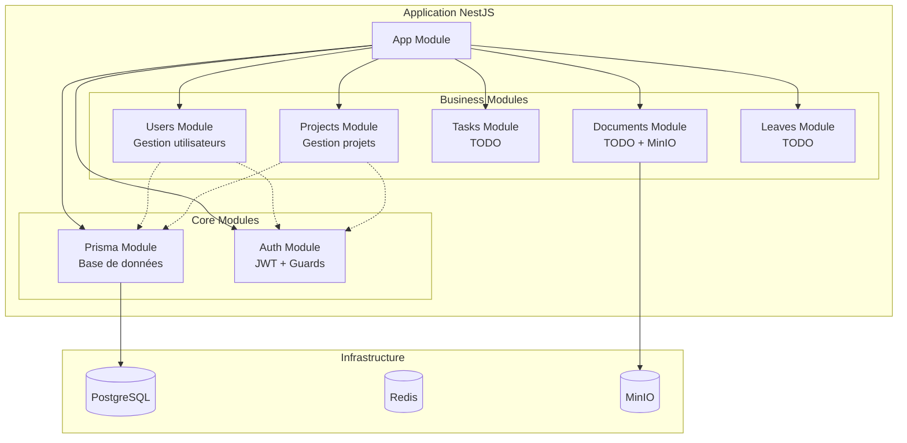
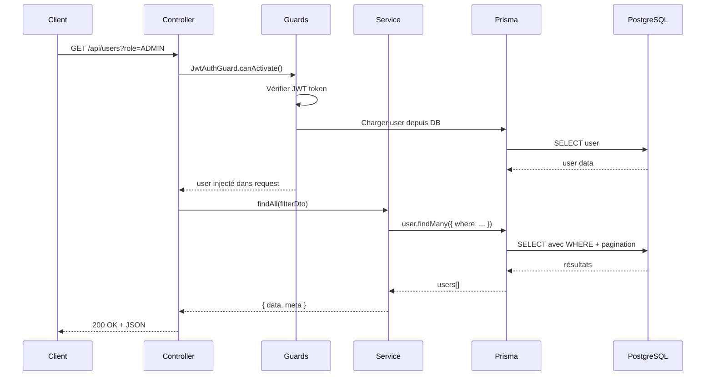

# 🏗️ Phase 2 : Modules Métier - Documentation Complète

> **Statut :** ✅ En cours d'implémentation
> **Date :** 11 octobre 2025
> **Durée :** Phase 2 (Semaines 3-6)

---

## 📋 Table des matières

1. [Vue d'ensemble](#vue-densemble)
2. [Module Users](#module-users)
3. [Module Projects](#module-projects)
4. [Architecture globale](#architecture-globale)
5. [Comment tester](#comment-tester)
6. [Prochaines étapes](#prochaines-étapes)

---

## 🎯 Vue d'ensemble

### Qu'est-ce que la Phase 2 ?

La Phase 2 crée les **modules métier** de l'application, c'est-à-dire tous les modules qui gèrent les entités business (utilisateurs, projets, tâches, documents, etc.).

### Modules implémentés

| Module | Statut | Routes | Description |
|--------|--------|--------|-------------|
| **Users** | ✅ Complété | 8 routes | Gestion complète des utilisateurs |
| **Projects** | ✅ Complété | 8 routes | Gestion des projets et membres |
| **Tasks** | ⏳ À venir | - | Gestion des tâches |
| **Documents** | ⏳ À venir | - | Upload/download avec MinIO |
| **Leaves** | ⏳ À venir | - | Gestion des congés |
| **Notifications** | ⏳ À venir | - | WebSocket temps réel |

### Architecture commune à tous les modules

Chaque module suit la même architecture NestJS :

```
module/
├── dto/
│   ├── create-entity.dto.ts   # Validation création
│   ├── update-entity.dto.ts   # Validation mise à jour
│   ├── filter-entity.dto.ts   # Filtres et pagination
│   └── ...dto.ts              # DTOs spécifiques
├── entity.service.ts          # Logique métier
├── entity.controller.ts       # Routes API REST
└── entity.module.ts           # Configuration NestJS
```

**Avantages :**
- ✅ Code organisé et maintenable
- ✅ Réutilisabilité
- ✅ Isolation des responsabilités
- ✅ Tests facilités

---

## 👥 Module Users

### Fonctionnalités

- ✅ **CRUD complet** : créer, lire, mettre à jour, supprimer
- ✅ **Recherche et filtrage** : par nom, email, rôle, département
- ✅ **Pagination** : gestion de grandes quantités de données
- ✅ **Changement de mot de passe** : sécurisé avec vérification
- ✅ **Statistiques** : compteurs de projets, tâches, commentaires, etc.
- ✅ **Protection par rôles** : seuls les ADMIN peuvent créer/supprimer
- ✅ **Soft delete** : désactivation au lieu de suppression

### Routes API

| Méthode | Route | Rôles requis | Description |
|---------|-------|--------------|-------------|
| **POST** | `/api/users` | ADMIN, RESPONSABLE | Créer un utilisateur |
| **GET** | `/api/users` | Authentifié | Liste avec filtres |
| **GET** | `/api/users/:id` | Authentifié | Détails d'un user |
| **GET** | `/api/users/:id/stats` | Authentifié | Statistiques |
| **PATCH** | `/api/users/:id` | Propriétaire ou ADMIN | Modifier |
| **DELETE** | `/api/users/:id` | ADMIN | Désactiver |
| **POST** | `/api/users/change-password` | Authentifié | Changer son mot de passe |

### Exemples d'utilisation

#### 1. Créer un utilisateur

```http
POST /api/users
Authorization: Bearer <token>
Content-Type: application/json

{
  "email": "nouveau@example.com",
  "password": "Password123!",
  "firstName": "Jean",
  "lastName": "Martin",
  "role": "CONTRIBUTOR",
  "departmentId": "550e8400-e29b-41d4-a716-446655440000"
}
```

**Réponse 201 :**
```json
{
  "id": "abc123...",
  "email": "nouveau@example.com",
  "firstName": "Jean",
  "lastName": "Martin",
  "role": "CONTRIBUTOR",
  "isActive": true,
  "departmentId": "550e8400-e29b-41d4-a716-446655440000",
  "department": {
    "id": "550e8400-e29b-41d4-a716-446655440000",
    "name": "Département IT",
    "code": "IT"
  },
  "createdAt": "2025-10-11T14:30:00.000Z",
  "updatedAt": "2025-10-11T14:30:00.000Z"
}
```

#### 2. Rechercher des utilisateurs

```http
GET /api/users?search=martin&role=CONTRIBUTOR&page=1&limit=20
Authorization: Bearer <token>
```

**Réponse 200 :**
```json
{
  "data": [
    {
      "id": "abc123...",
      "email": "jean.martin@example.com",
      "firstName": "Jean",
      "lastName": "Martin",
      "role": "CONTRIBUTOR",
      "isActive": true,
      "lastLoginAt": "2025-10-11T10:00:00.000Z"
    }
  ],
  "meta": {
    "total": 1,
    "page": 1,
    "limit": 20,
    "totalPages": 1
  }
}
```

#### 3. Changer son mot de passe

```http
POST /api/users/change-password
Authorization: Bearer <token>
Content-Type: application/json

{
  "oldPassword": "OldPassword123!",
  "newPassword": "NewPassword456!"
}
```

**Réponse 200 :**
```json
{
  "message": "Mot de passe changé avec succès"
}
```

#### 4. Récupérer les statistiques d'un utilisateur

```http
GET /api/users/abc123.../stats
Authorization: Bearer <token>
```

**Réponse 200 :**
```json
{
  "user": {
    "id": "abc123...",
    "email": "jean.martin@example.com",
    "firstName": "Jean",
    "lastName": "Martin",
    "role": "CONTRIBUTOR"
  },
  "counts": {
    "projects": 5,
    "tasks": 23,
    "comments": 45,
    "leaves": 3,
    "documents": 12,
    "notifications": 89,
    "activities": 234
  },
  "tasksByStatus": [
    { "status": "TODO", "_count": 5 },
    { "status": "IN_PROGRESS", "_count": 3 },
    { "status": "COMPLETED", "_count": 15 }
  ],
  "leavesByStatus": [
    { "status": "PENDING", "_count": 1 },
    { "status": "APPROVED", "_count": 2 }
  ]
}
```

### Filtres disponibles

Le `FilterUserDto` permet de filtrer avec :
- **search** : recherche dans email, firstName, lastName
- **role** : filtrer par rôle (ADMIN, MANAGER, CONTRIBUTOR, etc.)
- **departmentId** : filtrer par département
- **isActive** : filtrer les actifs/inactifs
- **page** : numéro de page (défaut : 1)
- **limit** : éléments par page (défaut : 20)
- **sortBy** : champ de tri (createdAt, email, firstName, etc.)
- **sortOrder** : ordre (asc, desc)

---

## 📁 Module Projects

### Fonctionnalités

- ✅ **CRUD complet** : créer, lire, mettre à jour, supprimer
- ✅ **Recherche et filtrage** : par nom, statut, priorité, dates, tags
- ✅ **Pagination** : gestion efficace
- ✅ **Gestion des membres** : ajouter/retirer des utilisateurs
- ✅ **Statistiques** : tâches par statut, documents, activités
- ✅ **Protection par rôles** : MANAGER, RESPONSABLE, ADMIN
- ✅ **Validation** : dates cohérentes, chef de projet existant

### Routes API

| Méthode | Route | Rôles requis | Description |
|---------|-------|--------------|-------------|
| **POST** | `/api/projects` | ADMIN, RESPONSABLE, MANAGER | Créer un projet |
| **GET** | `/api/projects` | Authentifié | Liste avec filtres |
| **GET** | `/api/projects/:id` | Authentifié | Détails d'un projet |
| **GET** | `/api/projects/:id/stats` | Authentifié | Statistiques |
| **PATCH** | `/api/projects/:id` | ADMIN, RESPONSABLE, MANAGER | Modifier |
| **DELETE** | `/api/projects/:id` | ADMIN, RESPONSABLE | Supprimer |
| **POST** | `/api/projects/:id/members` | ADMIN, RESPONSABLE, MANAGER | Ajouter un membre |
| **DELETE** | `/api/projects/:projectId/members/:userId` | ADMIN, RESPONSABLE, MANAGER | Retirer un membre |

### Exemples d'utilisation

#### 1. Créer un projet

```http
POST /api/projects
Authorization: Bearer <token>
Content-Type: application/json

{
  "name": "Rénovation Hôtel de Ville",
  "description": "Projet de rénovation complète avec mise aux normes énergétiques",
  "status": "DRAFT",
  "priority": "HIGH",
  "budget": 250000.50,
  "startDate": "2025-11-01T00:00:00.000Z",
  "dueDate": "2026-06-30T23:59:59.999Z",
  "managerId": "550e8400-e29b-41d4-a716-446655440000",
  "tags": ["travaux", "renovation", "energie"],
  "metadata": {
    "phase": "etude",
    "subvention": "DETR"
  }
}
```

**Réponse 201 :**
```json
{
  "id": "proj123...",
  "name": "Rénovation Hôtel de Ville",
  "description": "Projet de rénovation complète...",
  "status": "DRAFT",
  "priority": "HIGH",
  "budget": "250000.50",
  "startDate": "2025-11-01T00:00:00.000Z",
  "dueDate": "2026-06-30T23:59:59.999Z",
  "managerId": "550e8400-e29b-41d4-a716-446655440000",
  "tags": ["travaux", "renovation", "energie"],
  "metadata": { "phase": "etude", "subvention": "DETR" },
  "members": [],
  "_count": {
    "tasks": 0,
    "documents": 0,
    "milestones": 0
  },
  "createdAt": "2025-10-11T14:30:00.000Z",
  "updatedAt": "2025-10-11T14:30:00.000Z"
}
```

#### 2. Filtrer les projets

```http
GET /api/projects?status=ACTIVE&priority=HIGH&search=renovation&page=1&limit=10
Authorization: Bearer <token>
```

**Réponse 200 :**
```json
{
  "data": [
    {
      "id": "proj123...",
      "name": "Rénovation Hôtel de Ville",
      "status": "ACTIVE",
      "priority": "HIGH",
      "members": [
        {
          "id": "member1...",
          "role": "Chef de projet",
          "user": {
            "id": "user1...",
            "email": "chef@example.com",
            "firstName": "Marie",
            "lastName": "Dupont"
          }
        }
      ],
      "_count": {
        "tasks": 15,
        "documents": 8,
        "milestones": 3,
        "members": 5
      }
    }
  ],
  "meta": {
    "total": 1,
    "page": 1,
    "limit": 10,
    "totalPages": 1
  }
}
```

#### 3. Ajouter un membre à un projet

```http
POST /api/projects/proj123.../members
Authorization: Bearer <token>
Content-Type: application/json

{
  "userId": "user456...",
  "role": "Developer"
}
```

**Réponse 201 :**
```json
{
  "id": "member123...",
  "projectId": "proj123...",
  "userId": "user456...",
  "role": "Developer",
  "joinedAt": "2025-10-11T14:30:00.000Z",
  "user": {
    "id": "user456...",
    "email": "dev@example.com",
    "firstName": "Jean",
    "lastName": "Martin",
    "role": "CONTRIBUTOR"
  }
}
```

#### 4. Statistiques d'un projet

```http
GET /api/projects/proj123.../stats
Authorization: Bearer <token>
```

**Réponse 200 :**
```json
{
  "project": {
    "id": "proj123...",
    "name": "Rénovation Hôtel de Ville",
    "status": "ACTIVE",
    "priority": "HIGH",
    "startDate": "2025-11-01T00:00:00.000Z",
    "dueDate": "2026-06-30T23:59:59.999Z"
  },
  "tasksByStatus": [
    { "status": "TODO", "_count": 10 },
    { "status": "IN_PROGRESS", "_count": 3 },
    { "status": "COMPLETED", "_count": 2 }
  ],
  "tasksByPriority": [
    { "priority": "HIGH", "_count": 5 },
    { "priority": "MEDIUM", "_count": 8 },
    { "priority": "LOW", "_count": 2 }
  ],
  "counts": {
    "tasks": 15,
    "documents": 8,
    "members": 5,
    "milestones": 3,
    "activities": 142
  }
}
```

### Filtres disponibles

Le `FilterProjectDto` permet de filtrer avec :
- **search** : recherche dans nom et description
- **status** : DRAFT, ACTIVE, SUSPENDED, COMPLETED, CANCELLED
- **priority** : LOW, MEDIUM, HIGH, CRITICAL
- **managerId** : filtrer par chef de projet
- **startDateAfter** : projets commençant après cette date
- **dueDateBefore** : projets finissant avant cette date
- **tag** : filtrer par tag
- **page** : numéro de page
- **limit** : éléments par page
- **sortBy** : champ de tri
- **sortOrder** : ordre (asc, desc)

---

## 🏛️ Architecture globale

### Diagramme des modules



### Flux de requête type



### Protection des routes

Toutes les routes sont protégées par défaut avec :

1. **JwtAuthGuard** : vérifie le token JWT
2. **RolesGuard** : vérifie les rôles requis

```typescript
@Controller('users')
@UseGuards(JwtAuthGuard, RolesGuard)  // Protection globale
@ApiBearerAuth()
export class UsersController {

  @Post()
  @Roles('ADMIN', 'RESPONSABLE')  // Seuls ADMIN et RESPONSABLE
  create(@Body() dto: CreateUserDto) { ... }

  @Get()
  // Pas de @Roles() = tous les utilisateurs authentifiés
  findAll() { ... }
}
```

---

## 🧪 Comment tester

### Prérequis

1. **Services Docker lancés** :
   ```bash
   cd /home/alex/Documents/Repository/orchestr-a-docker
   docker-compose -f docker-compose.dev.yml up -d
   ```

2. **Migrations Prisma appliquées** :
   ```bash
   cd backend
   npx prisma migrate dev
   ```

3. **Backend démarré** :
   ```bash
   npm run start:dev
   ```

### Méthode 1 : Swagger UI (recommandé)

1. Ouvre **http://localhost:4000/api/docs**

2. **S'authentifier** :
   - POST `/api/auth/register` ou `/api/auth/login`
   - Copier l'`accessToken`
   - Cliquer sur "Authorize" 🔓
   - Coller le token
   - Cliquer sur "Authorize"

3. **Tester les routes** :
   - Aller dans la section "Utilisateurs" ou "Projets"
   - "Try it out" sur n'importe quelle route
   - Remplir les paramètres
   - "Execute"

### Méthode 2 : curl

```bash
# 1. S'authentifier
TOKEN=$(curl -s -X POST http://localhost:4000/api/auth/login \
  -H "Content-Type: application/json" \
  -d '{"email":"admin@example.com","password":"Password123!"}' \
  | jq -r '.accessToken')

# 2. Créer un utilisateur
curl -X POST http://localhost:4000/api/users \
  -H "Authorization: Bearer $TOKEN" \
  -H "Content-Type: application/json" \
  -d '{
    "email": "test@example.com",
    "password": "Password123!",
    "firstName": "Test",
    "lastName": "User",
    "role": "CONTRIBUTOR"
  }'

# 3. Lister les utilisateurs
curl -X GET "http://localhost:4000/api/users?page=1&limit=10" \
  -H "Authorization: Bearer $TOKEN"

# 4. Créer un projet
curl -X POST http://localhost:4000/api/projects \
  -H "Authorization: Bearer $TOKEN" \
  -H "Content-Type: application/json" \
  -d '{
    "name": "Mon Projet",
    "description": "Description du projet",
    "priority": "HIGH",
    "startDate": "2025-11-01",
    "dueDate": "2026-06-30",
    "managerId": "<ID_USER>"
  }'
```

### Méthode 3 : Postman

1. **Importer la collection Swagger** :
   - File > Import
   - URL : `http://localhost:4000/api/docs-json`

2. **Configurer l'authentification** :
   - Collection > Authorization
   - Type : Bearer Token
   - Token : `{{accessToken}}`

3. **Créer une variable d'environnement** :
   - Nom : `accessToken`
   - Valeur : copier depuis la réponse login

---

## 📊 Récapitulatif Phase 2

### ✅ Ce qui a été créé

#### Module Users
- ✅ 4 DTOs (Create, Update, Filter, ChangePassword)
- ✅ Service complet avec 9 méthodes
- ✅ Contrôleur avec 7 routes
- ✅ Filtrage, pagination, statistiques
- ✅ Soft delete et changement de mot de passe

#### Module Projects
- ✅ 4 DTOs (Create, Update, Filter, AddMember)
- ✅ Service complet avec 9 méthodes
- ✅ Contrôleur avec 8 routes
- ✅ Gestion des membres
- ✅ Filtrage avancé (dates, tags, statuts)
- ✅ Statistiques détaillées

#### Total
- **2 modules complets**
- **15 routes API REST**
- **8 DTOs avec validation**
- **18 méthodes de service**
- **Protection par rôles**
- **Documentation Swagger**

---

## 🎯 Prochaines étapes

### Phase 2 (suite) - À implémenter

1. **TasksModule** ⏳
   - CRUD tâches
   - Assignation à des utilisateurs
   - Gestion des dépendances
   - Changement de statut
   - Estimation/temps passé

2. **DocumentsModule** ⏳
   - Upload vers MinIO
   - Génération d'URLs signées
   - Permissions
   - Versioning

3. **LeavesModule** ⏳
   - CRUD congés
   - Workflow d'approbation
   - Calcul des jours
   - Notifications

4. **NotificationsModule** ⏳
   - WebSocket temps réel
   - Redis Pub/Sub
   - Marquage lu/non lu

### Phase 3 : Migration des données

- Script de migration Firestore → PostgreSQL
- Transformation des données
- Validation de l'intégrité

---

## 📚 Ressources

### Documentation NestJS
- Controllers : https://docs.nestjs.com/controllers
- Providers : https://docs.nestjs.com/providers
- Modules : https://docs.nestjs.com/modules
- Guards : https://docs.nestjs.com/guards
- Pipes : https://docs.nestjs.com/pipes

### Documentation Prisma
- CRUD : https://www.prisma.io/docs/concepts/components/prisma-client/crud
- Relations : https://www.prisma.io/docs/concepts/components/prisma-client/relation-queries
- Filtering : https://www.prisma.io/docs/concepts/components/prisma-client/filtering-and-sorting

---

**Phase 2 en cours ! 🚀**

*Prochaine étape : Implémenter les modules restants (Tasks, Documents, Leaves)*

---

*Document créé le 11 octobre 2025*
*Pour le projet Orchestr'A - Migration Open-Source*
